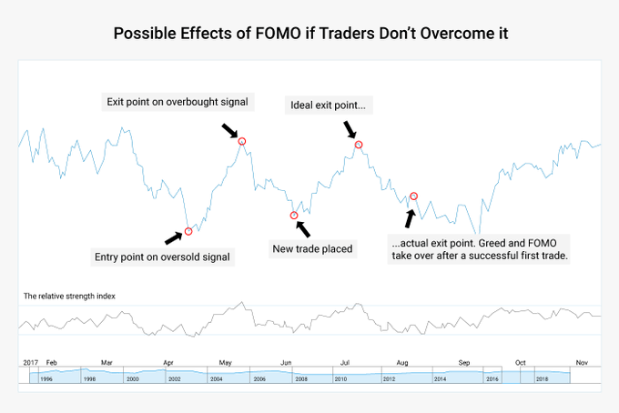
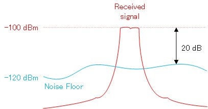
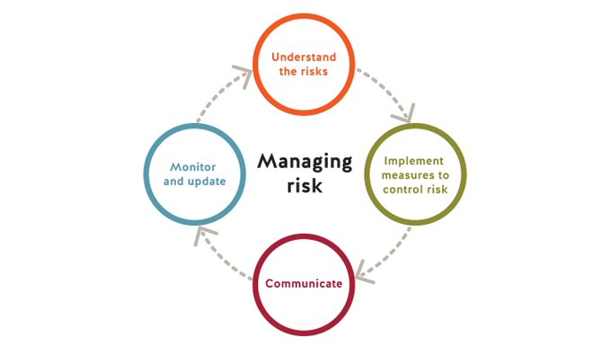

+++
author = "Pauldozer"
title = "3 Tips to Avoid FOMO"
date = "2023-07-12T10:00:00"
description = "FOMO in trading refers to the fear of missing a big opportunity in the market."
tags = [
   "Trading Psychology",
]
+++

You might say, "I can't believe I missed that opportunity!" and take a bad trade later because you're upset.

Some tips for avoiding FOMO:

## **FOMO EXISTS** 

Understand that FOMO exists and that it will affect you.

Learn your own psychology and have the presence of mind in the moment for diagnosing when you have FOMO. 

If you feel you're experiencing it, get up from the screen and go for a walk.

## **INCREASE SIGNAL, REDUCE NOISE**

Pay more attention to good sources of info and pay less attention to the bad sources of info.

Social Media can be poisonous and overwhelming sometimes. Reduce the amount of garbage you're consuming so you're less tempted by hype.

## **MANAGE RISK**

Journal your trades and manage your risk.

Don't oversize on trades, limit your downside, which helps keep you out of trouble even if you do get into bad trades.

Keep detailed notes on good winners and bad winners. Look at patterns. Lean into the good and discard the bad.

