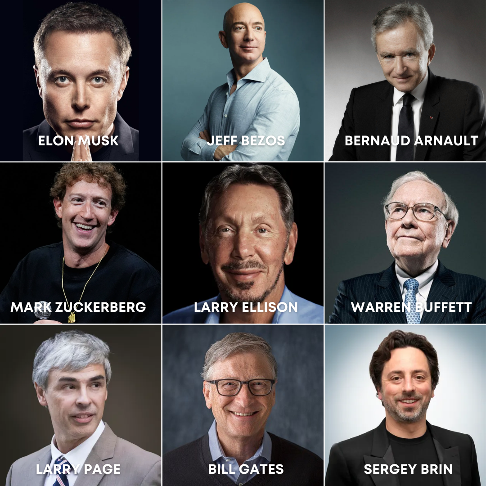

+++
author = "Pauldozer"
title = "6 Characteristics of Ultra High Net Individuals"
date = "2023-07-12T00:00:00"
description = "88% of ultra high net worth individuals (more than $30 million net worth) are self-made. "
course = "Long Term Investing"
time = "1 min"
tags = [
   "Getting Started",
]

+++

In personal finance, the term **High Net Worth Individual (HNWI)** frequently surfaces, but what does it mean, and why should you care? Let's explore who these individuals are, the criteria defining them, and what this status implies in today's financial landscape.

## Defining High Net Worth

A **High Net Worth Individual** is typically defined by having at least $1 million in liquid assets. However, definitions can vary:

- **General Definition**: Assets exclude primary residence, focusing on liquid assets like bank accounts, investments, or other easily convertible assets.
- **SEC Definition**: For regulatory purposes, the threshold might be higher, considering net worth beyond liquid assets, sometimes even including the primary residence, with figures like a net worth over $2.2 million or $1.1 million under management by an advisor.

## The Wealth Spectrum

- **High Net Worth Individuals**: $1 million to $5 million in liquid assets.
- **Very-High-Net-Worth Individuals**: Between $5 million and $30 million.
- **Ultra-High-Net-Worth Individuals**: Over $30 million in liquid assets.

Understanding these categories is crucial for wealth managers, financial planners, and even for individuals aspiring to reach these financial milestones.

## The Global Perspective

- **Distribution**: The U.S. hosts a significant portion of the world's HNWIs, followed by China, Japan, and other developed nations. However, wealth migration reports often highlight shifts in HNWI populations, influenced by economic policies, stability, and investment opportunities.
- **Growth Trends**: Despite economic fluctuations, the number of HNWIs globally continues to grow, driven by entrepreneurial success, inheritance, and savvy investments.

## Lifestyle and Services

HNWIs enjoy exclusive services:

- **Banking and Investment**: Access to private banking, exclusive investment opportunities like hedge funds, pre-IPO investments, and more.
- **Networking**: Membership in elite clubs or networks, offering not just social but also business and investment connections.
- **Financial Planning**: Sophisticated estate planning, tax strategies, and personalized financial advice tailored to manage and grow their wealth.

## Becoming an HNWI

For those interested in joining the ranks of HNWIs:

- **Invest Early**: The power of compounding over time is significant. Starting early with investments, even small amounts, can lead to substantial growth.
- **Smart Financial Planning**: This includes budgeting, maximizing retirement savings, and minimizing debt.
- **Entrepreneurial Ventures**: Many HNWIs generate significant wealth through business creation or acquisition.

## Who are the largest ultra high net worth individuals?

The 10 largest high net worth individuals in the world, or those with the highest net worth, are:

1. **Elon Musk ($269B)** - Known for his involvement with [Tesla](/stocks/tsla/) and SpaceX, Musk has consistently been at or near the top of various billionaire lists.
2. **Bernard Arnault ($190B)** - The Chairman and CEO of LVMH, one of the world's largest luxury goods companies, often ranks among the top due to the value of LVMH shares.
3. **Jeff Bezos ($161B)** - Founder of [Amazon](/stocks/amzn/), Bezos has been one of the richest individuals for several years, with his wealth largely tied to Amazon's stock performance.
4. **Mark Zuckerberg (106B)** - As the co-founder and CEO of [Meta](/stocks/meta/) Platforms (formerly known as Facebook), Zuckerberg's wealth fluctuates with the company's stock price.
5. **Larry Ellison (158B)** - Co-founder of [Oracle Corporation](/stocks/orcl/), Ellison's wealth is primarily from his stake in the software giant.
6. **Warren Buffett ($121B)** - The Oracle of Omaha, Buffett's wealth comes from his company [Berkshire Hathaway](/stocks/brk-a/) and his investments in various sectors.
7. **Larry Page ($114B)** - Co-founder of [Google](/stocks/goog/), now part of Alphabet Inc., Page's net worth is tied to Alphabet's performance.
8. **Bill Gates ($111B)** - Co-founder of [Microsoft](/stocks/msft/), Gates' wealth includes his stake in Microsoft and significant philanthropy through the Bill & Melinda Gates Foundation.
9. **Sergey Brin ($110B)** - Another co-founder of [Google](/stocks/goog/), Brin's wealth is also closely linked with Alphabet Inc.
10. **Steve Ballmer ($101B)** - Former CEO of [Microsoft](/stocks/msft/), Ballmer's wealth includes his significant Microsoft stock holdings and other investments.

## Characteristics of a High Net Worth Individual

So, what common characteristics do these ultra high net worth individuals share?

### **🏃‍♂️ AMBITION**

Self-made millionaires turn their ambition into reality, it's not just pie in the sky day dreaming, whether that’s starting a business or achieving other professional or personal pursuits.

### **🙏 HUMILITY**

Many self-made millionaires are quick to admit that they cannot possibly know how to do everything. They reach out to others who know the ins and outs of different knowledge areas, tapping into the best minds on each subject for perspective and insight.

### **💪 SELF IMPROVEMENT**

For a self-made millionaire, self-improvement never stops. Self-made millionaires look for critique and feedback in their ideas and business practices, ensuring that they can better identify blind spots and guarantee that their ventures will succeed.

### **⚔️ COURAGE**

They are not afraid of failure. Millionaires understand the benefits of learning lessons through failure. However, the risks they take are thoroughly calculated and each scenario played out. Once they commit to something, they give their all.

### **⌚ TIME MANAGEMENT**

They understand the value of time. Time is money, and millionaires know this all too well. They quickly learn how to manage their time, and they know that there is no reason to trade time for money.

