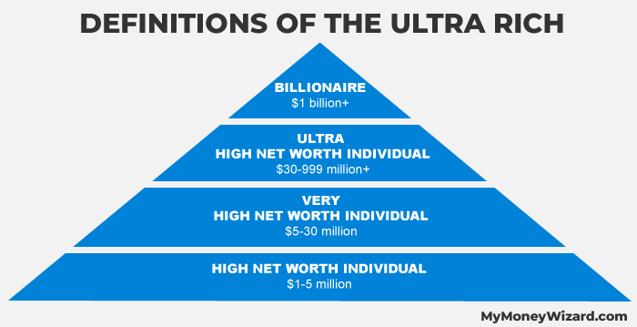
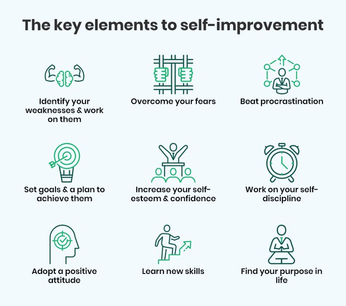
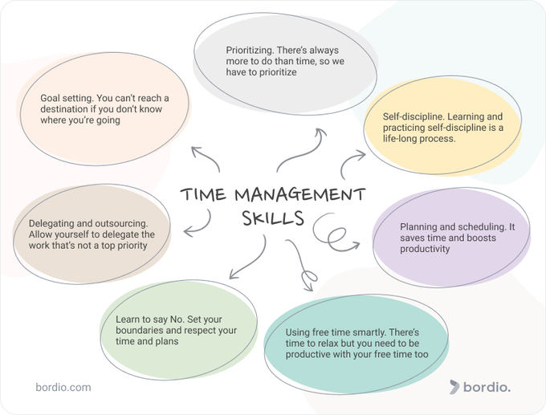

+++
author = "Pauldozer"
title = "6 Characteristics of Ultra High Net Individuals"
date = "2023-07-12T00:00:00"
description = "88% of ultra high net worth individuals (more than $30 million net worth) are self-made. "
course = "Long Term Investing"
tags = [
   "Getting Started",
]

+++

 What common characteristics do these ultra high net worth individuals share?

## **🏃‍♂️ AMBITION**

Self-made millionaires turn their ambition into reality, it's not just pie in the sky day dreaming, whether that’s starting a business or achieving other professional or personal pursuits.

## **🙏 HUMILITY**

Many self-made millionaires are quick to admit that they cannot possibly know how to do everything. They reach out to others who know the ins and outs of different knowledge areas, tapping into the best minds on each subject for perspective and insight.

## **💪 SELF IMPROVEMENT**

For a self-made millionaire, self-improvement never stops. Self-made millionaires look for critique and feedback in their ideas and business practices, ensuring that they can better identify blind spots and guarantee that their ventures will succeed.

## **⚔️ COURAGE**

They are not afraid of failure. Millionaires understand the benefits of learning lessons through failure. However, the risks they take are thoroughly calculated and each scenario played out. Once they commit to something, they give their all.

## **⌚ TIME MANAGEMENT**

They understand the value of time. Time is money, and millionaires know this all too well. They quickly learn how to manage their time, and they know that there is no reason to trade time for money.

