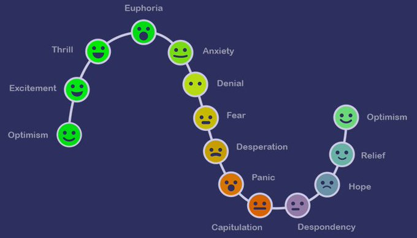

+++
author = "Pauldozer"
title = "8 Deadly Mistakes Traders Must Avoid"
date = "2023-07-12T00:00:00"
description = "Learn about some of the biggest mistakes traders make!"
tags = [
    "Trading Psychology",
]

+++

## **LACK OF A TRADING PLAN**

Failing to develop a well-defined trading plan is a significant mistake. A plan outlines a strategy, including entry and exit criteria, risk management rules, and overall goals. Traders may make poor and emotional decisions, leading to inconsistent results

## **EMOTIONAL TRADING**

Emotions, such as fear and greed, can cloud a trader's judgment and lead to poor decision making. Making emotionally impulsive trades rather than following a cogent strategy can result in losses. Traders must maintain discipline and stick to their  plan.

## **FAILURE TO MANAGE RISK**

Risk management is essential for traders. Failing to implement proper risk management techniques, such as setting stop-losses and position sizing, can expose traders to excessive losses. You must determine the appropriate risk-reward ratio for each trade.

## **OVERTRADING**

Excessive trading activity driven by the desire to be constantly involved in the market. It can lead to increased transaction costs, reduced focus on quality trades, and emotional exhaustion. Traders should aim for quality strategic trades, rather than gambling.

## **LACK OF PATIENCE AND DISCIPLINE**

Successful trading requires patience and discipline. Traders may make the mistake of entering trades prematurely or exiting too early due to lack of discipline. It's important to wait for the right opportunities that align with your trading plan.

## **NEGLECTING FUNDAMENTALS AND TECHNICAL ANALYSIS**

Traders should utilize both to make informed trading decisions. Neglecting either of these approaches may result in incomplete market analysis. Aim to understand market trends, economic indicators, and company fundamentals.

## **FAILURE TO ADAPT TO CHANGING MARKET CONDITIONS**

Markets are dynamic, and traders need to stay informed and flexible. Failing to recognize shifts in market trends, volatility, or economic factors and adjusting trading approaches accordingly can lead to poor performance.

## **LACK OF CONTINUOUS LEARNING**

Trading is a skill that requires ongoing learning and improvement. Traders who fail to invest time in expanding their knowledge and keeping up with market developments may struggle to adapt to new strategies and techniques.

