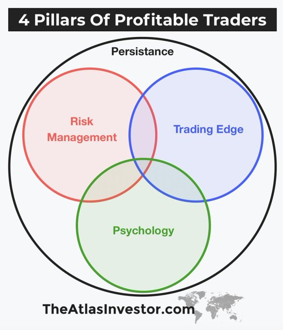
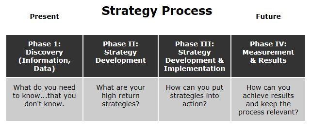
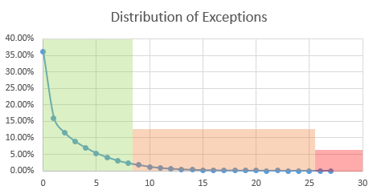
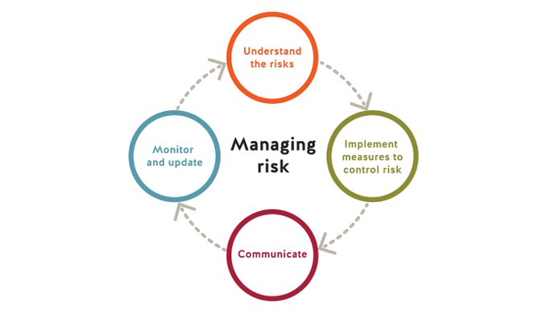
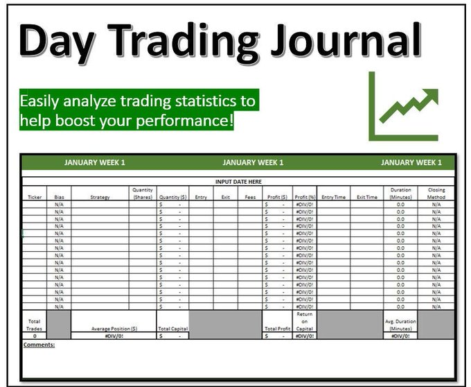

+++
author = "Pauldozer"
title = "9 Steps Towards Trading Succcess"
date = "2023-07-06T10:00:00"
description = "How to develop a trading edge: nine steps towards trading success"
course = "Trading 101"
time = "2 min"
tags = [
   "Getting Started",
]
+++

## Trading Edge 101
Understand what a trading edge is and why it's crucial for profitable trading. It's the difference between winning and losing traders. Without an edge, you're essentially donating your money to the market.

## Trading Strategies
Explore different examples of trading edges. It could be a news trading strategy, cutting losses early, letting profits run, or identifying specific patterns for big price moves. Find what suits your style. 

## Market Knowledge
Educate yourself in the ways of the market. Learn about different trading strategies, such as scalping, day trading, momentum trading, technical analysis, etc. Familiarize yourself with as much information as possible to build your personal edge. 

## Develop your strategy
Develop your own strategy. Customize existing strategies, combine elements that resonate with you. Create a repeatable method with favorable results. Consider entry/exit points, stop-loss levels, position sizes, and profit-taking strategies. 

## Test Your Strategy
Test your strategy. Look for examples where it has worked, backtest it using historical data, use a risk-free demo account. Calculate wins and losses to determine if your strategy has an edge. Learn from the results and tweak your approach accordingly. 

## Manage Risk
 Manage your risk effectively. Set limits on how much you're willing to lose per trade, per day, week, or month. Use stop-loss orders to minimize losses. Risk management rules protect your account from depleting rapidly during losing streaks. 

## Understand Trading Psychology
Understand trading psychology. Discipline is key to executing your strategy effectively. Be aware that emotions hinder your trading decisions. Keep a journal to track your thoughts and trade details. Learn from your experiences and improve your edge. 

## Journal your Trades
Keep a trading journal to record your thoughts, trade details, and ideas for improvement. Analyze your trades, identify weaknesses, and develop a deeper understanding of your trading edge. Continuously refine your approach based on your journal entries. 

## Find your edge
Quantify your trading edge using formulas like positive expectancy. Calculate win rates, average wins and losses, and risk/reward ratios. A positive expectancy indicates a potential edge. Be patient, rinse, and repeat the process.

Remember, developing a trading edge takes time and effort. Be persistent, keep learning, and adapt as the market evolves. With a solid edge, you can increase your chances of long-term trading success.
