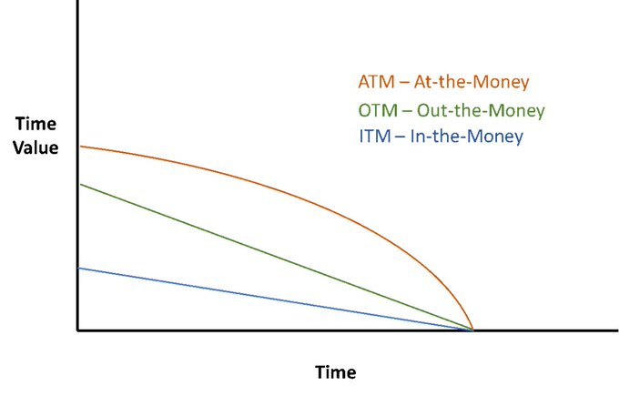

+++
author = "Pauldozer"
title = "5 Greeks You Need To Know With Options Trading"
date = "2023-07-21T00:00:00"
description = "When you hear about Delta, Gamma, Vega, Theta, Rho - it's not a secret society, it's financial engineering at its finest. Get ready to demystify these terms!"
course = "Trading 101"
time = "2 min"
tags = [
    "Getting Started",
]

+++

Welcome to a deep dive into the world of Options Trading and its hidden language, the Greeks! When you hear about Delta, Gamma, Vega, Theta, Rho - it's not a secret society, it's financial engineering at its finest. Get ready to demystify these terms!

## Delta
Let's start with Delta. This Greek measures the sensitivity of an option's price to changes in the underlying asset price. Think of it as a prediction - if the stock price changes by $1, Delta tells you how much the option price will move.

For instance, a call option with a Delta of 0.6 will increase in price by 60 cents for every $1 increase in the underlying stock price. Put options, on the other hand, have negative Delta because their value decreases as the stock price increases.

## Gamma

Next up is Gamma. This is the rate of change of Delta with respect to changes in the underlying price. In simpler terms, Gamma tells us how fast Delta is changing. It's important because it helps traders manage the risk of large price swings in the underlying asset.

## Vega

Now onto Vega. Despite not being a real Greek letter, Vega plays a crucial role in options trading. It measures an option's sensitivity to changes in volatility of the underlying asset. A higher Vega means the option's price is more sensitive to volatility.

For example, if an option has a Vega of 0.1 and implied volatility increases by 1%, the option's price will increase by 10 cents. Therefore, Vega is particularly important for traders betting on big price moves, regardless of the direction.

## Theta

Theta, often referred to as time decay, represents the rate at which the option's price decreases over time, assuming everything else stays constant. It reflects the fact that options are wasting assets; their value declines as their expiration date gets closer.

## Rho

Lastly, we have Rho. This Greek measures the sensitivity of an option's price to changes in the interest rate. While often overlooked, Rho becomes significant in a changing rate environment. When rates increase, call options typically increase and put options decrease.

## Summary
In essence, the Greeks provide a powerful toolkit for managing risk and making informed trading decisions in the world of options. They enable traders to understand and quantify the sensitivity of an option's price to various factors.

And there you have it - the Greeks of Options Trading, demystified. But remember, while knowledge is power, always be aware of the risks involved in trading options. Always do your homework and remember that the market's only constant is change itself.
