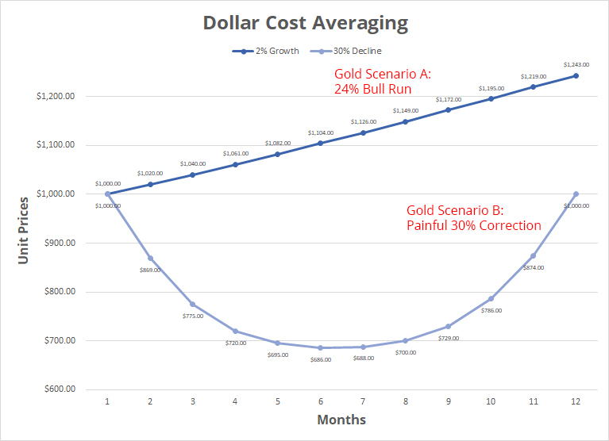
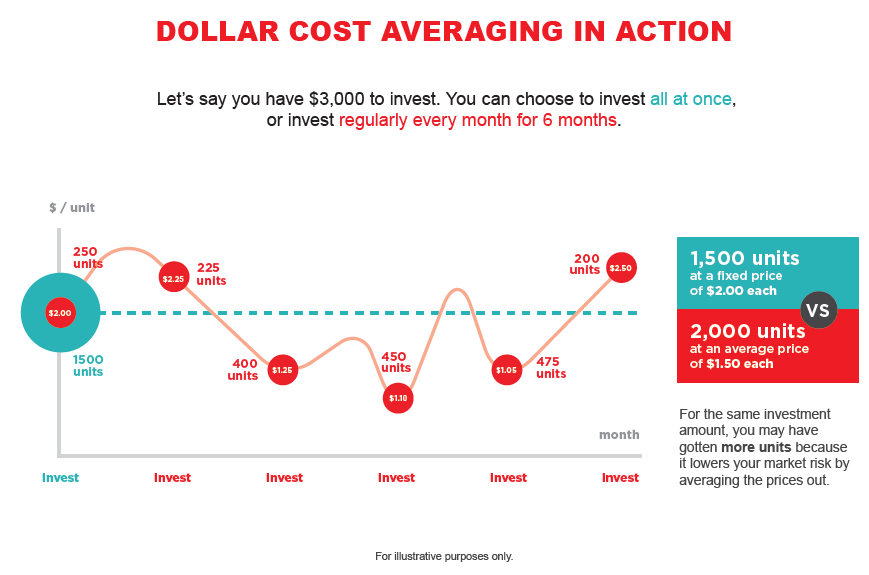

+++
author = "Pauldozer"
title = "4 Reasons Dollar Cost Averaging Can Make You Money"
date = "2023-07-21T00:00:00"
description = "Unlocking the Power of Consistent Investing"
course = "Long Term Investing"
time = "2 min"
tags = [
    "Getting Started",
]

+++

Are you looking for a smart investing strategy that can potentially minimize risks and maximize returns? Look no further! In this post, we'll dive into the concept of dollar cost averaging (DCA) and why it's a game-changer. Let's get started!

Dollar cost averaging is a simple yet powerful approach where you invest a fixed amount of money at regular intervals, regardless of market conditions. 

By doing so, you buy more shares when prices are low and fewer shares when prices are high.

## Smooths Out Volatility
The beauty of dollar cost averaging lies in its ability to smooth out market volatility. 

Instead of trying to time the market, DCA allows you to spread your investments over time, reducing the impact of short-term market fluctuations.

## Lower Cost Per Share
One of the key advantages of DCA is its potential to lower the average cost per share. 

By consistently investing the same amount, you automatically buy more shares when prices are low. Over time, this can lead to a lower average cost and potentially higher returns.

## It's a Mental Hack
Another benefit of DCA is its psychological advantage. It eliminates the need to make emotionally-driven investment decisions based on short-term market movements. 

Instead, you stick to a disciplined approach, focusing on long-term goals.

## Perfect for Small Accounts
DCA is particularly beneficial for new investors or those who don't have a lump sum to invest. 

It allows you to start investing with whatever amount you can afford, and you can gradually increase your investments over time as your financial situation improves.

## Summary
Remember, dollar cost averaging is a long-term strategy. It thrives on consistency and discipline. By committing to regular investments, you harness the power of compounding and give your portfolio the opportunity to grow steadily over time.

Of course, like any investment strategy, dollar cost averaging has its limitations. It may not be the most suitable approach for those seeking quick profits or actively trading in volatile markets. It's important to align your strategy with your goals and risk tolerance.

Dollar cost averaging is an excellent strategy for long-term investors looking to build wealth steadily. By investing consistently, regardless of market conditions, you can potentially reduce risks, lower your average cost, & enjoy the power of compounding 🚀📊