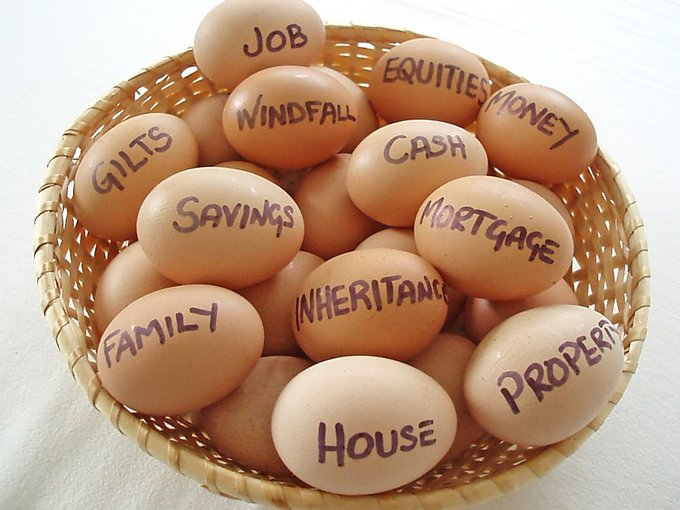
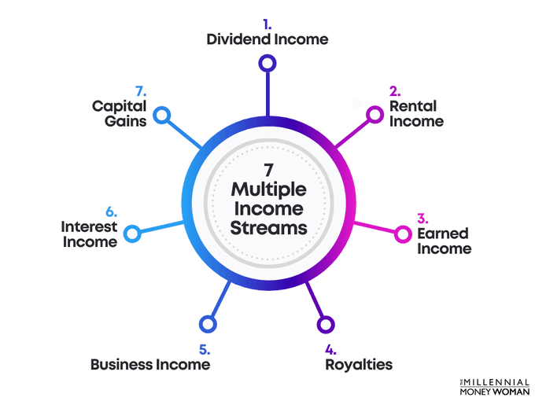
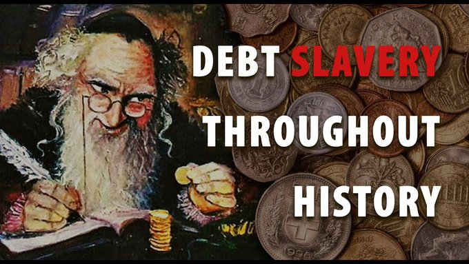

+++
author = "Pauldozer"
title = "How Millionaires Make Their Money"
date = "2023-07-12T00:00:00"
description = "Learn how ultra high net worth millionaires make their money."
tags = [
    "Strategies",
]

+++

We previously talked about [ultra high net worth millionaires](../6-characteristics-of-millionaires/), so how do they make their money?

🏦 Inheritance 

🛍️ Sales

📇 Business Owner

🏬 Real Estate

📊 Investing

But today’s self-made millionaires are multidimensional, what does this mean?

## **INVEST IN DIFFERENT PLACES AND AVENUES**

Don’t put your eggs in one basket. Diversifying your investments helps manage risk by ensuring that all your money is not at risk if a particular investment goes south.

## **HAVE MULTIPLE STREAMS OF INCOME**

They have money coming in from several places, including their W2, income from rental properties, and investments in other business enterprises, Amazon selling, etc.

If one income stream slows down, another can take its place, or usurp.

## **SAVE**

One common theme you’ll hear from self-made millionaires is to hold on to your money. Beyond just investment accounts, you need to control your spending. 

Don't be comfortable wallowing in debt, especially for a depreciating asset like a new car.

