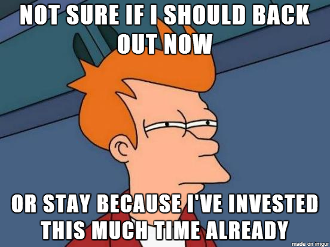

+++
author = "Pauldozer"
title = "How to Avoid the Sunk Cost Fallacy"
date = "2023-07-24T00:00:00"
description = "The Sunk Cost Fallacy: a trap that many fall into in the world of options trading. But what is it? Simply put, it's the fallacy of allowing past, irretrievable costs to influence future decisions."
course = "Trading Psychology"
time = "1 min"
tags = [
    "Trading Psychology",
]

+++

## The Sunk Cost Fallacy
A trap that many fall into in the world of options trading. 

But what is it? Simply put, it's the fallacy of allowing past, irretrievable costs to influence future decisions.

## Example

Let's say you've purchased 10 call options, each costing you $500, adding up to a total investment of $5,000. Things, unfortunately, don't go as expected. The underlying stock plummets, causing the value of each option to drop to $100.

🔻Now, your total investment is worth $1,000—a brutal $4,000 loss. 

The market looks bleak and a rebound seems unlikely. 

The key here is not to let the Sunk Cost Fallacy drag you further down, holding on to these options in hopes they will bounce back.

## Another Example
🔑Let's reinforce this concept with another example: 

This time, you purchase 20 put options for $200 each, investing $4,000. Suddenly, the market rallies, and your options value drop to $50 each, leaving you with just $1,000 in hand.

## Hopium
💔This is where the Sunk Cost Fallacy might tempt you to stay in, hoping the market will turn again. But the pragmatic choice is to cut your losses, accept the $3,000 loss, and wisely reinvest your remaining $1,000 in other promising options.

## Seperate Emotions
🌱In options trading, it's crucial to separate yourself emotionally from past investments, and make calculated decisions based on present and future market scenarios. The Sunk Cost Fallacy should never obscure your judgment or hamper your upcoming trades.

