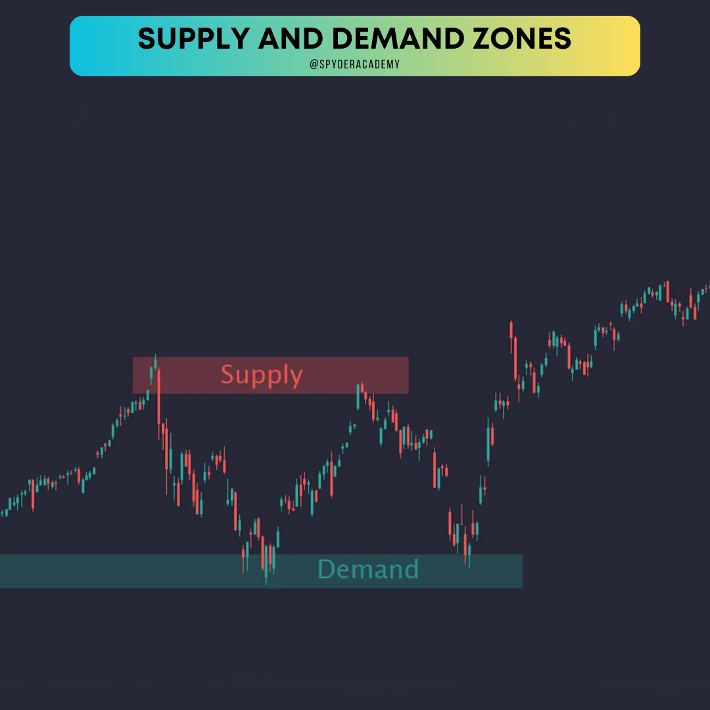

+++
author = "CashMoneyTrades"
title = "A Guide to Identifying Key Supply and Demand Areas"
date = "2023-10-12T11:00:00"
description = "Master the art of spotting supply and demand zones. Learn to identify key areas on the chart that can impact your trading decisions."
course = "TA 101"
time = "2 min"
tags = [
   "Strategies",
]
+++

Hey traders! 👋 Ready to dive into the nitty-gritty of supply and demand zones? Today, we're uncovering the secrets behind identifying key areas on the chart that can be game-changers for your trades. Buckle up as we explore the fascinating world of supply and demand!

## What's the Buzz About?

Supply and demand zones are like hidden treasures on the chart. They represent levels where buyers and sellers have clashed in the past, leaving an invisible footprint. Understanding these zones is crucial because they can act as magnets, influencing future price movements.

## How to Spot Supply and Demand Zones?

1. **Historical Price Levels:**
   - Look for historical levels where the price has reversed sharply in the past. These could be significant highs or lows.

2. **Strong Reactions:**
   - Identify areas where the price has experienced strong reactions – sudden bounces or plunges. These reactions often indicate strong supply or demand.

3. **Volume Analysis:**
   - Pay attention to volumes. A surge in trading volume at a specific level suggests heightened interest and potential supply or demand.

4. **Confluence with Other Indicators:**
   - Combine your analysis with other indicators like trendlines, moving averages, or Fibonacci retracements for added confirmation.

## Key Characteristics of Supply and Demand Zones:

### Supply Zone:

- **Bearish Reversal:** Supply zones often act as barriers where selling pressure exceeds buying pressure, leading to a potential bearish reversal.
- **Price Often Falls:** Prices tend to fall sharply from supply zones, indicating a surplus of sellers.

### Demand Zone:

- **Bullish Reversal:** Demand zones act as springboards where buying interest overpowers selling pressure, signaling a potential bullish reversal.
- **Prices Bounce Up:** Prices often bounce upward from demand zones, suggesting a surplus of buyers.

## Let's Break It Down with an Example:

In this example, we can see clear supply and demand zones. The price encounters strong selling pressure in the supply zone, leading to a bearish reversal. On the flip side, the demand zone acts as a trampoline, propelling prices upward in a bullish reversal.

## Tips for Trading Like a Pro:

1. **Patience is Key:**
   - Wait for price confirmation around supply and demand zones before making trades. Patience prevents false signals.

2. **Risk Management:**
   - Set clear stop-loss levels and profit targets. Risk management is crucial in volatile zones.

3. **Adapt to Changing Conditions:**
   - Market dynamics change. Stay adaptable and adjust your strategy as new supply and demand zones form.

## Wrapping Up:

And there you have it – the insider's guide to identifying key supply and demand areas. These zones are like breadcrumbs left by market forces. Dive into your charts, practice spotting these zones, and elevate your trading game! Happy trading, zone hunters! 📊🎯
