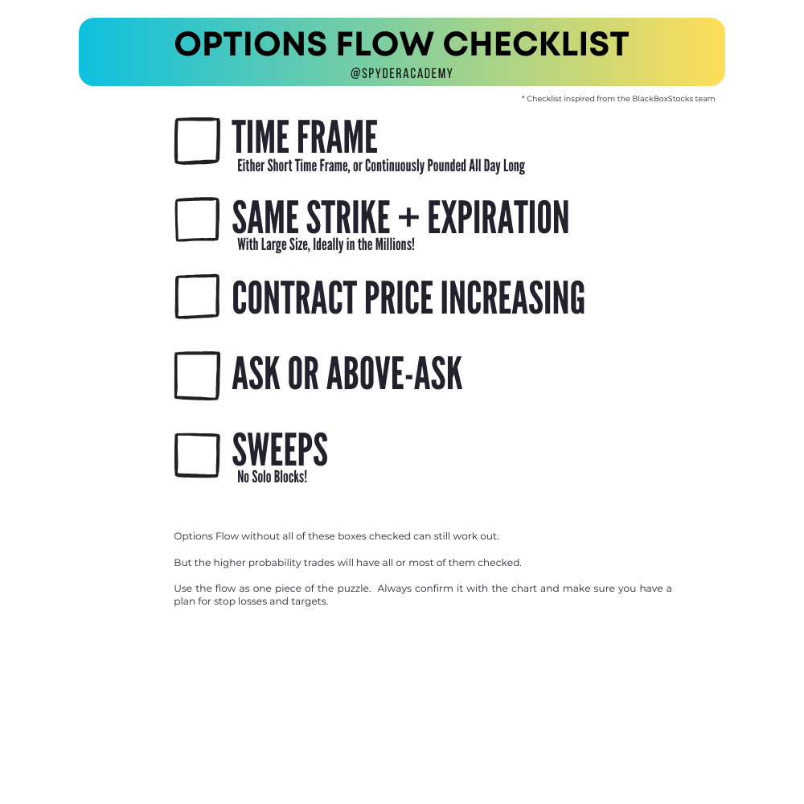
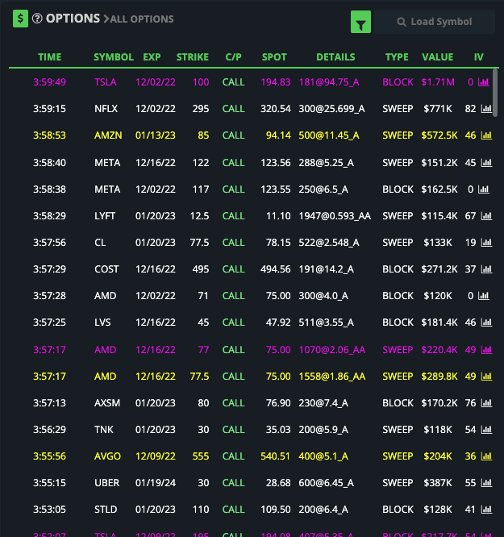
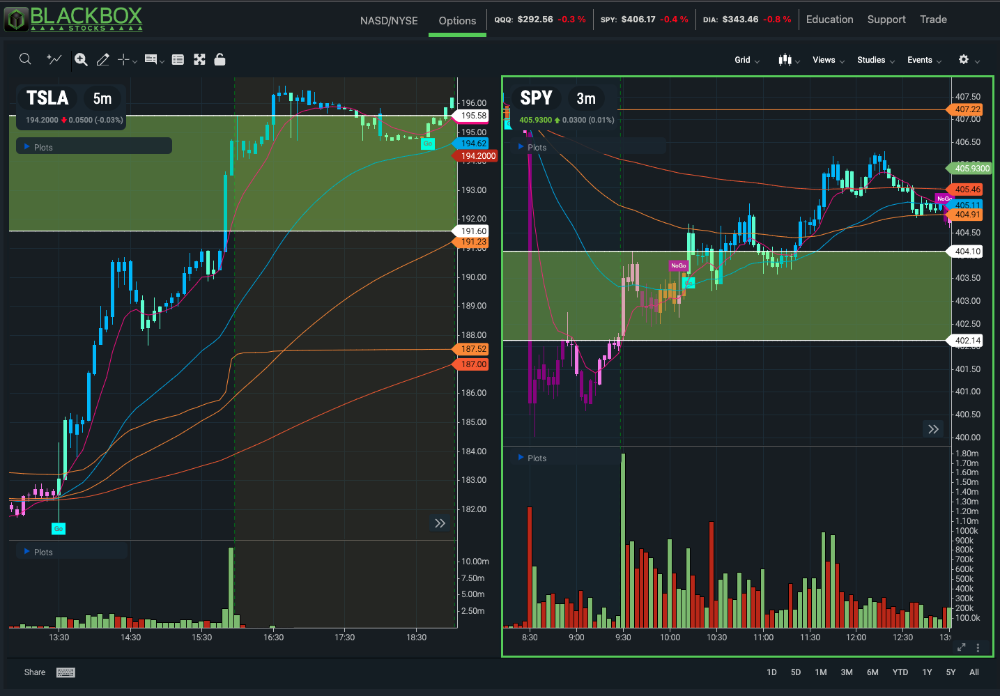

+++
author = "CashMoneyTrades"
title = "How To Read Options Flow"
date = "2023-09-05"
description = "Understanding and interpreting options flow for successful trading."
tags = [
    "Strategies",
]
+++

If you're an options trader, you've likely come across the term "options flow." Options flow refers to the record of large or unusual options trades, often showing up as significant volumes on the options market. Reading and understanding options flow can provide valuable insights into market sentiment and potential trading opportunities.

### What Is Options Flow?

Options flow is essentially a record of the big bets being placed in the options market. These bets can come from institutional investors, hedge funds, or well-informed retail traders. When significant options positions are opened, it can indicate that someone with a deep understanding of the market has a strong opinion on the direction of a particular stock or index.

### Why Is Options Flow Important?

Options flow can serve as a leading indicator, giving traders a sense of where a stock or market might be headed. Here are some reasons why options flow is important:

1. **Market Sentiment**: Options flow can reveal the sentiment of large players in the market. If institutions are buying call options, it may indicate bullish sentiment, while heavy put buying can suggest bearishness.

2. **Unusual Activity**: Unusual options activity, such as a surge in trading volume or large trades, can signal significant news or events that might impact a stock's price.

3. **Trading Opportunities**: By monitoring options flow, traders can identify potential entry or exit points for their trades. Unusual activity can lead to short-term price swings that traders can capitalize on.

### How to Read Options Flow

Reading options flow involves looking at several key factors:

1. **Volume**: Start by examining the volume of options contracts traded. Unusually high volume compared to the stock's average can be a sign of interest.

2. **Strike Prices**: Pay attention to the strike prices of the options being traded. Are they near the current stock price (at-the-money), or are they significantly out-of-the-money or in-the-money?

3. **Expiration Dates**: Look at the expiration dates of the options. Are traders targeting short-term or longer-term movements?

4. **Call vs. Put Options**: Determine whether traders are buying more call options (bullish) or put options (bearish). This can provide insight into market sentiment.

5. **Block Trades**: Keep an eye out for block trades, which involve significant amounts of options contracts being bought or sold at once. These can be particularly meaningful. But a block trade by itself can be deceptive.  Ideally you want it surrounded by a number of Sweeps.

6. **Sweep Trades**: Sweep trades indicate aggressiveness in buying.  Fill my order and get it from whatever exchange you can, breaking the trade up into multiple orders.  Block trades are less aggressive as it asks for the order to be filled entirely at once, or dont fill at all, and are usually privately negotiated between the buyer and seller. Multiple sweeps over a short period of time adds an additional layer of confirmation for the flow.

7. **Follow the Money**: If a large institution with a successful track record is making significant options trades, it may be worth paying extra attention.

### Tools for Tracking Options Flow

To read options flow effectively, traders often use specialized tools and platforms that provide real-time data and analysis. Some popular options flow tracking tools include:

- [Black-Box Stocks](http://staygreen.blackboxstocks.com/SHJG)
- [Unusual Whales](https://www.unusualwhales.com/)

### BLACK BOX STOCKS 
[Black-Box Stocks](http://staygreen.blackboxstocks.com/SHJG) is a data platform that provides traders with real-time options flow data. 

The platform offers a variety of data points such as volume, open interest, and implied volatility. 

[Black-Box Stocks](http://staygreen.blackboxstocks.com/SHJG) also provides a heat map which highlights unusual activity, as well as the ability to create custom alerts. 

Additionally, the platform provides a suite of tools to help traders analyze and manage their options trades with cutting edge charting tools.

[Black-Box Stocks](http://staygreen.blackboxstocks.com/SHJG) is designed to provide traders with an edge by helping them identify profitable opportunities in the options market.

Personally, I am a *BIG* fan of [Black-Box Stocks](http://staygreen.blackboxstocks.com/SHJG).  Not only do you get the great Options Flow from them, but they have an insanely great team of traders to guide you throughout the day on live voice and discord, and point out interesting flow.  

They frequently give out trade alerts worth following, as well as teach you how to trade (both Options Flow Trading as well as Technical Analysis). 

### Conclusion

Options flow can be a valuable tool for traders looking to gain insights into market sentiment and identify potential trading opportunities. 

By paying attention to volume, strike prices, expiration dates, and the types of options being traded, you can start to read and interpret options flow more effectively. 

Options Flow alone is not a guarantee the trade will work out.  Large money can also lose money too.  Always use the flow as one signal of confluence for your trade.  Align it with what the Technical Analysis is also telling you, and always manage your risk.  A flow trade which you may consider large may be a small position for a whale trader.

Remember that options trading carries inherent risks, so always do your due diligence and consider consulting with a financial advisor before making trading decisions based on options flow data.
