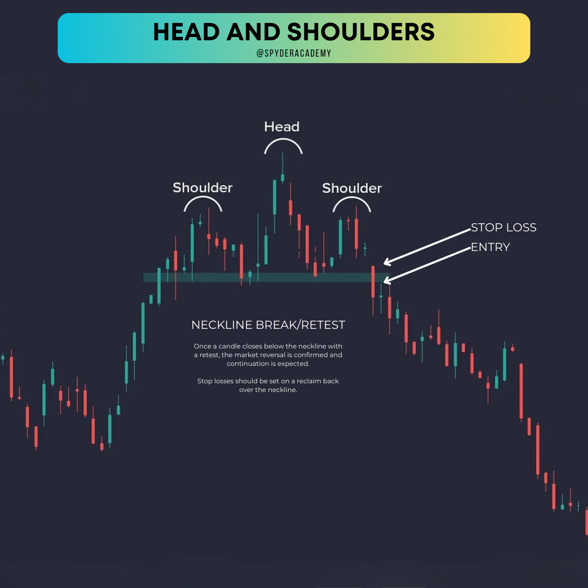
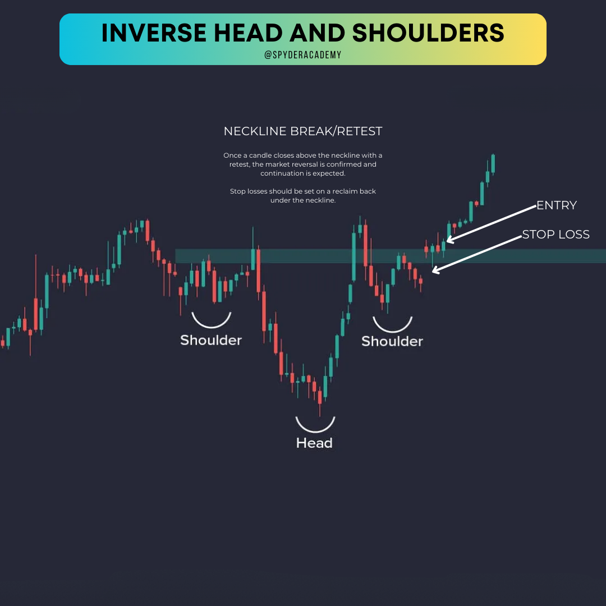

+++
author = "CashMoneyTrades"
title = "How to Trade the Head and Shoulders Pattern"
date = "2023-10-12T10:00:00"
description = "Mastering Market Reversals: A Guide to Trading the Head and Shoulders Pattern"
course = "TA 101"
time = "3 min"
tags = [
   "Strategies",
]
+++

Dive into the world of technical analysis as we unravel the Head and Shoulders pattern, a powerful signal for trend reversals, providing new traders with insights and statistics to navigate the complexities of chart patterns.

In the labyrinth of charts and candlesticks, a pattern emerges that tells a story of trend reversals and shifting market dynamics—the Head and Shoulders pattern. 

Picture this: a stock's journey resembles the silhouette of a person with three distinctive peaks and troughs, capturing the essence of a potential trend reversal.

## What is the Head and Shoulders Pattern?

The Head and Shoulders pattern is like the rockstar of trend reversal signals. It's all about spotting shifts in market sentiment. Imagine it as a three-peaked rollercoaster ride – you've got two lower peaks (the shoulders) sandwiching a higher peak (the head). It's the market's way of saying, "Hey, a trend change might be on the horizon!"

## The Anatomy of Head and Shoulders

Imagine the left shoulder as the beginning of doubt, a moment when the prevailing uptrend hesitates. The head marks a pinnacle, a point of euphoria or despair. Finally, the right shoulder signals confirmation, sealing the fate of the previous trend. It's a narrative etched into the price movements, waiting to be deciphered.

## How to Spot It?

1. **Left Shoulder:**
   - Picture an uptrend. That's where it all starts. The left shoulder forms as prices reach a peak and then pull back a bit. Normal stuff.

2. **Head:**
   - Now, the excitement kicks in. The market surges to a higher high. Boom! That's the head, baby! Bulls are partying, but keep an eye out for trouble.

3. **Right Shoulder:**
   - Here's the plot twist. The market rallies again but falls short of the head's high. That's your right shoulder, signaling a struggle. Uh-oh, things might be changing.

## What's the Big Deal?

When the neckline (the support line connecting the low points of the left and right shoulders) breaks, it's game on! If it breaks to the downside, it screams "Bearish Reversal." Breaks to the upside? "Bullish Reversal" dance party! 🐂💃

## Let's Break It Down with Examples:

### Example 1: Bearish Setup (Head and Shoulders)

In this example, we see a classic Head and Shoulders setup. The left shoulder and head form during an uptrend. The right shoulder struggles to reach the head's height. When the neckline breaks (red line), the market takes a dive. Bingo! Bearish reversal in action.

### Example 2: Bullish Twist (Inverse Head and Shoulders)

Now, flip the script. This time, the Head and Shoulders is signaling a bullish reversal. The left shoulder and head form during a downtrend. The right shoulder fails to reach the head's low. Breakthrough! When the neckline (green line) is breached to the upside, it's party time for the bulls.

## Tips for Trading Like a Pro:

1. **Confirmation is Key:**
   - Wait for that neckline to break before making any moves. Confirmation is your best friend.

2. **Volume Matters:**
   - Keep an eye on trading volumes. A breakout with high volume adds weight to the pattern.

3. **Target and Stop-Loss:**
   - Set realistic profit targets and protective stop-loss levels. Risk management is the name of the game.

## Statistics and Significance

1. **Accuracy in Reversals**: 

Statistically, the Head and Shoulders pattern is recognized for its accuracy in signaling trend reversals, offering traders a clear visual cue to anticipate shifts in market sentiment.

2. **Volume Confirmation**: 

An essential companion to the pattern is volume analysis. An increase in volume during the formation and breakout of the pattern adds weight to the validity of the reversal.

## Spyder Academy: Guiding the Way

In the pursuit of trading mastery, new traders find solace in education. Spyder Academy, committed to empowering traders, imparts knowledge to struggling traders, helping them decipher complex patterns and navigate the intricacies of technical analysis.

## Conclusion: Will You Recognize the Silhouette?

As you venture into the fascinating realm of technical analysis, the Head and Shoulders pattern becomes a beacon of insight. How will you use this storytelling chart pattern to identify potential trend reversals and make informed trading decisions? In the dance of the markets, recognizing the silhouette is the key to mastering the rhythm.

*Disclaimer: Trading involves risks, and understanding chart patterns is crucial for making informed decisions.*

