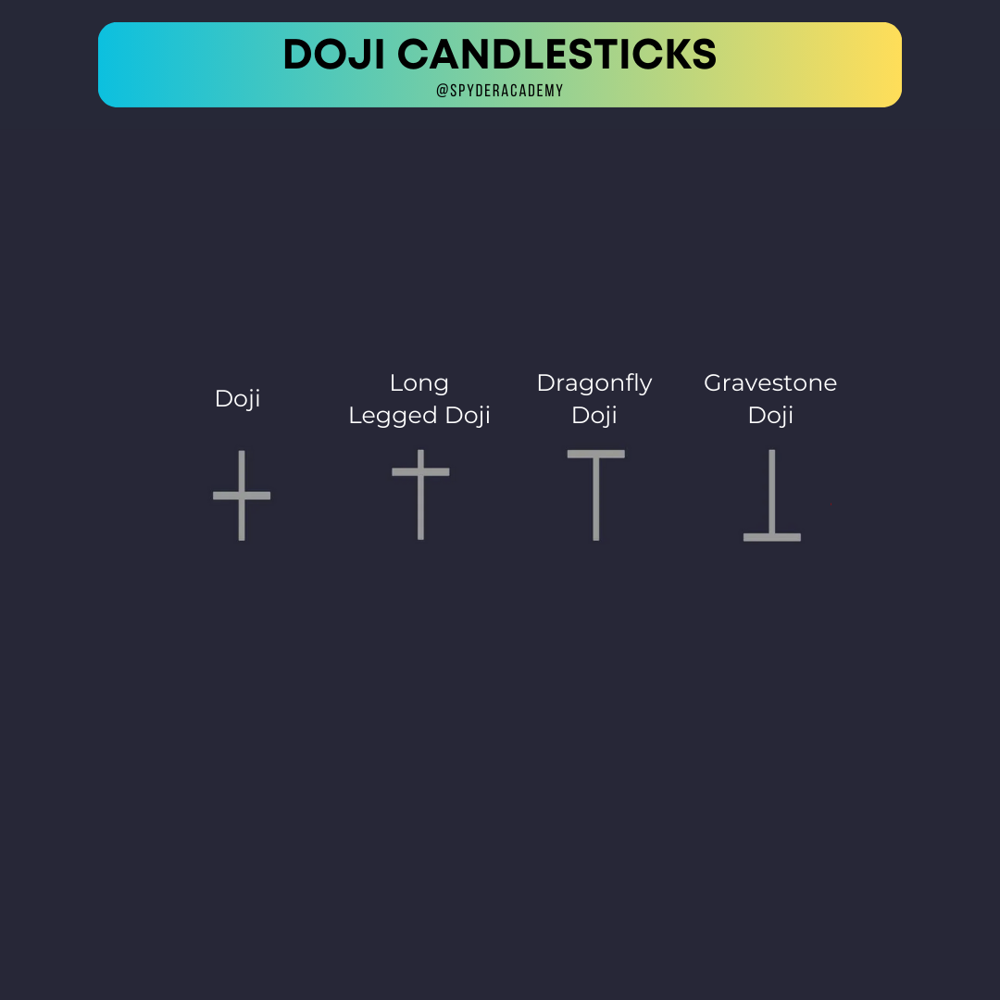
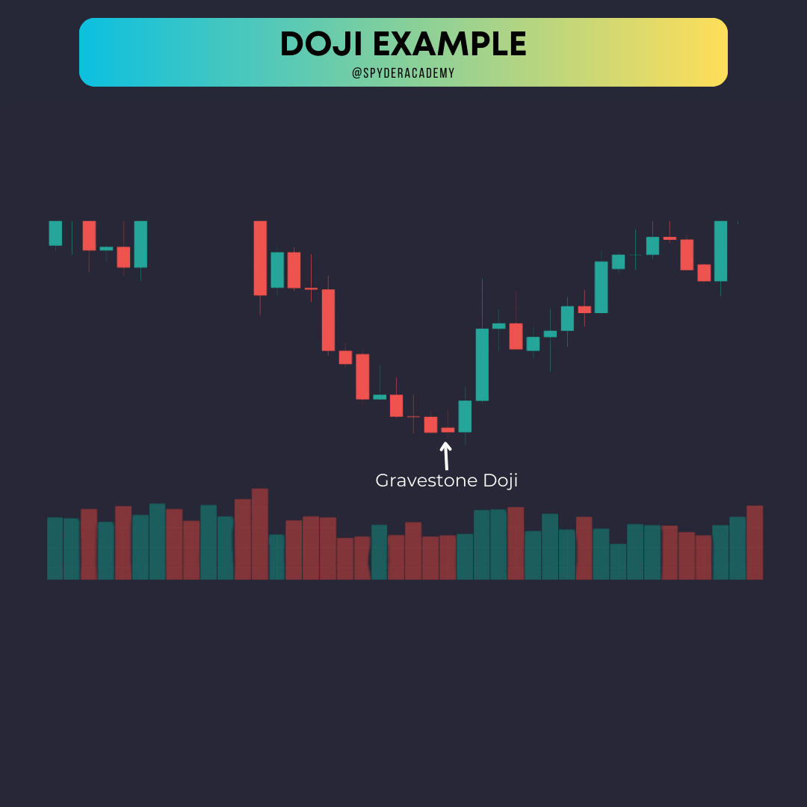

+++
author = "CashMoneyTrades"
title = "Unveiling the Secrets of the Doji - Gravestones and Dragonflies"
date = "2023-10-12T11:00:00"
description = "Explore the world of Doji candles and master the art of using Gravestones and Dragonflies for reversal signals. Learn how volume and key levels play a crucial role in your trading decisions."
course = "TA 101"
time = "2 min"
tags = [
   "Strategies",
]
+++

Hey fellow traders! 🕯️ Ready to dive into the fascinating realm of Doji candles? Today, we're unraveling the mysteries behind these small yet powerful candlestick patterns, with a special focus on Gravestone Dojis and Dragonfly Dojis. Get ready to decode signals and elevate your trading skills!

## Understanding Doji Candles

Doji candles are unique because they signify market indecision. These candles have open and close prices that are nearly equal, forming a cross-like shape. Traders often interpret them as a battle between bulls and bears, resulting in a potential reversal.

### Gravestone Doji

- **Appearance:** The Gravestone Doji has a long upper shadow and little to no lower shadow, resembling an upside-down "T" or tombstone.
- **Significance:** It suggests that buyers started strong but were overpowered by sellers by the close, indicating a potential bearish reversal when put in at highs.  A gravestone doji at lows can indicate sellers not able to push the price lower, and thus signal a reversal back up as a bottoming candle.

### Dragonfly Doji

- **Appearance:** The Dragonfly Doji has a long lower shadow and little to no upper shadow, resembling a dragonfly.
- **Significance:** It signals that sellers dominated early but were overcome by buyers by the close, hinting at a potential bullish reversal when put in at lows.  A dragonfly doji at highs usually signal that buyers couldnt push the price higher, thus becoming a topping candle and may indicate a reversal lower.

## Using Volume and Key Levels for Reversals

### 1. **Volume Analysis:**

- **Gravestone Doji:** 
  - High volume accompanying a Gravestone Doji reinforces the potential for a bearish reversal.
  - It indicates strong selling interest at higher levels.

- **Dragonfly Doji:** 
  - High volume alongside a Dragonfly Doji strengthens the case for a bullish reversal.
  - It shows strong buying interest, especially at lower price levels.

### 2. **Key Levels:**

- **Support and Resistance:**
  - Identify key support and resistance levels on your chart.
  - A Gravestone Doji near resistance or a Dragonfly Doji near support can strengthen reversal signals.

- **Yesterday High/Low:**
  - Check how the Doji interacts with yesterday's high or low.
  - A Gravestone Doji above yesterday's high or a Dragonfly Doji below yesterday's low enhances reversal probabilities.

## Real-Life Examples:

In the example, we see a Gravestone Doji forming near a resistance level, accompanied by increased volume. This combination suggests a potential bearish reversal. On the flip side, a Dragonfly Doji near a support level with surging volume indicates a possible bullish reversal.

## Tips for Trading Like a Pro:

1. **Confirmation is Key:**
   - Use Doji patterns as part of a comprehensive analysis, combining them with other indicators for confirmation.

2. **Risk Management:**
   - Set stop-loss and take-profit levels to manage your risk effectively.  Enter/Exit a trade based on a breach of the wicks of the doji candle.  Eg, you may consider entering long on price movement above the high of a doji (indecision breaking to the upside) with a stop if price breaks below the low of the doji.

3. **Stay Informed:**
   - Stay updated on market news and events that could impact your chosen assets.

## Wrapping Up:

There you have it – the insider's guide to Gravestone and Dragonfly Dojis! Mastering these candlestick patterns and incorporating volume and key levels into your analysis can significantly enhance your trading game. Dive into your charts, spot those Dojis, and let the signals guide you to potential reversals! Happy trading, candlestick wizards! 🕵️‍♂️📉📈

