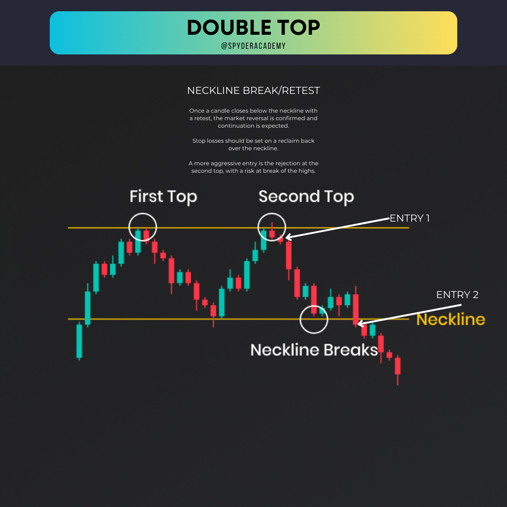
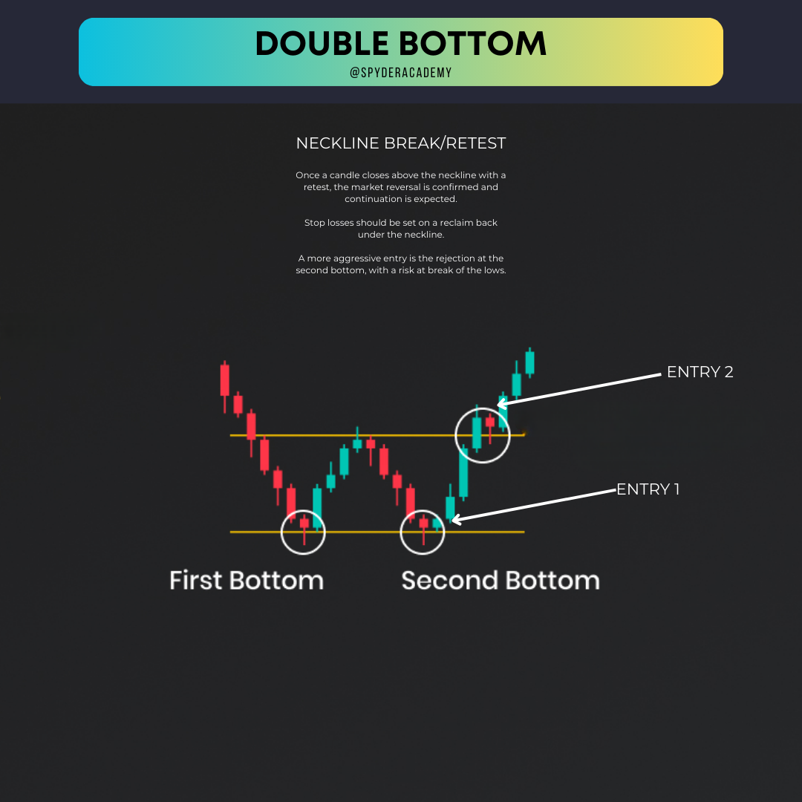

+++
author = "CashMoneyTrades"
title = "A Deep Dive into Double Tops and Double Bottoms"
date = "2023-10-12T11:00:00"
description = "Learn the secrets of trading with Double Tops and Double Bottoms. Spot trends, identify reversals, and up your trading game with real-life examples."
course = "TA 101"
time = "3 min"
tags = [
   "Strategies",
]
+++

Hey traders! 👋 Ready to uncover another powerful duo in the world of trading? Today, we're shedding light on the mysterious Double Tops and Double Bottoms – also known as Tweezer Tops and Tweezer Bottoms. Get ready for a ride through the highs and lows of the market!

## What’s the Buzz About?

Double Tops and Double Bottoms are like the dynamic duo of trend reversal patterns. They signal potential shifts in market direction, offering traders a heads-up for strategic moves. Picture it like a two-act play – you’ve got two peaks (Double Tops) or two troughs (Double Bottoms) standing out in the price action.

## How to Spot Them?

1. **Double Tops:**
   - Act one begins with an uptrend. The first peak forms as prices reach a high, then pull back. The market rallies again, creating the second peak, but can't surpass the first. It's like a market tug-of-war – bears stepping up!

2. **Double Bottoms:**
   - Cue act two with a downtrend. The first low point forms, followed by a bounce. The market slips again, forming the second low, but doesn't break the first. Bulls are putting up a fight!

## Why Should You Care?

When the neckline (the line connecting the lows for Double Tops or highs for Double Bottoms) breaks, it's showtime! A break below signals a potential bearish reversal, while a break above screams bullish vibes.

## Let’s Break It Down with Examples:

### Example 1: Bearish Double Tops 

In this scenario, we witness a classic Double Tops setup. The market rallies twice but fails to break the initial peak's height. When the neckline (red line) breaks, it's the bears taking center stage.

### Example 2: Bullish Double Bottoms

Now, flip the script! Double Bottoms indicate a potential bullish reversal. The market slips twice but fails to break the initial low. Breakthrough! When the neckline (green line) is breached upwards, it's time for the bulls to shine.

## Tips for Trading Like a Pro:

1. **Confirm the Break:**
   - Wait for that neckline to break before making your move. Patience pays off.

2. **Volume Matters:**
   - Keep an eye on trading volumes. A breakout with high volume adds weight to the pattern.

3. **Risk Management is Key:**
   - Set clear profit targets and protective stop-loss levels. Risk wisely to ride the waves.

## Wrapping Up:

And there you have it – Double Tops and Double Bottoms demystified! They're your partners in crime for spotting trend reversals. Remember, practice makes perfect, so go ahead and dive into the charts. Happy trading, legends! 🚀💸

