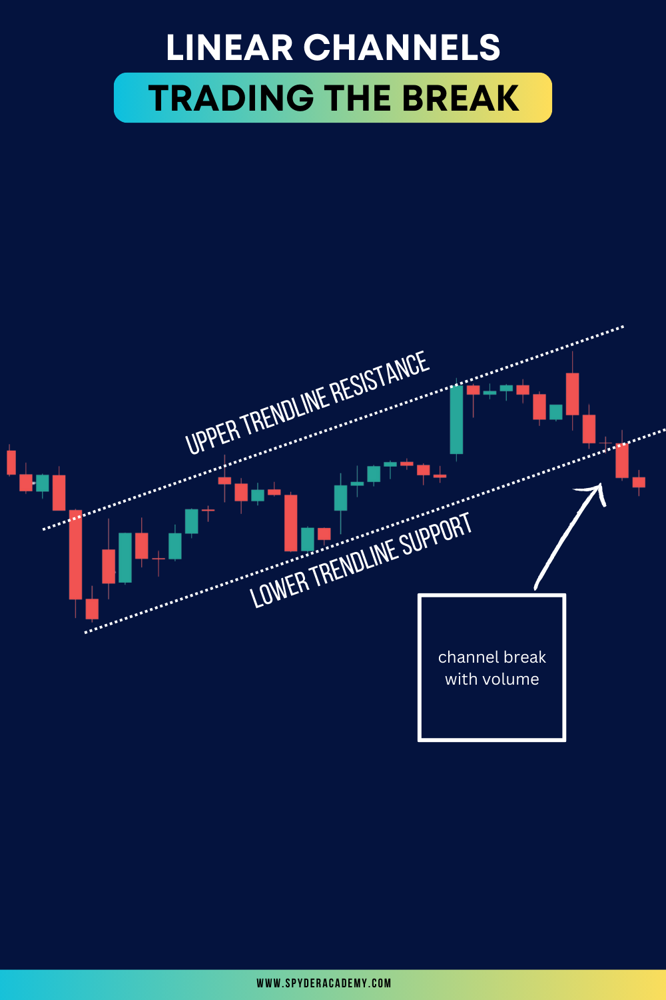

Linear Regression Channels are a powerful tool in the trader's toolkit, offering insights into trend direction, potential reversals, and areas of support and resistance. 

In this comprehensive guide, we'll explore how to effectively trade using Linear Regression Channels, covering their definition, calculation, trading strategies, and risk management.

## **Understanding Linear Regression Channels**

Linear Regression Channels are based on the linear regression trendline, which is a statistical tool used to identify the overall trend direction in a set of data points. 

The channels consist of three lines: the linear regression trendline in the middle and two parallel lines equidistant from it, forming a channel. These outer lines act as dynamic support and resistance levels.

## **How to Calculate Linear Regression Channels**

1. **Choose a Time Frame:** Select a specific time frame for your analysis, such as daily, weekly, or intraday.
2. **Apply Linear Regression:** Use the linear regression tool on your trading platform to generate the trendline.
3. **Construct Channels:** Draw parallel lines above and below the trendline, typically one or two standard deviations away.

## **Trading Strategies with Linear Regression Channels**

1. **Channel Breakout Strategy:**
   - **Buy Signal:** Enter a long position when the price breaks above the upper channel line with volume.  Seek confirmation of the [break out](/education/how-to-trade-the-break-hook-and-go/) with a candle close/continuation and volume.
   - **Sell Signal:** Enter a short position when the price breaks below the lower channel line.  Seek confirmation of the [break out](/education/how-to-trade-the-break-hook-and-go/) with a candle close/continuation and volume.

2. **Reversion to the Mean:**
   - **Buy Signal:** Initiate a long trade when the price touches or falls below the lower channel line, anticipating a move back to the mean.
   - **Sell Signal:** Initiate a short trade when the price touches or exceeds the upper channel line, expecting a reversion to the mean.

3. **Trend Confirmation:**
   - **Buy Signal:** Confirm an existing uptrend if prices consistently trade near or above the upper channel line.
   - **Sell Signal:** Confirm a downtrend if prices consistently trade near or below the lower channel line.

## **Risk Management with Linear Regression Channels**

1. **Set Stop-Loss Orders:** Place stop-loss orders below the lower channel line for long trades and above the upper channel line for short trades.
2. **Position Sizing:** Adjust position sizes based on the width of the channel to manage risk effectively.
3. **Confirmation Indicators:** Use additional indicators, such as RSI or MACD, to confirm signals from Linear Regression Channels.

## **Common Mistakes to Avoid**

1. **Ignoring Overall Market Conditions:** Consider broader market trends and conditions before relying solely on Linear Regression Channels.
2. **Overlooking Confirmation Signals:** Use other technical indicators to validate signals generated by Linear Regression Channels.
3. **Ignoring Fundamental Analysis:** Incorporate fundamental analysis to complement technical insights and enhance decision-making.

## **Conclusion - Empowering Your Trading Journey with Linear Regression Channels**

Linear Regression Channels offer a nuanced perspective on market trends and dynamics, providing traders with valuable information for making informed decisions. By mastering the calculation, understanding trading strategies, and implementing robust risk management, traders can harness the power of Linear Regression Channels to enhance their trading success.

