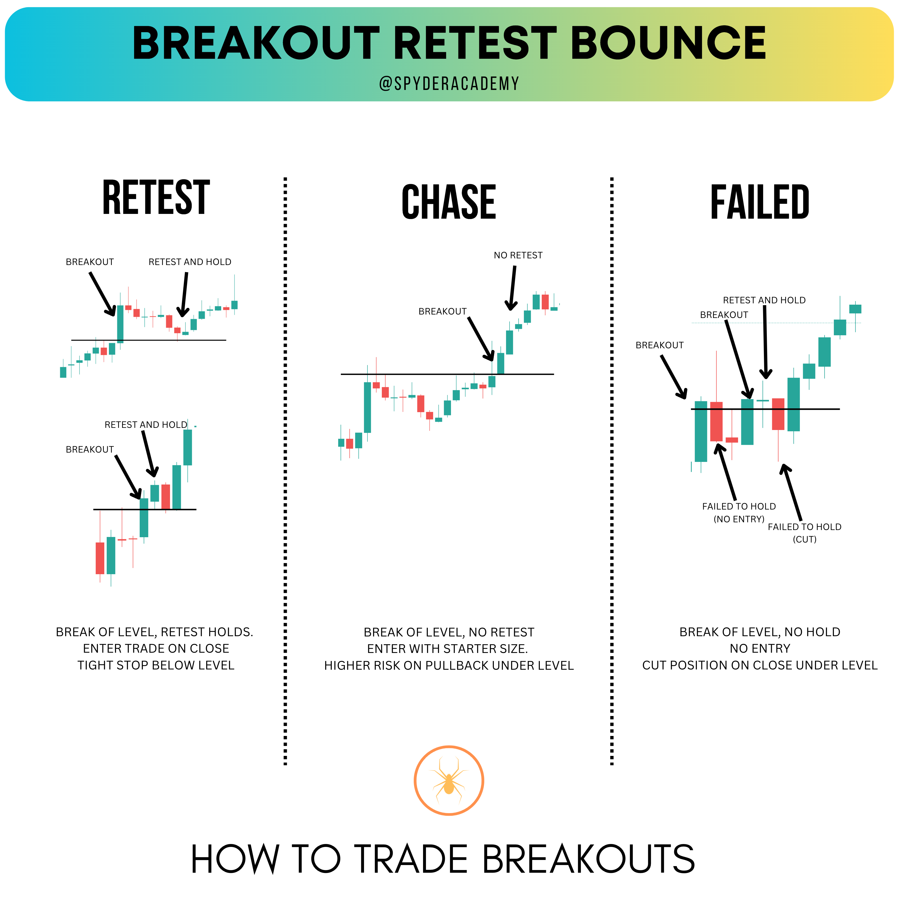

+++
author = "CashMoneyTrades"
title = "Mastering Break and Retest Strategies: The Break Hook and Go Technique"
date = "2023-05-29T09:00:00"
description = "Learn How to Excel in Break and Retest Trading with the Break Hook and Go Technique"
course = "TA 101"
time = "2 min"
tags = [
    "Strategies",
]
+++

The Break Hook and Go, often referred to as Breakout, Retest, and Bounce (BRB), is a powerful technique embraced by Break Traders, especially those who thrive in Break and Retest scenarios.

### Unveiling the Break (BREAK)

The Break represents a pivotal moment when price action decisively breaches a significant level (THE BREAKOUT). While many traders are tempted by breakouts, it comes with inherent risks. When you chase a breakout, your stop is often positioned further from the entry price, compromising your risk-to-reward ratio. In options trading, breakouts can trigger IV (Implied Volatility) spikes, leading to higher premiums.

In the image above, the candle breaks through the prior support line, resulting in a short burst of momentum followed by a swift reversal. Traders rushing to enter during the breakout phase often find themselves caught in reversals, causing stress during the trade. A more prudent approach is to await the retest of the level post-break.

### Navigating the Retest (HOOK)

After the initial breach of a support/resistance level, price action frequently retraces to retest this level, a phenomenon known as the Hook (or Retest).

In the depicted image, what once served as support is now breached. We patiently await confirmation that this level has transformed into resistance. Five candles after the breakout, price revisits the level, briefly overshooting it but ultimately closing below it, solidifying its role as resistance. Greater conviction emerges with the subsequent candle, as the level holds, and price direction shifts.

A strategic entry point at this juncture is as close as possible to the retested level, ideally upon its closure below it. Your stop should be positioned just above the level, accounting for the ticker's volatility at the time.

### Embracing the Bounce (GO)

Following the retest, it becomes imperative to monitor the level's resilience. Occasionally, price may dip below the level and close under it, negating the initial breakout. Conversely, if the level holds during the retest, and price begins to ascend (with the candle closing above the level again), it signifies the bounce and represents a secure entry point. Initially, position your stop just below the level, adjusting it as price moves in your favor to secure a win and maximize profits.

I typically permit the price to move to the next leg down before adjusting my stop to break even, accounting for volatility in the price action. As the trade progresses, I further adjust my stops based on my profit-taking objectives.

By mastering the Break Hook and Go technique, Break Traders can navigate break and retest trading scenarios with precision and confidence.
