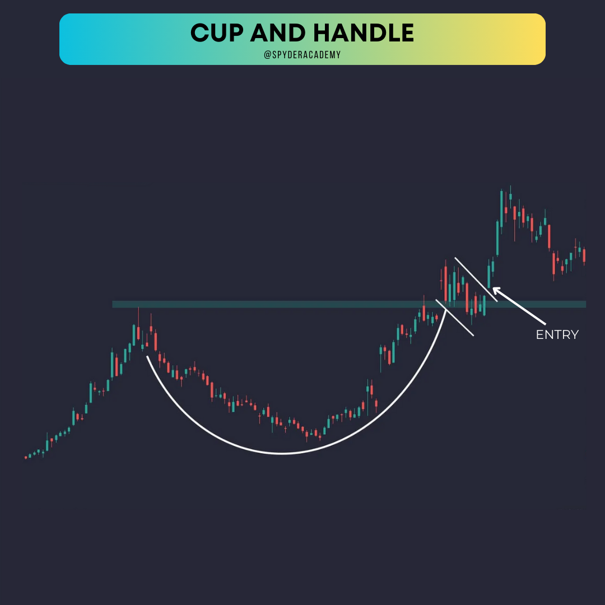

+++
author = "CashMoneyTrades"
title = "Learn how to Trade the Cup and Handle Pattern"
date = "2023-10-14T11:00:00"
description = "Mastering the Cup and Handle Patterns: A Trader's Comprehensive Guide"
course = "TA 101"
time = "4 min"
tags = [
   "Strategies",
]
+++

In this comprehensive guide, we'll dive into the fascinating world of the Cup and Handle pattern and explore how traders can leverage them for profitable outcomes.

Trading in the stock market is akin to navigating a dynamic landscape, and successful traders often employ various patterns to make informed decisions. One such pattern that's both popular and powerful is the Cup and Handle, complemented by its inverse counterpart. 

## Understanding the Cup and Handle Patterns

### The Cup and Its Secrets

The Cup and Handle pattern is a bullish continuation pattern, resembling the shape of a tea cup. It typically unfolds after a sustained uptrend and signals a temporary pause before the upward momentum resumes. Let's break down the components of this pattern:

#### 1. **The Cup Formation**

The cup takes shape as the price experiences a gradual decline, creating a rounded bottom. Traders look for a U-shaped curve, indicating a diminishing selling pressure. During this phase, diminishing volume suggests a lack of interest in further selling.

#### 2. **The Handle Emerges**

Following the cup's formation, there's a short consolidation period known as the handle. This phase usually involves a downward drift in prices, but the decline is not as pronounced as during the cup formation. Traders observe this period for signs of stabilization and prepare for a potential breakout.

### Trading the Cup and Handle

Trading the Cup and Handle pattern involves strategic entry and exit points. Here's a step-by-step guide:

#### Step 1: **Identification**

- Locate a Cup and Handle pattern on the price chart. Ensure the cup has a U-shaped bottom, and the handle is a relatively short consolidation.

#### Step 2: **Volume Confirmation**

- Confirm the pattern with decreasing volume during the cup formation and a slight increase in volume during the handle formation.

#### Step 3: **Entry Point**

- Enter a long position when the price breaks above the handle's resistance level. This breakout signals the potential continuation of the uptrend.

#### Step 4: **Stop-Loss and Target**

- Place a stop-loss just below the handle's support level to manage risk.
- Set a target based on the pattern's height. Measure the distance from the cup's bottom to the handle's breakout point and project it upward from the breakout.

### Inverse Cup and Handle: Turning the Tables

Just as the Cup and Handle is a bullish continuation pattern, its inverse, aptly named the Inverse Cup and Handle, is a bearish continuation pattern. Here's a quick overview:

#### **The Inverse Cup and Handle**

- The Inverse Cup and Handle forms after a downtrend, signaling a potential downtrend continuation.
- The pattern comprises an inverted U-shaped cup followed by a downward-sloping handle.

### Trading the Inverse Cup and Handle

The trading approach for the Inverse Cup and Handle is essentially the opposite of its counterpart:

#### Step 1: **Identification**

- Locate an Inverse Cup and Handle pattern on the price chart. Ensure the cup is inverted and followed by a downward-sloping handle.

#### Step 2: **Volume Confirmation**

- Confirm the pattern with decreasing volume during the inverted cup formation and a slight volume increase during the handle formation.

#### Step 3: **Entry Point**

- Enter a short position when the price breaks below the handle's support level. This breakout signals the potential continuation of the downtrend.

#### Step 4: **Stop-Loss and Target**

- Place a stop-loss just above the handle's resistance level.
- Set a target based on the pattern's height, measured from the cup's top to the handle's breakout point, and project it downward from the breakout.

## Real-Life Examples

Let's explore a couple of real-life examples to solidify our understanding:

### Example 1: Cup and Handle in Action

In this example, notice the U-shaped cup formation, followed by a short consolidation period forming the handle. The breakout above the handle signals an entry point, leading to a subsequent uptrend.

### Example 2: Inverse Cup and Handle Unveiled

Here, the inverted U-shaped cup is followed by a downward-sloping handle. The breakdown below the handle's support level serves as an entry point for a potential downtrend continuation.

## Conclusion

Mastering the Cup and Handle patterns, along with their inverse counterparts, adds valuable tools to a trader's arsenal. As with any trading strategy, risk management is crucial. Always use stop-loss orders and position sizes that align with your risk tolerance. Regular practice and observation of these patterns in different market conditions will enhance your ability to spot and trade them effectively.

Happy trading!
