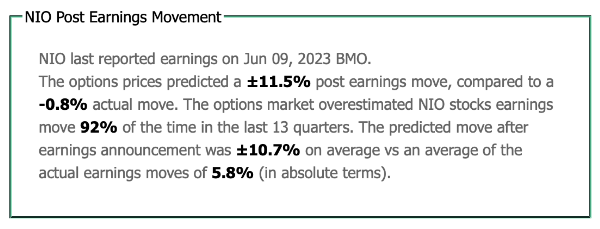
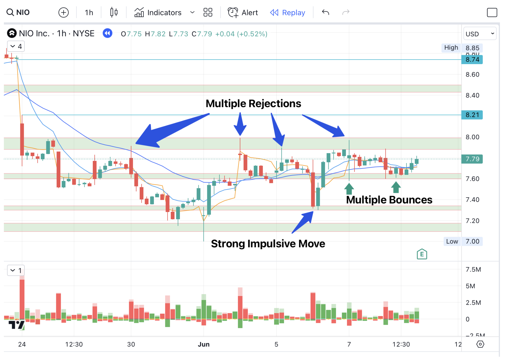
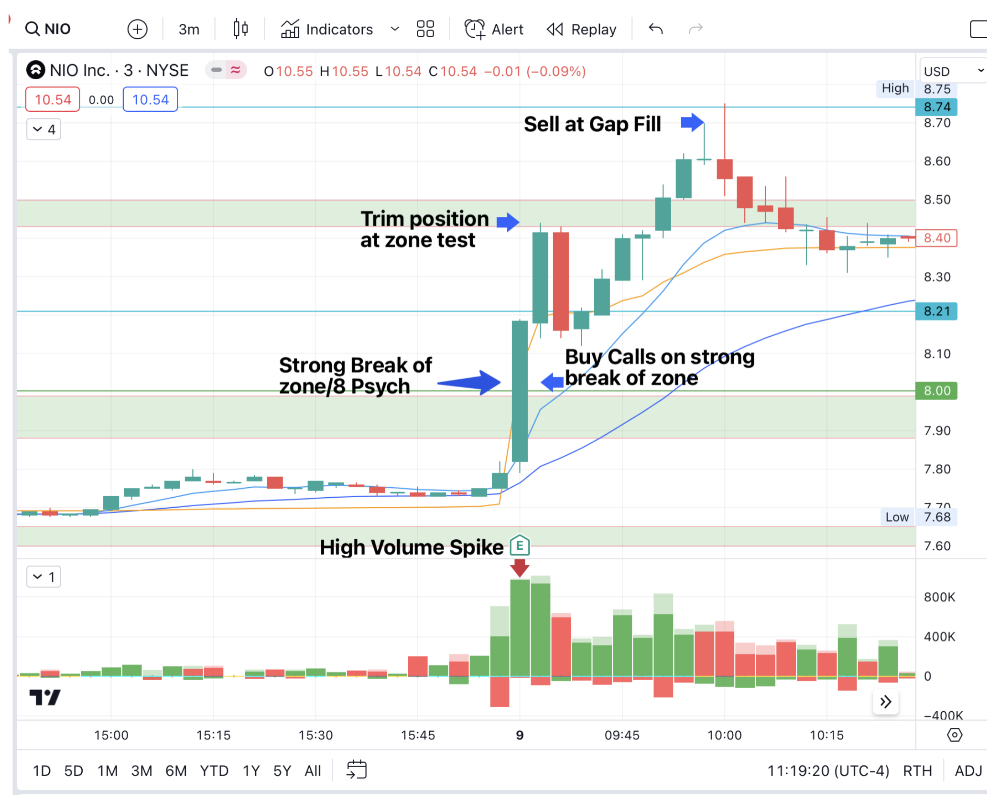

+++
author = "Link Snipes"
title = "How to Trade the IV Flush Strategy"
date = "2023-07-24T10:00:00"
description = "The IV Flush strategy takes advantage of the implied moves in options pricing."
course = "Trading Strategies"
time = "2 min"
tags = [
   "Strategies",
]
+++

## What is the IV Flush?

The IV flush is a unique strategy that revolves around companies quarterly earnings and trading after they report. 

_This strategy was originally taught by [The Real Nasa | Frog-Tzu](https://twitter.com/TheRealNasa00) who covers this strategy with his amazing [YouTube](https://www.youtube.com/@therealnasa0028/videos) content._

Because there is a binary event/catalyst (in this case earnings), the MMs price in an expected move post earnings based on previous data & calculated using option straddles. 

When the actual move is well below the expected or implied move, this presents the opportunity to play the IV flush. Reason being, both sides that were playing calls & puts prior to the earnings announcements are going to be down on their options positions. 

Off open, these players will want to sell their contracts for whatever they can get for them, giving us the chance to capitalize on these discounted premiums.

### Step 1: Find The Earnings Play Within The Implied Move

First step is to find out if the stocks actual move is within the implied move or not. 

Example - If the implied move is  &#177;8% and the actual is +9%, this is not something I would want to play. But if the actual is +2%, we would move onto the next step as a possible IV flush candidate. 

I typically go on [marketchameleon.com](https://marketchameleon.com) to see the implied move vs actual move. 

We can use NIO as our example moving forward, NIO had an actual move well within the implied move. 

Opening relatively flat around -0.8% vs the expected &#177;11.5%, this is the ideal candidate:
 

### Step 2: Identify Support & Resistance Zones

Once earnings drops, you will want to mark out your areas of interest - I like to plot support/resistance zones off of the hourly or 30m timeframes. 

There are a couple of things I keep in mind when plotting zones:

- Recent price action takes priority over older price action.
- Mark out areas that see multiple rejections and/or bounces
- Mark zones that had a big impulsive move in either direction
- Zones that have been [Break Hook & Go](/education/how-to-trade-the-break-hook-and-go/) are also good areas to have

## Step 3: Watch The Volume & Execute
Off open, the contracts will typically be spready. I do not recommend taking a trade if the spread is larger than 15-20%. 

The spread on the contracts will settle anywhere between 1-3 minutes on average. Using the 3m, watch how price and volume are reacting to the zones we’ve plotted out.

In the example with NIO, we are interested in calls once we see the $8 zone break and hold on the 3m. Also note the volume spiking as we’re breaking this zone, this is indicating that buyers are very strong pushing into the move. 

After seeing that we’re holding above this zone for 2 minutes, I grab calls as the contract spreads have settled and buying momentum still looks strong. 

The risk level would have been if we failed to hold above the $8 zone. Profits were taken at the next resistance zone around $8.40 and gap fill $8.74 for a 200%+ gain at peak.

