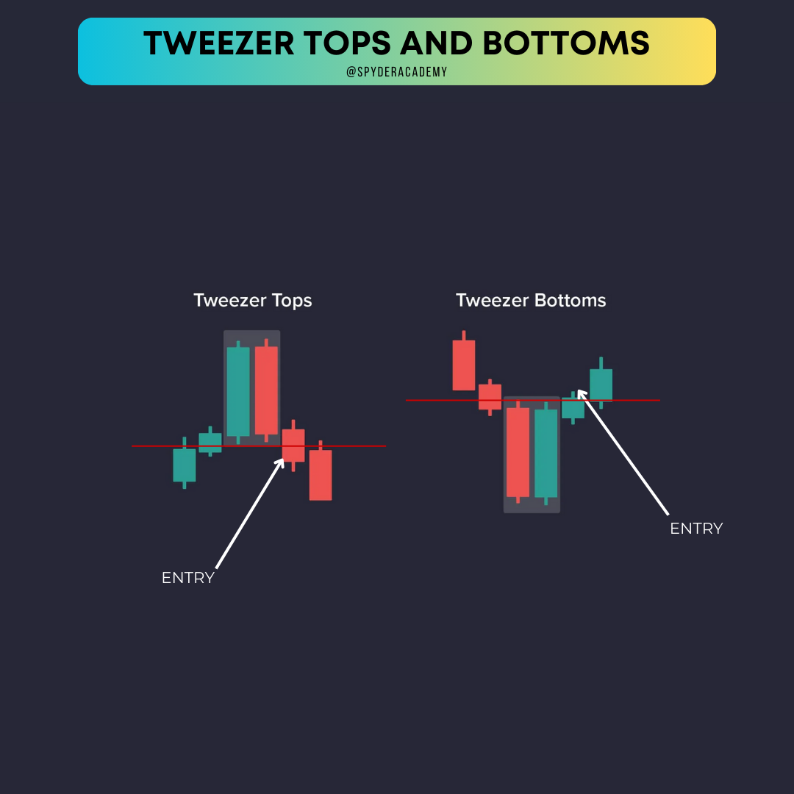

+++
author = "CashMoneyTrades"
title = "Learn how to Trade Tweezer Tops and Bottoms"
date = "2023-10-12T11:00:00"
description = "Unlock the secrets of Tweezer Tops and Bottoms. Learn to trade these powerful reversal patterns like a pro with real-life examples and practical tips."
course = "TA 101"
time = "2 min"
tags = [
   "Strategies",
]
+++

Hey traders! 👋 Ready to add some powerful tools to your trading arsenal? Today, we're delving into the fascinating world of Tweezer Tops and Tweezer Bottoms – the dynamic duo of reversal patterns. Get ready to decode market signals and elevate your trading game!

## What Are Tweezer Tops and Bottoms?

Tweezer Tops and Bottoms are candlestick patterns that signal potential trend reversals. They occur when two consecutive candles have matching highs (Tweezer Tops) or lows (Tweezer Bottoms), forming a distinctive shape resembling tweezers. These patterns suggest a shift in market sentiment – from bullish to bearish or vice versa.

## How to Trade Tweezer Tops:

1. **Spotting Tweezer Tops:**
   - Look for two consecutive candles with identical or nearly identical highs.
   - The first candle should have an established uptrend.

2. **Wait for Confirmation:**
   - Be patient and wait for the next candle to form.
   - A bearish candle following Tweezer Tops confirms the potential reversal.

3. **Execute Your Trade:**
   - Consider entering a short position (selling) as the bearish sentiment takes hold.
   - Set stop-loss and take-profit levels to manage your risk.

## How to Trade Tweezer Bottoms:

1. **Spotting Tweezer Bottoms:**
   - Identify two consecutive candles with identical or nearly identical lows.
   - The first candle should have an established downtrend.

2. **Wait for Confirmation:**
   - Be patient and wait for the next candle to form.
   - A bullish candle following Tweezer Bottoms confirms the potential reversal.

3. **Execute Your Trade:**
   - Consider entering a long position (buying) as the bullish sentiment takes over.
   - Set stop-loss and take-profit levels to manage your risk.

## Real-Life Examples:

### Tweezer Tops and Tweezer Bottoms:

In this example, we see Tweezer Tops forming after a strong uptrend. The identical highs signal potential exhaustion among buyers, and the following bearish candle confirms the reversal. Traders could enter short positions to capitalize on the bearish momentum.

In this Tweezer Bottoms example, the market is in a downtrend. The matching lows suggest a possible exhaustion of sellers, and the subsequent bullish candle confirms the reversal. Traders could consider entering long positions to ride the emerging bullish trend.

## Tips for Trading Like a Pro:

1. **Combine with Other Indicators:**
   - Use Tweezer patterns in conjunction with other technical indicators for added confirmation.

2. **Practice Risk Management:**
   - Set clear stop-loss and take-profit levels to manage your risk effectively.

3. **Stay Informed:**
   - Keep an eye on market news and events that could impact your chosen assets.

## Wrapping Up:

And there you have it – the insider's guide to trading Tweezer Tops and Bottoms. These patterns offer valuable insights into potential trend reversals. Dive into your charts, spot those tweezer formations, and let your trades tweeze out profits! Happy trading, trend tweezers! 📈💰

