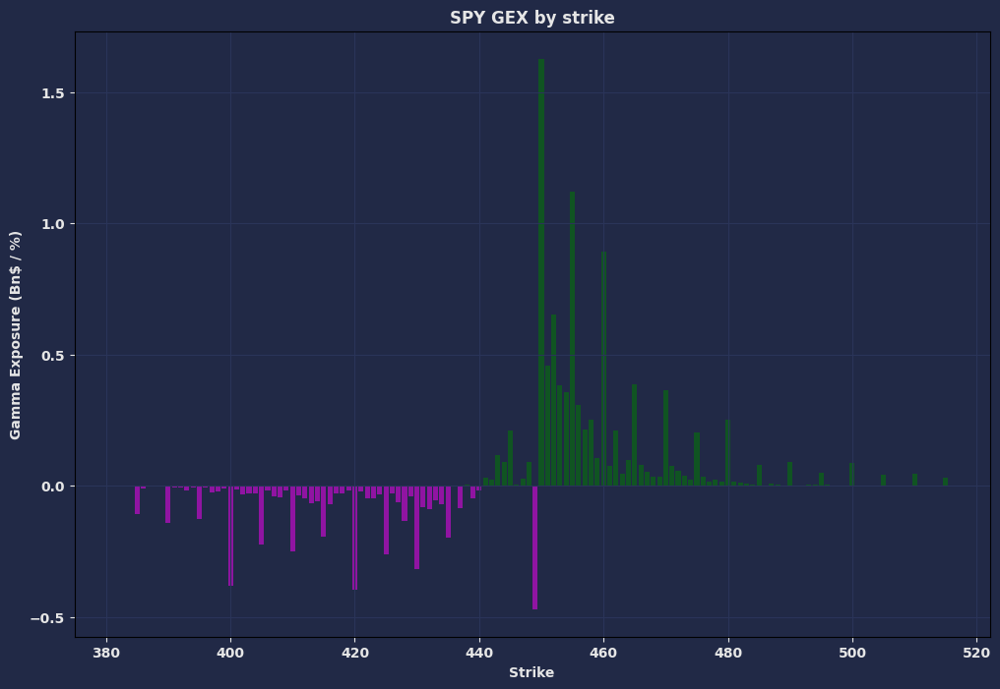
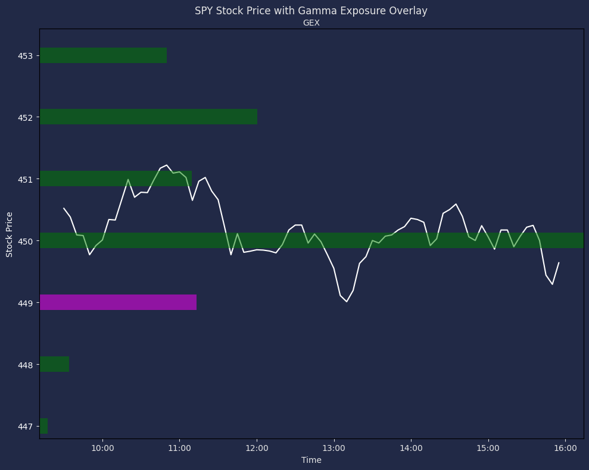

+++
author = "CashMoneyTrades"
title = "How to Trade using Gamma Exposure (GEX)"
date = "2023-10-15"
description = "What is Gamma Exposure (GEX) and how can it improve your trading?"
course = "TA 101"
time = "5 min"
tags = [
    "Getting Started",
]
+++

For traders venturing into the dynamic world of financial markets, understanding the intricacies of trading strategies is paramount. In this guide, we'll unravel the concepts of Delta Hedging and Gamma Exposure, shedding light on how these factors influence market dynamics and impact trading decisions.

## Delta Hedging and Market Liquidity:

Market makers play a pivotal role in providing liquidity and depth to financial markets. Delta hedging is their go-to strategy for managing directional risks associated with price changes in the underlying asset. As markets fluctuate, market makers adjust their risk exposure by trading the underlying asset, ensuring they maintain a balanced position.

## Understanding Structural Flows and Good Liquidity:

Structural flows are closely tied to the concept of good liquidity, characterized by tight spreads and abundant quotes on both sides of the order book. In liquid markets, market makers find it easier to reduce risk exposure through delta hedging. Liquidity, reflected in implied volatility, becomes a crucial factor. High liquidity results in lower implied volatility, making it challenging to move a liquid market. Conversely, low liquidity leads to higher implied volatility, allowing large trades to impact the market significantly.

## Exploring Gamma and Its Relationship with Delta Hedging:

[Gamma, Vanna, and Charm](/education/five-greeks-you-need-to-know-with-options-trading/) are second-order Greeks that gauge the sensitivity of first-order Greeks to changes in underlying factors. Gamma, the focus of this guide, measures the change in delta concerning the underlying price. Understanding gamma is essential for reading structural flows in the market, enabling traders to anticipate potential delta-hedging activities by market makers.

## Long Gamma vs. Short Gamma Positions:

Long gamma and short gamma describe the positions taken by participants. When market makers are long gamma, they have positive gamma exposure, stabilizing the market by buying during price decreases and selling during price increases. Conversely, short gamma positions involve market makers buying during price increases and selling during price decreases, intensifying moves in the underlying asset.

## Net Gamma Exposure Tool:

Traders can leverage tools like the [Net Gamma Exposure tool](/tools/gamma-exposure/) on the Spyder Academy platform to read near real-time gamma positioning in the market. This provides a deeper understanding of structural flows, offering valuable insights into the market's current state and potential future movements.


### Gamma Exposure Tool in the Spyder Academy Discord

In the Spyder Academy Discord Classroom, type ```/gex chart TICKER```, replacing `TICKER` with the ticker you are analyzing.

For Example, typing ```/gex chart SPY``` will result in the following chart being returned (Nov 15, 2023):



This chart shows the Net Gamma Exposure for all options contracts for SPY at the current point in time.  The GREEN bars represent NET CALL GAMMA, while the magenta bars represent NET PUT GAMMA.

Call Gamma is bullish and means that most participants in the market have positions that ideally move towards that particular price level.

Put Gamma is bearish, and means that most market participants want to drive the underlying price of the ticker down to that level.

Thus, these Gamma Levels tend to act as a magnet for price movement.

### Gamma Exposure Overlay

In the chart above, you can see the highest gamma levels are at $450 for SPY.  The gamma levels shrink as you move away from the price, and put gamma starts to increase below that price.  Thus the underlying price will naturally be drawn to that $450 level as that is what the big market makers are betting on.

How does this look if we overlay the Gamma Exposure levels over the stock chart for SPY?



Here, you can see the SPY underlying price opened above teh $450 level, and initially moved down to it before bouncing off near that level.  It found resistance near the $451 strike price, and then started to make a move back towards $450 where it consolidated for much of the day.  

Typically, as market participants start covering their positions, the underlying price will start to move away from that level depending on how aggressively their positions are being covered.

Although the largest Gamma Exposure levels act as a magnet, it is not a guarantee that the price of the underlying will trade at that level on that day.  It can be a magnet to move the price in that direction.  Sometimes other news events can overwhelm and move the stock price in the opposite direction.  In such cases, you can see the Open Interest on these contracts reduce rapidly if the move away is strong as market partipants aggressively cover to get out of their positions.

However, if price does start moving towards the largest GEX levels, then these levels can provide targets for the entire move, while you trim along the way to that magnet level.

### The Math

Gamma Exposure is calculated using the following formula:

```spot * spot * gamma * open_interest * contract_size * 0.01```

We then add up all Call and Put Gamma at each strike level, and present the net Gamma Exposure for that level.

### Other Sources for GEX Data

If you don't have access to Gamma Exposure at Spyder Academy, dont fret! Just [become a member](/#services) and you get access to it!  Alternatively, there are a few other data providers who offer Gamma Exposure Levels.

#### Black Box Stocks
Check out [Black Box Stocks](http://staygreen.blackboxstocks.com/SHJG)!  They have a great video on Gamma Exposure too!  

<iframe width="560" height="315" src="https://www.youtube.com/embed/w2UiOck37_A?si=DsUSfGVSuHAQWBWe" title="YouTube video player" frameborder="0" allow="accelerometer; autoplay; clipboard-write; encrypted-media; gyroscope; picture-in-picture; web-share" allowfullscreen></iframe>

#### Unusual Whales
[Unusual Whales](https://www.unusualwhales.com) is another trader favorite and lets you slice and dice Gamma Exposure in different ways!


## Conclusion

🧲 Positive GEX at a strike can act like a magnet, drawing stock prices and stabilizing them. Market makers tend to buy more of the underlying if it rises, and sell if it drops. The real magic of GEX is predicting price behaviors!

⚖️ On the flip side, negative GEX can mean a rollercoaster ride 🎢! As we approach these levels, volatility might spike. Market makers could sell more if prices drop and buy if they rise, adding to the swings.

🚨 GEX offers valuable insights, but many factors influence stock/index movements. Always use GEX alongside other tools & analyses. Remember, no single indicator tells the whole story! 📚