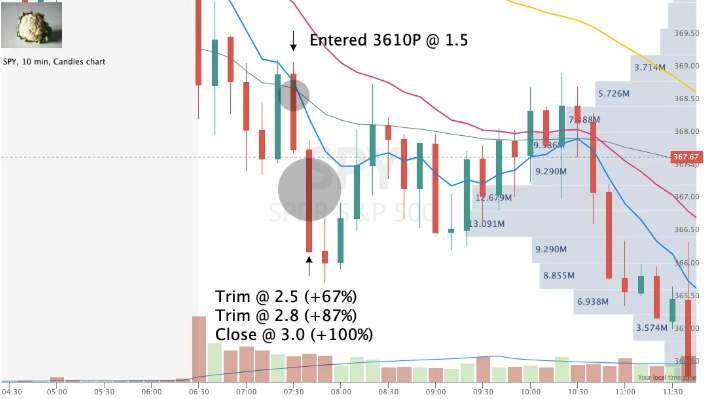

+++
author = "Gobi Calls"
title = "Mastering the Art of Trading with Moving Average Crossovers"
date = "2023-05-25T10:00:00"
description = "Unlocking Success with the 9/21/50 EMA Moving Average Crossover Strategy"
tags = [
   "Getting Started",
   "Strategies",
]
+++

## A Guide to Moving Average Crossovers

In the world of trading, finding the right strategies can be a game-changer. One such strategy that holds significant promise is the Moving Average Crossover, and in this guide, we'll delve into its intricacies, particularly the 9/21/50 EMA (Exponential Moving Average) variant. Whether you're a novice or an experienced trader, understanding this powerful tool can make a substantial difference in your trading journey.

### Unveiling Moving Average Crossovers

Let's begin by demystifying the concept of Moving Average Crossovers, focusing on the exponential moving average (EMA). EMA, which stands for exponential moving average, may sound similar to its counterpart, the simple moving average (SMA). Both EMAs and SMAs measure trend direction over a specified period of time. However, EMA distinguishes itself by assigning more weight to recent price data, making it a top choice among day traders for its agility in responding to price changes.

### The Role of 9 and 21 EMA in Day Trading

In day trading, specificity matters, and that's where the 9 and 21 EMA settings come into play. The 9 EMA represents the average price over the previous 9 periods, while the 21 EMA calculates the average over the past 21 periods. These particular settings hold value because they excel at identifying short-term price trends and potential reversal points.

### Leveraging EMAs in Day Trading

Unlocking the full potential of EMAs involves mastering their application:

- **Identifying Trends**: The relationship between the 9 EMA and the 21 EMA serves as a valuable indicator of the current trend. When the 9 EMA resides above the 21 EMA, it often signals an uptrend, while the reverse suggests a downtrend. In a nutshell, 8 EMA < 21 EMA < 50 EMA equates to a robust bearish trend, while 8 EMA > 21 EMA > 50 EMA signifies a robust bullish trend.

- **Spotting Reversals**: Keep a watchful eye on the crossovers of the 9 and 21 EMA lines, as they can hint at potential trend reversals. A bullish crossover occurs when the 9 EMA crosses above the 21 EMA, indicating a potential long entry point. Conversely, a bearish crossover unfolds when the 9 EMA crosses below the 21 EMA, signaling a potential short entry opportunity.

- **Assessing Trend Strength**: The gap between the 9 and 21 EMA can provide insights into the strength of the prevailing trend. A wider gap signifies a stronger trend, while a narrowing gap may indicate weakening momentum and a possible reversal on the horizon.

### Real-World Application

Here's an example chart featuring the 9, 21, and 50 EMAs:

- The blue line represents the 9EMA, the pink line signifies the 21EMA, and the yellow line denotes the 50EMA.

- This chart illustrates a classic scenario of retracement to the 9EMA before a decisive rejection and continued downward movement.

- Consider entering a trade after the testing candle closes, confirming the desired rejection, and trimming your position during the descent. (Remember, always trim into strength.)

- Regarding stops, a close above the EMAs would invalidate the trade.

### Embrace Risk Management

While the 9, 21, and 50 EMA strategy can be a potent tool, it's essential to recognize that no strategy is foolproof. False signals can and will occur. Therefore, it's crucial to implement a robust risk management plan. This plan should encompass setting stop-loss levels and pre-determining how much you're willing to risk on any single trade.

In conclusion, mastering Moving Average Crossovers, especially the 9/21/50 EMA variant, can significantly enhance your trading prowess. Remember that practice and continuous learning are key to success in the dynamic world of trading. Incorporate these strategies into your toolkit, and adapt them to suit your unique trading style for optimal results.

Start your journey with Moving Average Crossovers today and open doors to informed and profitable trading decisions.
