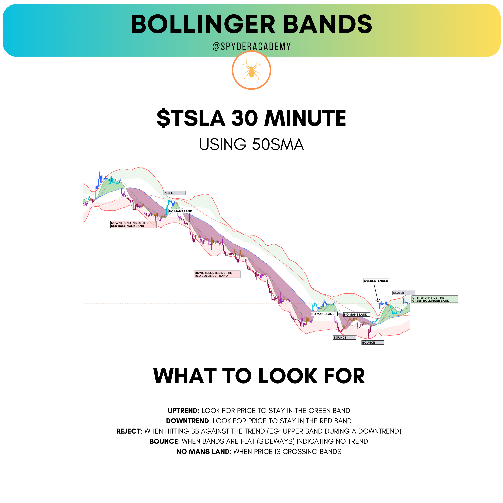

+++
author = "CashMoneyTrades"
title = "How To Trade With Bollinger Bands"
date = "2023-07-31T00:00:00"
description = "Bollinger Bands are a popular technical indicator used by traders to identify potential buying and selling opportunities in the market."
course = "TA 101"
tags = [
    "Getting Started",
]

+++

Bollinger Bands are a popular technical indicator used by traders to identify potential buying and selling opportunities in the market.

Developed by John Bollinger in the 1980s, the indicator consists of a moving average, and two standard deviation lines plotted at a set distance above and below the moving average.

When trading [The System](/education/strategy-thesystem/) + [ORB](/education/openingrangebreakout/) strategies together ([SORBET](/education/strategy-sorbet/)), I have been using the 50-day simple moving average (SMA) on the 30 minute chart from The System to determine my Bollinger Bands.

You can use it similar to how we treat the 100 point extended line on SPX using The System where we say its time to take profits.

## IDENTIFYING OVERBOUGHT / OVERSOLD

When using Bollinger Bands, it’s important to keep in mind that the market tends to stay within the boundaries of the 1 standard deviation line and the 2 standard deviation line. This means that when price is trading between the two lines, it’s considered to be in a “normal” state.

If price breaks through the 1 standard deviation line and trades above or below the 2 standard deviation line, it’s considered to be in an “overbought” or “oversold” state.

## TRADING THE TREND

One strategy for trading with Bollinger Bands is to look for buying opportunities when price is trading near the lower band and selling opportunities when price is trading near the upper band. This is because, when price is trading near the lower band, it’s considered to be oversold and may be due for a rebound. On the other hand, when price is trading near the upper band, it’s considered to be overbought and may be due for a pullback.

Another strategy is to trade with the trend using the bands: when price is between 1 standard deviation and 2 standard deviation, it’s considered to be trending, and we can trade in the same direction of that trend with the help of the bands.

## OUTSIDE THE BANDS

It’s also important to note that price can and often does trade outside of the Bollinger Bands. This can happen during strong trending markets or during times of high volatility. When price breaks outside of the bands, it’s a sign that the market is either unusually bullish or bearish.

## HOW TO SET UP YOUR CHART

If using TradingView, you can add their stock Bollinger Band indicator. Set the length field to 50 to use the 50sma on a 30 minute chart. If you trade on a 5 minute chart, and want to use the same 50sma from the 30min, then you will need to set the length field to 300.

## SUMMARY

It’s important to consider other indicator, price action and fundamentals to confirm the signal we getting from the Bollinger Bands.

In summary, Bollinger Bands are a useful tool for traders to identify potential buying and selling opportunities in the market. By looking for buying opportunities when price is trading near the lower band and selling opportunities when price is trading near the upper band, and also trade with the trend between the 1 standard deviation and 2 standard deviation bands, traders can improve their chances of success in the market.

