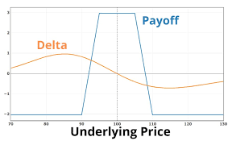
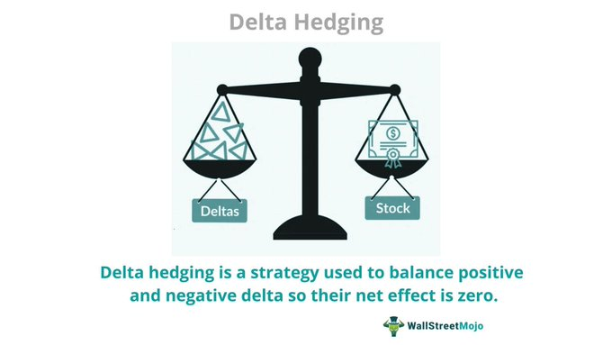
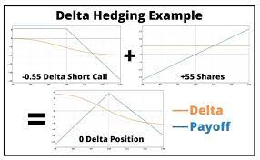
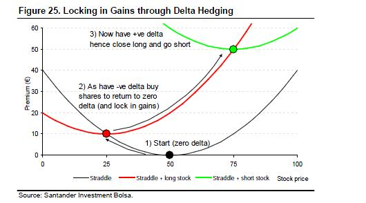
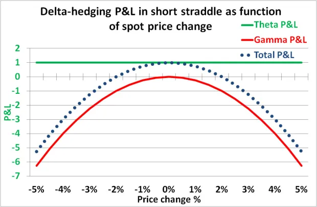
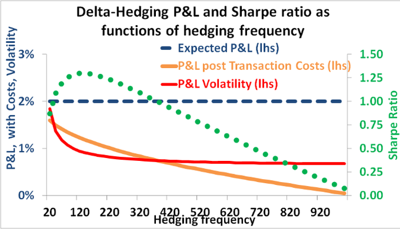

+++
author = "Pauldozer"
title = "Mastering Delta Hedging"
date = "2023-07-26T00:00:00"
description = "Minimize Risk, Profit from Volatility, and Unleash the Potential of Delta Hedging!"
tags = [
    "Getting Started",
]

+++

Options trading is a realm of possibilities, where risk and reward dance hand in hand. Among the many strategies available, one stands out for its advanced risk management capabilities: 

**Delta Hedging**. 
This powerful technique allows traders to navigate the treacherous waters of price movements in the underlying asset while capitalizing on volatility. 

In this post, we'll unlock the secrets of Delta Hedging and explore its intricacies to help you make informed decisions in your trading journey.

## Understanding Delta
Delta is a crucial metric in options trading, representing the relationship between an option's price and the underlying asset's price. A delta of 0.5, for instance, means that the option's price changes by $0.50 for every $1 move in the underlying asset. 

As enticing as this may sound, it also brings risks, as the option holder could face losses if the asset moves unfavorably.

## Delta Hedging in a Nutshell
Enter Delta Hedging—the superhero of risk management strategies! This technique involves taking an opposing position in the underlying asset compared to your options contract.

When you go long on an option, you go short on the asset, and vice versa. It's a strategic dance of balance between the two.

## The Hedge at Work
Imagine you've sold a call option (short call) with a delta of -0.55. In this case, for every $1 increase in the underlying asset's price, the value of your short call position decreases by $0.55. 

To hedge this risk, you would go long on the underlying asset by purchasing 55 shares for each option contract you sold. 

Now, if the asset's price increases, your losses on the short call are offset by the gains on the shares you bought.

## The Art of Rebalancing
Delta isn't a constant; it morphs as the underlying asset's price changes. Therefore, you'll need to be vigilant and adjust your hedge over time through a process called rebalancing. 

This is the secret to maintaining the delicate balance of your delta hedge, ensuring your risk management remains on point.

## Is Delta Hedging for You?
As with any powerful tool, there are nuances to consider. Delta hedging may not be the best fit for traders with small accounts due to high transaction costs and the need for significant capital to hold a substantial position in the underlying asset. 

Additionally, this strategy demands a solid grasp of options trading, as missteps can lead to substantial losses. 

While delta hedging offers significant advantages for large portfolios, it may add more risk and cost for smaller accounts.

## Conclusion
Delta Hedging stands tall as a versatile risk management strategy in the world of options trading. 

By understanding the dynamics of delta, mastering the art of rebalancing, and carefully considering your account size and trading expertise, you can harness the full potential of this powerful technique. 

Embrace the balance, navigate volatility, and let Delta Hedging be your ally on your journey to trading success!
