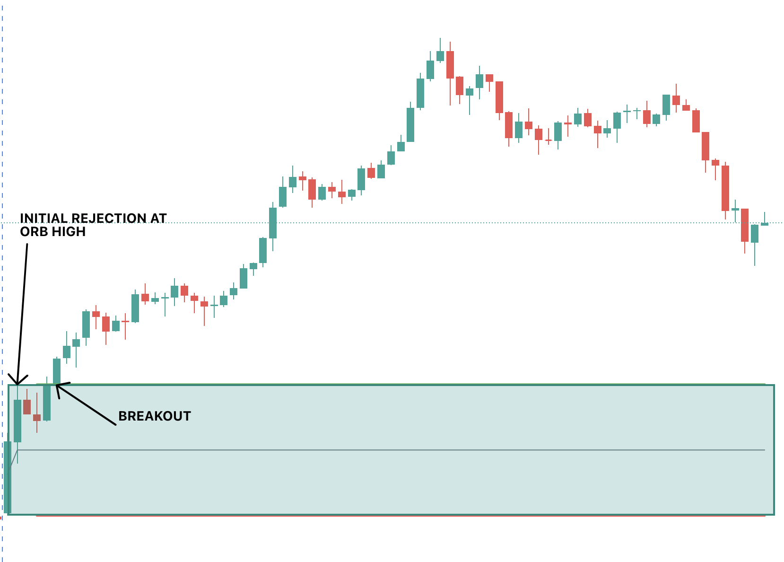
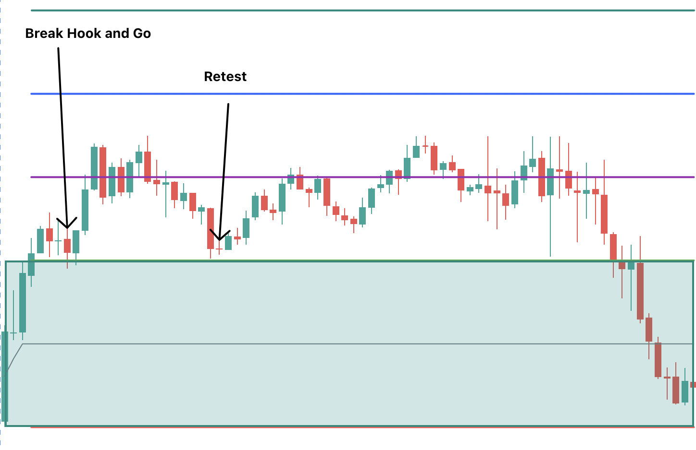

+++
author = "CashMoneyTrades"
title = "Unlocking the Secrets of the Opening Range: Master Your Trading Strategy"
date = "2023-05-29T09:00:00"
description = "In this article, we will unveil the hidden secrets of the opening range and provide you with the tools and knowledge to become a master of your own trading strategy using the Opening Range Breakout (ORB). "
course = "Trading Strategies"
time = "5 min"
tags = [
    "Strategies",
]
+++

Welcome to "Unlocking the Secrets of the Opening Range: Master Your Trading Strategy", where we dive deep into the fascinating world of trading and show you how to leverage the opening range to optimize your investment decisions. 

In this article, we will unveil the hidden secrets of the opening range and provide you with the tools and knowledge to become a master of your own trading strategy. 

Whether you are a seasoned investor looking to refine your approach or a novice trader seeking to understand the fundamentals, this article is designed to be your comprehensive guide. 

We will explore the significance of the opening range, how to identify its key levels, and the strategies you can implement to capitalize on this crucial time window in the market. 

With expert insights and real-life examples, we will demystify the opening range so that you can make informed trading decisions. 

By the end of this article, you will have the confidence to navigate the opening range with ease, unlocking new opportunities and maximizing your trading profits. 

Join us on this enlightening journey as we uncover the mysteries of the opening range and empower you to take control of your trading destiny.

#### What Is The Opening Range In Trading?

The **Opening Range Breakout (ORB) Strategy** is a commonly used strategy where levels of support and resistance for the day are determined from the opening period. The direction for the day is often set at the opening bell - whether it is an uptrend, downtrend, or sideways day.

The **15 minute ORB Strategy** is determined by using the High and Low from the first 15 minutes of the regular session (930am - 945am ET), but there are others who have successfully traded with a 5 minute ORB or even a 30 minute ORB strategy.

What we have found is that the price of a security will tend to retest and bounce and breakout from these opening highs and lows.  You can take advantage of that price action by setting those levels on your charting software and triggering Calls or Puts when those levels cross with volume or are retested.

Whats more, the 50% and 100% levels from the ORB range also tend to attract the price and become S/R levels themselves.  This gives you a good Profit Target area to guide when you should exit an options contract.



#### Key components of the opening range

The opening range consists of several key components that traders should be aware of. These components provide valuable insights into the market's behavior and can be used to develop effective trading strategies. At Spyder Academy, we will usually look at the 15 minute Opening Range.

1. **Opening Price**: The price at which the first trade occurs after the market opens. It sets the initial reference point for the trading session and can influence subsequent price movements.
2. **High and low of the opening range**: The highest and lowest prices reached during the opening range. These levels serve as important support and resistance levels and can help traders identify potential breakout opportunities.
3. **Volume**: The number of shares or contracts traded during the opening range. High volume during this period indicates strong participation and can confirm the validity of price movements.

Understanding these key components and their interplay is crucial for successfully navigating the opening range and making informed trading decisions.

#### Tools and Indicators for analyzing the Opening Range

If you use [TradingView](https://www.tradingview.com/gopro/?share_your_love=amitgandhinz), you can integrate the best (and free) [ORB indicator](https://www.tradingview.com/script/ZpONAzhm-ORB-with-Price-Targets/) directly into your charts, created by our very own CashMoneyTrades.  The ORB Strategy Indicator will automatically plot the high and low opening range lines (optionally shaded), and plot the Price Targets.

{}
  Don't Trade ORB Alone. 
  Join us at Spyder Academy where we teach how to trade the ORB every day! 
  <a class="btn btn-lg btn-block btn-secondary mt-1" style="border-radius: 0.5em; max-width: 250px" href="https://whop.com/checkout/plan_bCMjkbQ9TJsN2?d2c=true">Trade Together</a>
{}

#### Case studies and examples of successful opening range trades

Here are some examples of where ORB levels have played out beautifully.

#### Strategies for Trading the Opening Range Breakout

In these examples, I will be referring to the 15 minute opening range.  But you can apply these same principles to any of the other time ranges (5min, 15min, 30min).

To trade the Opening Range Breakout strategy, you want to allow the market to settle down for the first 15 minutes.  You will often get a lot of volatility at the open, so this allows you to sit out the craziness of the opening bell and let the direction work itself out.  Once the first 15 minutes are up, game on.

You can trade the ORB strategy on any timeframe, but I recommend the 1m, 3m, or 5m.  The 3m or 5m helps avoid the fakeouts a bit more in my opinion.  Whichever timeframe you choose, you want to make sure your confirmation is a candle close over the ORB level and then enter on the retest with a stop on a cndle close below the level. 

There are two ways to play the Opening Range breakout.

##### 1.  Break with Volume

Look for a break of the opening range level (lets say the high of the opening range in this example).  You want the level to break with significant relative volume, supported with the price action of the underlying stock.  If you have a strong break of the level, you can enter a CALL position at this time. This can be considered riskier as if the volume doesnt continue, the price could move against you.  If you do enter on a break with volume, you want to ensure you have a suitable Stop Loss in place - usually just below the ORB High level - so you can minimize losses if it moves against you.

##### 2.  Wait for a Retest Bounce

A safer approach is to wait for a retest after the initial breakout, and confirmation of a bounce.  After the initial break, often the stock will retrace to the ORB High level (in the case of bullish direction).  You can enter on the retest and hold of that ORB High level, with a Stop Loss just below the ORB High.  

This approach allows you to stop out with minimal losses if the ORB High level does not hold.  We have often seen retests like these propel a stock to new daily highs.

If the neckline for the retest was pretty close to the ORB level, then you can be safer more by waiting for that neckline to break.

In both of these scenarios, it is critical to ensure the volume is telling the story.  If there is a lack of volume to push the stock higher, then its likely to not carry to new highs.

#### How to identify Strong Breakouts

A strong breakout or retest can be identified by looking at the volume on the current candle.  If you have a breakout but the relative volume is low, chances of the price holding also becomes low as few buyers are pushing the price.

Likewise, you may get high volume, but the candle results in a doji - meaning both buyers and sellers came in with volume, but were unable to shift the price.  This would be considered a weak breakout.

However, if you get large price candles moving in your direction with the relatively high volume coming in, then that is considered a strong breakout and price is likely to continue as buyers are stepping up.

#### Common mistakes to avoid when trading the opening range

While trading the opening range, it is crucial to avoid common mistakes that can lead to losses or missed opportunities. Here are some pitfalls to watch out for:

1. **Lack of preparation**: Failing to analyze the opening range and its key levels before the market opens can result in missed opportunities and uninformed trading decisions. Traders should always be prepared and have a clear plan in place.
2. **Chasing breakouts**: FOMO (Fear Of Missing Out) can lead traders to chase breakouts without proper confirmation, resulting in entering trades at unfavorable prices. It is essential to wait for confirmation and assess the strength of the breakout before entering a position.
3. **Ignoring risk management**: Proper risk management is crucial in trading. Traders should always set stop-loss orders to limit potential losses and adhere to their risk tolerance. Ignoring risk management can lead to significant drawdowns and jeopardize the trading account.
4. **Overtrading**: Trading every breakout or every opportunity during the opening range can lead to overtrading and diluted focus. It is important to be selective and only take trades that align with the trading strategy and have a favorable risk-reward ratio.

By avoiding these common mistakes, traders can increase their chances of success when trading the opening range and maximize their profitability.

#### How to Short with The Opening Range ORB Strategy

The Opening Range Breakout strategy is not just for CALLS.  In the examples above I referenced the ORB High level and getting into CALLs above that level.  Likewise, the ORB Low level can be used to allow you to play PUTs.  

The advantage of this is you dont need to hold a market bias going into a trade.  If its below the ORB Low level, and the market is looking weak, then its a good indicator to short the stock by buying PUTs.

#### Advanced techniques for mastering the opening range

I will usually overlay the 9 ema (on the 5m chart) and VWAP alongside the ORB indicator.  The 9ema is great to use as support when in CALLs and as resistance when in PUTs.  If getting into CALLs and price is below the 9ema (5m chart), then its a no entry sign.  

Likewise VWAP should also support your trade as another level of support/resistance.  A really powerful combination is also when the break of the ORB level coincides with the 9ema on the 5min chart.  That provides an A+ setup with multiple factors setting up a higher conviction trade.

#### When to Exit the trade

The ORB Strategy indicator for Trading View will give you price targets based on the 50% and 100% of the opening range.  Price tends to reject at these levels and so are good profit target areas to start trimming your position.  

Likewise the 5m 9ema is another great moving average to keep you in a trade while the price stays above it.  You can exit when the price crosses the 5m 9ema.  

Note though if the stock is going parabolic and starts diverging away from the 9ema, then its a good idea to book the profit so you dont give a lot of it back on its way back to the 9ema.

#### Conclusion: Taking your trading strategy to the next level with the opening range

In conclusion, the opening range is a critical time window in trading that can provide valuable insights and profitable trading opportunities. Understanding the opening range, its key components, and the various breakout strategies can elevate your trading strategy to new heights.

By avoiding common pitfalls, utilizing the right tools and indicators, and mastering advanced techniques, you can navigate the opening range with confidence and seize profitable trading opportunities. Remember to always practice proper risk management and continuously refine your strategies based on real-life examples and case studies.

Now that you have unlocked the secrets of the opening range, it's time to take control of your trading destiny. Embrace the opening range, seize the opportunities it presents, and master your trading strategy to achieve consistent profitability in the market. 

Join the team at Spyder Academy where we will help you unlock your trading success.  The team trades the Opening Range Breakout every day, and will help fast track you to becoming a successful trader.
