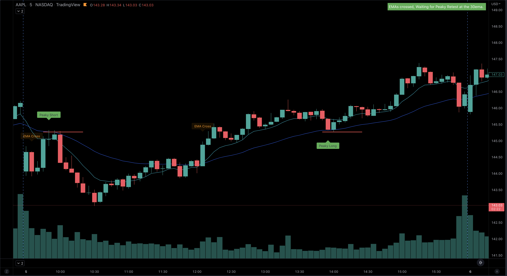

## Unleashing the Power of the Peaky Blinders Strategy

Welcome to the world of trading, where strategies can make all the difference. Today, we'll delve into a strategy known as the Peaky Blinders Strategy, specifically focusing on its utilization of the 9/30 EMA (Exponential Moving Average) crossover on a 5-minute Regular Hours Chart. Whether you're a novice or an experienced trader, understanding this approach can be a game-changer in your trading journey.

### How to Implement the 9/30 EMA Crossover

Let's dive into the practical aspects of trading with the 9/30 EMA crossover. To set the stage, take a look at the 5-minute chart of $AAPL on October 5, 2022.

The process begins with patience. The Peaky Blinders Strategy waits for the opportune moment when the 9EMA and 30EMA cross paths on the chart, typically occurring within the first 5 minutes after the market opens. This crossover serves as the initial signal.

But the real magic happens just before 10am when we witness a retest of the 30EMA. This retest serves as the perfect entry point for executing The Peaky Blinders strategy. It's during this phase that the Break Hook and Go pattern comes into play, setting the stage for potential gains.

As the trading day progresses, keep a vigilant eye on the charts. In the example provided, we observe another EMA crossover at 12:05pm, followed by a retest of the 30EMA at 1:55pm. These are additional opportunities to leverage The Peaky Strategy and potentially go long.

Remember, no trading strategy can guarantee a 100% success rate. However, The Peaky Blinders Strategy offers a low-risk, high-reward scenario, making it a valuable tool in your trading arsenal.

In conclusion, the 9/30 EMA Moving Average Crossover within The Peaky Blinders Strategy provides traders with a systematic approach to navigate the dynamic world of trading. As you embrace this strategy, practice and adapt it to your unique trading style, always keeping an eye on market conditions and chart patterns.

Unlock the potential of the 9/30 EMA crossover, and let The Peaky Blinders Strategy guide your path to informed and profitable trading decisions.
