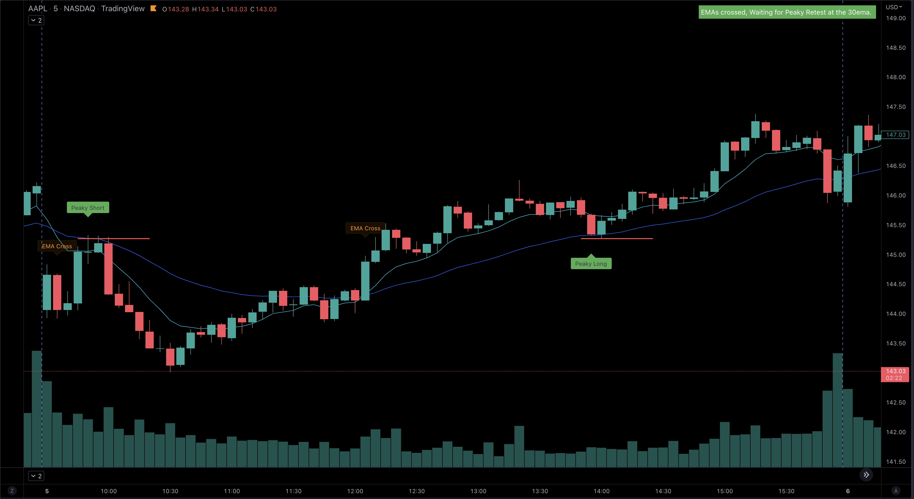

In the dynamic arena of day trading, the Exponential Moving Average (EMA) stands out as a pivotal tool for market analysis and strategy development. Among various EMA settings, the 9 EMA has garnered particular attention for its effectiveness in capturing short-term market trends. This article, "Mastering Moving Averages: The Best EMA Settings for Day Traders," delves into the world of EMAs, shedding light on how these powerful indicators can sharpen your trading acumen.

At its core, an EMA is a type of moving average that places a greater weight and significance on the most recent data points. This makes it exceptionally responsive to recent price changes, a characteristic highly valued in the fast-paced environment of day trading. The 9 EMA, specifically, offers a fine-tuned balance between responsiveness and reliability, making it a favorite among day traders for its ability to provide quick and clear insights into market momentum.

In this guide, we will explore the fundamental principles behind EMAs, with a special emphasis on understanding what the 9 EMA is and how it can be strategically employed in day trading. We'll compare different EMA settings and discuss optimal ways to integrate the 9 EMA into your trading strategies, ensuring that you have a well-rounded understanding of how to leverage this tool for better trading decisions.

Whether you're a seasoned trader or just starting out, this article aims to equip you with the knowledge and strategies necessary to effectively utilize EMAs, especially the 9 EMA, in your day trading endeavors.

## Introduction to Exponential Moving Averages (EMAs)

Exponential Moving Averages (EMAs) are vital tools in the trader's arsenal, especially in the realm of day trading where quick decisions are crucial. Understanding what an EMA is and its particular application in the context of a 9-day setting is key to harnessing its potential.

#### What is an EMA?
The Exponential Moving Average is a type of moving average that gives more weight to recent price data. Unlike a Simple Moving Average (SMA) which evenly distributes weight, the EMA responds more quickly to price changes. This responsiveness is particularly useful in day trading, where capturing trends as they develop can be the difference between profit and loss.

#### Characteristics of the EMA
- **Responsiveness**: EMAs reduce the lag inherent in simple moving averages, providing a more current reflection of price trends.
- **Weighting Factor**: The formula for an EMA involves a weighting factor, which determines how much emphasis is placed on recent data.

#### The Significance of the 9 EMA
- **Popularity in Day Trading**: The 9 EMA is widely used due to its effectiveness in tracking short-term price movements.
- **Balancing Act**: It strikes a balance between being reactive enough to reflect recent price changes and stable enough to filter out market noise.

#### Application of the 9 EMA
- **Trend Identification**: The 9 EMA can be used to quickly identify the direction of the market trend.
- **Signal for Entry and Exit Points**: Changes in the direction of the 9 EMA can signal potential entry or exit points for trades.

By understanding the basics of EMAs, and particularly the functionality of the 9 EMA, traders can enhance their day trading strategy to be more responsive and effective.

{}
  Don't Trade the 9EMA Moving Average Alone. 
  Join us at Spyder Academy where we trade the 9 EMA every day! 
  <a class="btn btn-lg btn-block btn-secondary mt-1" style="border-radius: 0.5em; max-width: 250px" href="https://whop.com/checkout/plan_bCMjkbQ9TJsN2?d2c=true">Let's Trade Together</a>
{}

## The Role of EMAs in Day Trading Strategies

Understanding the role of Exponential Moving Averages (EMAs) in day trading strategies is crucial for effective market analysis and decision-making. The 9 EMA, in particular, plays a significant role in these strategies.

#### Trend Analysis with EMAs
- **Identifying Market Direction**: EMAs help in determining the overall market trend. A rising EMA indicates an uptrend, while a falling EMA suggests a downtrend.
- **Strength of the Trend**: The angle and separation of multiple EMAs (like 9-day, 20-day, 50-day) can indicate the strength of the trend.

#### The 9 EMA Trading Strategy in Action
- **Short-Term Market Movements**: The 9 EMA is particularly useful for identifying short-term market movements and can act as a trigger for entering or exiting trades. The [Butler Trading Strategy](/education/the-butler/) uses the 9ema to identify trend reversals.
- **Support and Resistance**: Often, the 9 EMA can act as a dynamic support or resistance level, offering strategic entry and exit points.

#### Combining EMAs for Enhanced Analysis
- **Multiple EMA Analysis**: Using a combination of EMAs (like the 9-day and 50-day) can provide a clearer picture of market trends and potential reversals.
- **Crossover Strategies**: When a short-term EMA (like the 9-day) crosses over a longer-term EMA (such as the 30ema - [9ema/30ema crossover strategy](/education/strategy-peakyblinders/)), it can signal a potential change in the market direction. Learn more about [Moving Average Crossovers](/education/how-to-trade-with-emas/).

By incorporating the 9 EMA and other EMAs into day trading strategies, traders can enhance their market analysis, leading to more informed and potentially profitable trading decisions.

## Optimal EMA Settings for Day Traders

Selecting the right Exponential Moving Average (EMA) settings is crucial for day traders to capture market movements accurately. The 9 EMA is particularly notable for its effectiveness.

#### Choosing the Right EMA Length
- **Short-Term EMAs (like the 8ema or 9ema)**: These EMAs are ideal for capturing short-term trends and quick market movements. The 9 EMA, in particular, is favored for its responsiveness to price changes.
- **Medium-Term EMAs (like 21ema, 30ema, or 50ema)**: These provide a broader view of the market trend, smoothing out short-term volatility.
- **Long-Term EMAs (like 100ema or 200ema)**: Useful for identifying long-term market trends and overall market direction.

#### The 9 EMA Trading Strategy
- **Quick Response to Market Changes**: The 9 EMA is highly responsive, making it an excellent tool for day traders who need to make rapid decisions.
- **Identifying Trade Setups**: When the price crosses the 9 EMA or when the 9 EMA changes its slope, it can indicate potential trade setups.

#### Balancing Different EMA Lengths
- **Combining EMAs for Depth**: Using a combination of short, medium, and long-term EMAs can provide a more comprehensive view of the market. For example, traders will often look for a 9ema/21ema cross over to identify trend.
- **Confirmation and Confluence**: A trade signal is often stronger when multiple EMAs align or confirm the same trend.

By carefully selecting and combining various EMA lengths, with a focus on the 9 EMA, day traders can refine their strategies to align with market movements and enhance their trading performance.

## Combining EMAs with Other Technical Indicators

Integrating Exponential Moving Averages (EMAs), particularly the 9 EMA, with other technical indicators can significantly enhance trading analysis and decision-making in day trading.

#### Synergy with Other Indicators
- **MACD (Moving Average Convergence Divergence)**: Combining EMAs with MACD, which itself is based on moving averages, can provide confirmation for trade signals. For instance, a bullish crossover on the 9 EMA along with a bullish MACD crossover can indicate a strong buying opportunity.
- **RSI (Relative Strength Index)**: When used alongside the RSI, EMAs can help in identifying overbought or oversold conditions. A stock crossing above the 9 EMA in an oversold RSI zone might suggest a potential upward reversal.

#### Enhancing Trade Signals
- **Bollinger Bands**: These can be used with EMAs to gauge market volatility. A stock moving outside the Bollinger Band and crossing the 9 EMA could signify a strong trend.
- **Volume**: Combining volume analysis with EMA trends, especially the 9 EMA, can help confirm the strength of a trend. High volume on a day when a stock crosses its 9 EMA might indicate a strong commitment to that trend.

#### Building a Comprehensive Trading Strategy
- **Diverse Signals**: Using EMAs with other indicators offers a more rounded and robust approach to market analysis, providing diverse signals for better decision-making.
- **Risk Management**: This combination also aids in risk management by providing multiple layers of confirmation before executing trades.

By effectively combining the 9 EMA with other technical analysis tools, day traders can develop more nuanced and successful trading strategies.

## Real-Life Examples and Case Studies

To illustrate the practical application and effectiveness of Exponential Moving Averages (EMAs), particularly the 9 EMA, in day trading, let's explore some real-life examples and case studies.

#### Case Study 1: Utilizing the 9 EMA for Trend Reversals
- **Scenario**: A trader identifies a stock that has been in a downtrend but observes that it has started to consistently close above the 9 EMA.
- **Action**: The trader takes a long position as the price crosses above the 9 EMA, signaling a potential trend reversal.
- **Outcome**: The stock continues its upward trajectory, validated by the 9 EMA acting as support, leading to a profitable trade.

#### Case Study 2: 9 EMA and Volume Spike
- **Scenario**: The price of a stock drops below the 9 EMA with a significant increase in trading volume.
- **Action**: Recognizing this as a bearish signal, the trader short sells the stock.
- **Outcome**: The price continues to fall, and the trader covers the short position for a profit once the price starts to rise back towards the 9 EMA.

#### Success Story: Combining 9 EMA with RSI
- **Scenario**: A day trader spots a stock where the RSI indicates an oversold condition, and simultaneously, the stock crosses above the 9 EMA.
- **Action**: The trader buys the stock, anticipating a bounce-back due to the oversold condition and EMA crossover.
- **Outcome**: The stock rebounds, and the trader exits the position as it reaches overbought territory on the RSI, securing a gain.

These examples demonstrate how the 9 EMA, when used thoughtfully in conjunction with other indicators and market signals, can be a powerful tool in a day trader's strategy. They underscore the importance of context, timing, and a balanced approach to technical analysis in day trading.

## Conclusion

The journey through the world of Exponential Moving Averages, especially the 9 EMA, reveals its indispensable role in day trading. This guide has underscored the versatility and efficacy of EMAs, demonstrating their capacity to enhance trading strategies when used judiciously.

#### Key Takeaways
- **Adaptability**: The 9 EMA, in particular, offers a balanced approach, providing timely insights without overwhelming traders with market noise.
- **Complementary Tool**: When combined with other technical indicators, the 9 EMA becomes an even more powerful tool, enabling traders to make well-informed decisions.
- **Practical Application**: Real-life case studies illustrate the practical benefits and applications of EMAs, showcasing their potential in various trading scenarios.

#### Moving Forward
As traders continue to navigate the ever-changing landscapes of financial markets, the knowledge and application of tools like EMAs will remain a cornerstone of successful trading strategies. It's important to remember that while EMAs are powerful, they are most effective when integrated into a comprehensive trading plan that includes a thorough understanding of the market, sound risk management, and continuous learning.

Embrace the insights provided by EMAs and let them guide you to more informed and potentially profitable trading decisions in your day trading journey.
