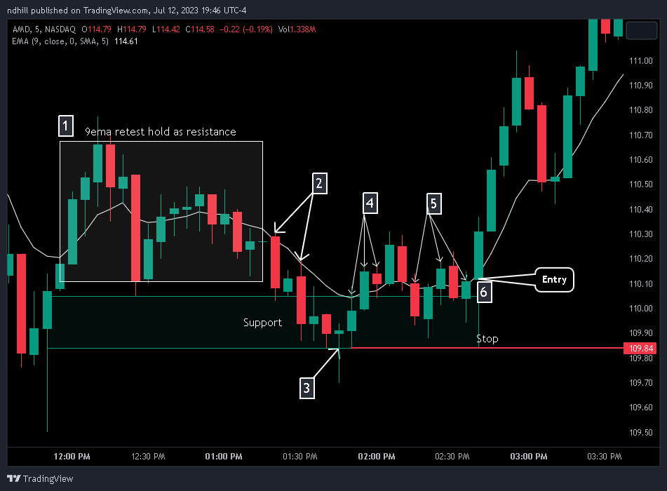
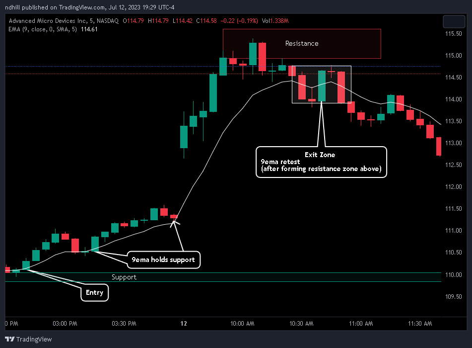
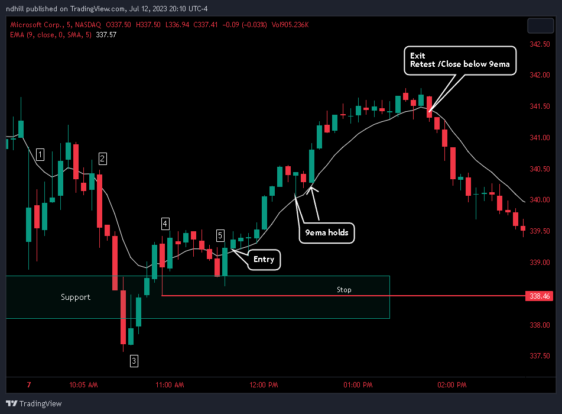
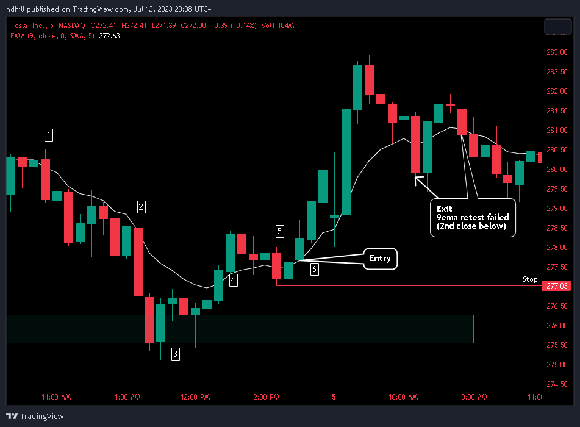

+++
author = "Sith"
title = "Trading The Butler"
date = "2023-07-12T00:00:00"
description = "How to trade The Butler 9ema bullish reversal pattern"
course = "Trading Strategies"
tags = [
    "Strategies",
]
+++

The Butler is a bullish reversal of a 9ema rejection and should signal support of the 9ema and move for a leg higher. This setup provides a support zone below entry that acts as a stop and invalidates the trade. A bullish reversal with support provides a solid Risk:Reward ratio(R:R) on these setups. Typically traded on the 5-minute chart, The Butler is also valid on other timeframes.

## The Setup ##
1.	The Butler starts with the 9ema flipping or holding as resistance.
2.	Once the 9ema is established resistance, look for a strong rejection off the 9, to the downside.
    - Increasing volume is a plus, and adds to conviction, but not required.
3.	A bullish reversal pattern at lows.
    - Hammer, doji, tweezer, abandon baby, engulfing, etc. are all acceptable patterns
4.	Retest and reclaim of the 9ema.
    - Commonly followed by a small move higher
5.	Retest and hold of the 9ema. 
    - The retest and hold should form/hold a Support Zone below.
6.	Entry on the 2nd retest and hold of the 9ema.
    - Stop can be set at low of the mover or the bottom of the 1st 9ema retest. A close at/below those levels invalidates the 9ema retest and the trade.

**Example 1 - AMD**

When exiting the position, look for a test and fail of the 9ema, after forming a resistance zone above. Determining the correct exit depends on a number of factors including, news, market conditions, volume, and overall volatility.

**Example 2 - MSFT**

**Example 3 - TSLA**

