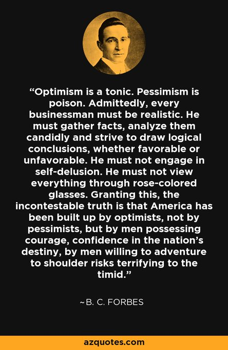

+++
author = "Pauldozer"
title = "The Dangers of Pessimism in Trading"
date = "2023-07-12T00:00:00"
description = "Pessimism can be a deep psychological trap. It sows seeds of doubt, erodes hope, and colors our perception of the world. It's like a poison that seeps into our thoughts, affecting our mood and outlook."
course = "Trading Psychology"
time = "2 min"
tags = [
    "Trading Psychology",
]

+++

The danger of pessimism lies in its contagious nature. When we're surrounded by negativity, it's easy to get caught up in a spiral of despair. Pessimistic attitudes spread like wildfire, infecting those around us and creating a toxic environment.

Avoiding pessimism is crucial for our well-being. It starts with recognizing when we're falling into negative thought patterns. Awareness allows us to challenge our pessimistic tendencies and seek a more positive perspective.

Cultivating optimism takes effort, but it's worth it. Surround yourself with positive influences, whether it's uplifting books, supportive friends, or inspiring content. Train your mind to focus on possibilities, gratitude, and the potential for growth.

Remember, pessimism is not a fixed state. It's a habit that can be unlearned. Practice reframing negative thoughts, seeking evidence to the contrary, and finding silver linings in challenging situations. Gradually, you'll shift towards a more optimistic mindset.

Embrace the power of positive affirmations. Repeat uplifting statements daily, such as "I am capable," "I choose happiness," or "I am resilient." By affirming positivity, you rewire your brain to believe in a brighter future.

Surround yourself with supportive individuals who radiate optimism. Seek out their energy, share ideas, and collaborate on uplifting projects. Together, you can create a ripple effect of positivity that counters the spread of pessimism.

Finally, take care of your mental health. Engage in activities that bring you joy, practice self-care, and prioritize your well-being. When you nurture your own happiness, you become a beacon of light in a world that often succumbs to pessimism.