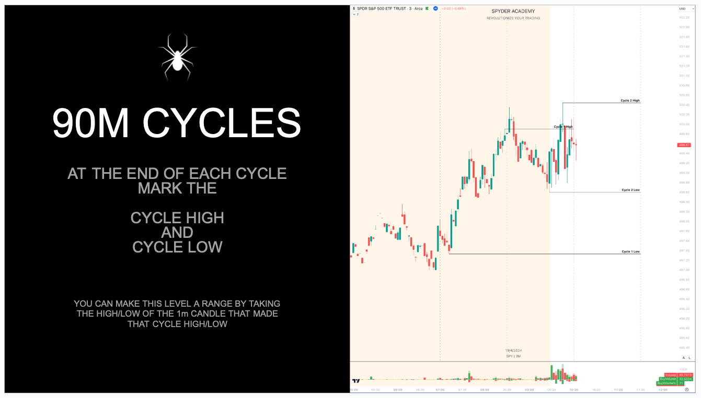
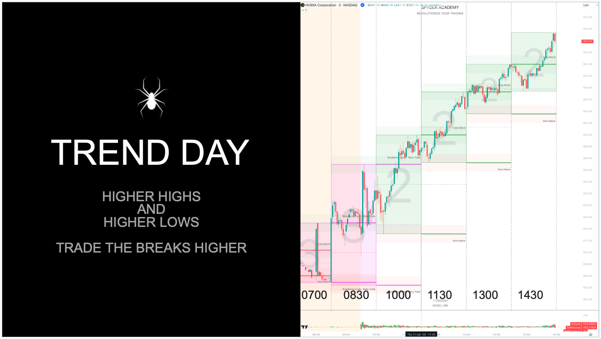
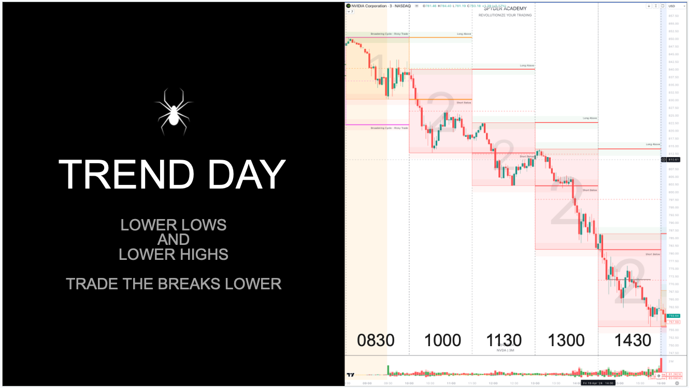
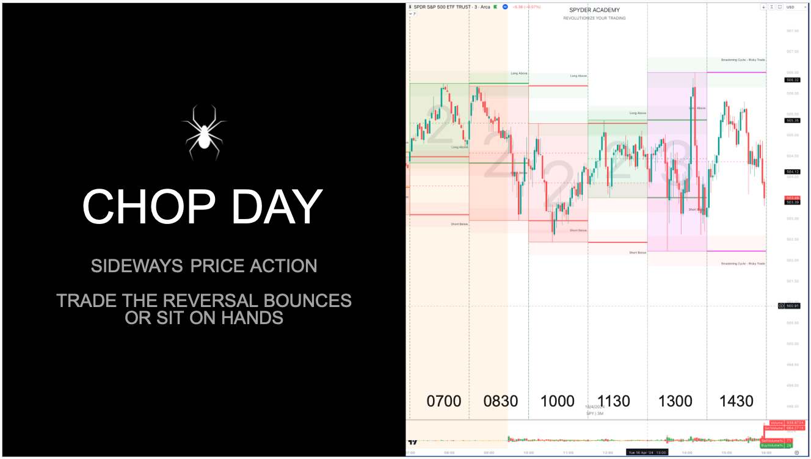
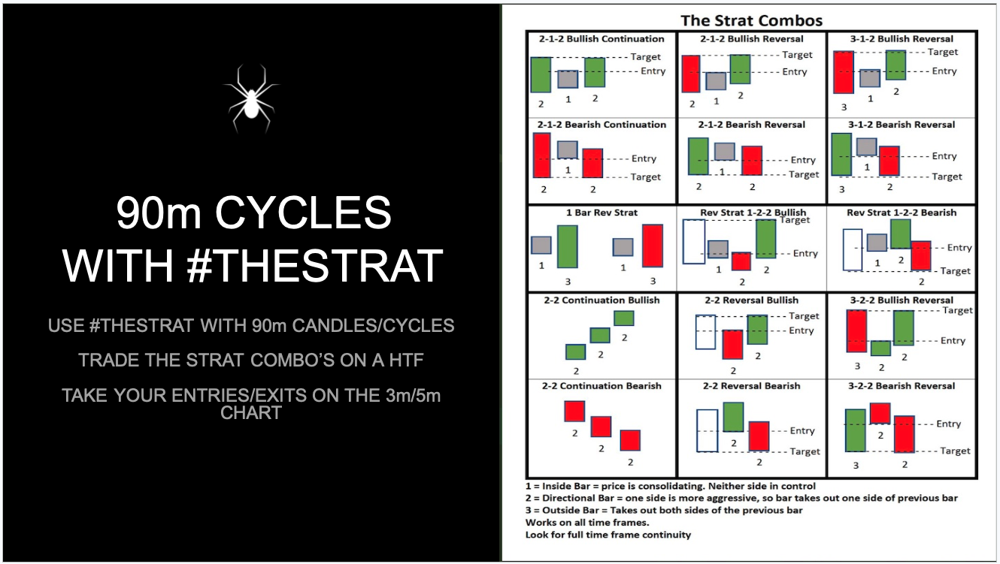
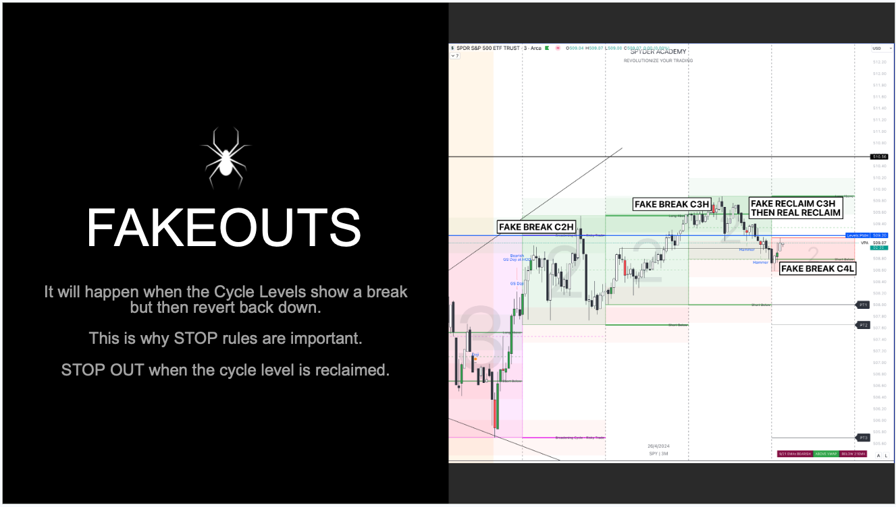

## Introducing 90m Cycles

Recently, [@zeussy_mmxm](https://x.com/zeussy_mmxm) has been taking 𝕏 by storm with his concept of 90m Cycles and Order Flow.  

If you havent watched his video on this topic, please watch it before delving into this post.

  <iframe width="560" height="315" src="https://www.youtube.com/embed/mQ6p6V4GhY0?si=EjWZIbWOd5QJSIN_" title="YouTube video player" frameborder="0" allow="accelerometer; autoplay; clipboard-write; encrypted-media; gyroscope; picture-in-picture; web-share" referrerpolicy="strict-origin-when-cross-origin" allowfullscreen></iframe>

So, now that you have watched the video, let's provide the Spyder Academy take on how we trade these concepts.

#### What are 90m Cycles?

90m Cycles are windows of time where the algo's shift with their buy and sell algorithms.

It is broken down into the following sessions:

**MORNING SESSION**
- 7:00am - 8:30am 
- 8:30am - 10:00am 
- 10:00am - 11:30am 

**AFTERNOON SESSION**
- 11:30am - 1:00pm 
- 1:00pm - 2:30pm
- 2:30pm - 4:00pm

Generally, you will find key data events tend to occur during the boundaries of these sessions.  

For example, 
- 8:30am - We usually get CPI/PPI/Jobs numbers in premarket.  
- 10:00am - We will get data like Home Sales.  
- 11:30am - Treasury Bill auctions occur.
- 1:00pm - Treasury Bond Auctions occur.  
- 2:30pm - Then on FOMC days, the Fed Chair begins his remarks, and most days the Market Makers are returning from the pub and power hour starts where price action becomes volatile again.

Due to these high impactful events, the boundaries of the cycle times also over key times where reversals can occur.

### How do I draw the 90m Cycles?

Using your trading platform (eg TradingView), draw vertical boundaries at each of these time windows.  That will allow you to see when each 90m cycle starts and ends.

Then, each time a new cycle starts, mark a horizontal line at the high and low of that previous cycle.  This marks your Cycle High (PxH) and Cycle Low (PxL), also known as your **Key Pivot Points**.

With 90m Cycles we usually look at the previous two cycles to make our trading decisions.

### How do I trade these 90m Cycle levels?

Great, now that you have your 90m cycle time boundaries, and you have your highs and lows marked, there are a few ways to trade this.

#### Continuations

**BREAK HOOK AND GO OFF THE PREVOUS CYCLE HIGH/LOW**

If Price is **Bullish**, Price should find **support** at the previous cycle high after breaking above it.

If Price is **Bearish**, Price should find **resistance** at the previous cycle low after breaking below it.

#### Reversals

**RECLAIM/BOUNCE OFF THE PREVOUS CYCLE HIGH/LOW**

If Price was **Bullish**, but **does not find support** after breaking above the previous cycle high, then it's a sign that OrderFlow is potentially changing.  A reclaim below the previous cycle high is a good signal to enter a short.

If Price was **Bearish**, but **does not find resistance** at the previous cycle low after breaking below it, then its a sign that OrderFlow is potentially changing.  A reclaim above the previous cycle low is a good signal to enter a long.

#### Price Targets

Once you enter a trade, a stop out will be when the previous cycle level is reclaimed (invalidating your entry).  Your price targets should be the next cycle level up as you look back on your chart.

For Example, if you entered a short on the break of the 830am Cycle Low, then your target may be the low from the 7am cycle, or even the lows from a cycle from the previous day.  Likewise if you went long.  Always look back at previous cycle levels to find your targets.

#### Isn't this basically #TheStrat?

Yeh pretty much.  It is basically using 90m candles, and applying TheStrat concepts to it.

The high/low of each 90m cycle is basically the high/low of a 90m candle in TheStrat.  You are entering on the breakouts of these 90m candles (90m Cycles) and targeting a previous 90m candle level.

I like to keep TheStrat combo cheat sheet handy, and look for these same patterns with these 90m cycles.

#### What about FakeOuts?

Like any strategy, nothing works 100% of the time.  These cycle times can get fake outs.  But since you enter near a well defined level, your losses are limited (get out quickly when the level is invalidated), and targets where the next level is decently away can then be rewarding.

I won't use Cycle Times in isolation.  Keep an eye on other indicators like where PreMarket High/Low is, Previous Day High/Low, Weekly and Monthly levels.  Things like the 9ema etc. Momentum and Volume. All of these act as secondary levels of confirmation to enter a trade, but make sure if the level is invalidated you take your stop.

#### How strict is the stop rule?

My rule is usually a 3 minute close below the level and i will set a hard stop to prevent a lower low.  On the Zeussy video, he will set a range box using the 1 minute high and low candle that made that cycle high/low.  Always trade to your risk tolerance.

