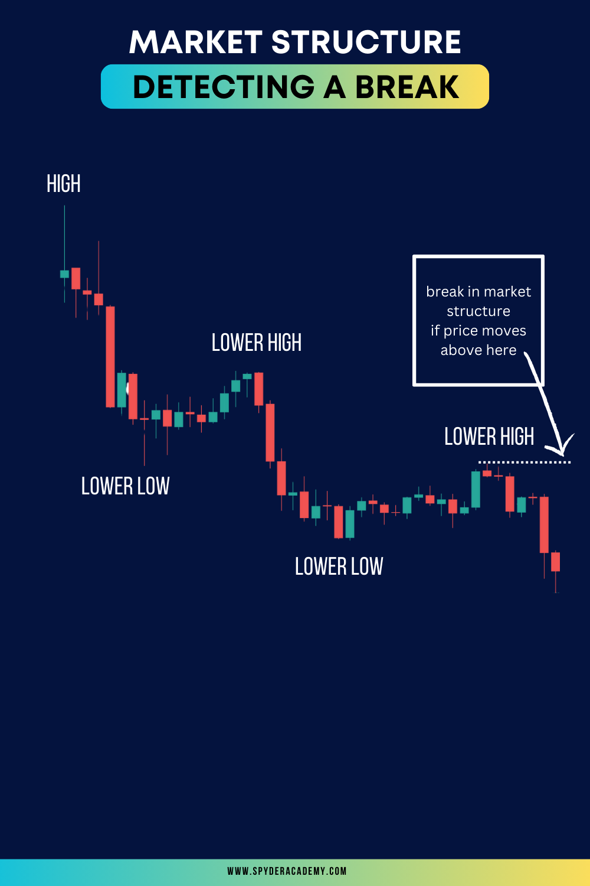

Market structure breaks, a phenomenon in financial markets, hold significant implications for traders and investors alike. Understanding these breaks is essential for adapting to evolving market dynamics and making informed decisions. 

In this article, we delve into the concept of market structure breaks, exploring their nature, causes, and strategies for navigating them successfully.

## **What are Market Structure Breaks?**

Market structure breaks occur when there is a noticeable shift in the established patterns and dynamics of a financial market. These breaks can manifest as sudden changes in trend, increased volatility, or shifts in trading volumes. Traders often analyze market structure to identify potential opportunities or risks, making market structure breaks a crucial aspect of technical analysis.

## **Causes of Market Structure Breaks**

1. **Economic Events:** Major economic announcements, geopolitical events, or changes in central bank policies can trigger market structure breaks.
2. **Technological Advances:** Rapid advancements in trading technologies or the introduction of new trading platforms may alter market behaviors.
3. **Liquidity Changes:** Shifts in market participants, liquidity providers, or changes in trading algorithms can lead to breaks in market structure.
4. **Macro Trends:** Long-term shifts in economic conditions, such as changes in interest rates or inflation, can influence market structures.

## **Identifying Market Structure Breaks**

1. **Price Action Analysis:** Sudden and significant price movements can signal a break in market structure.
2. **Volume Analysis:** Unusual spikes or drops in trading volumes may indicate a shift in market dynamics.
3. **Technical Indicators:** Changes in key technical indicators, such as moving averages or momentum oscillators, can signal a break.
4. **Pattern Recognition:** Recognizing the failure of established patterns, like trendlines or chart patterns, is essential.

## **Strategies for Navigating Market Structure Breaks**

Once you see a market structure (higher highs/higher lows or lower highs/lower lows), then look to trade the trend by going short when a new higher low is put in (during a clear downtrend), or going long with each higher low in an uptrend.  When the market structure breaks, consider exiting your position as it could signify a reversal.  Alternatively, consider flipping your bias if a reversal is starting to play out.  Always look for other indicators for confirmation of a market shift.

1. **Stay Informed:** Regularly monitor economic calendars, news feeds, and market analysis to anticipate potential market-moving events.
2. **Risk Management:** Implement robust risk management strategies to protect against unforeseen market disruptions.
3. **Adaptability:** Be prepared to adapt trading strategies based on the evolving market structure.
4. **Use Confirmation Indicators:** Confirm signals from market structure breaks with multiple indicators to increase reliability.

## **Challenges and Risks in Dealing with Market Structure Breaks**

1. **False Signals:** Not all breaks signify a significant shift; distinguishing between genuine breaks and false signals is challenging.
2. **Overreaction:** Traders may overreact to perceived breaks, leading to increased volatility and erratic market movements.
3. **Lack of Historical Precedence:** New market conditions may lack historical precedence, making it challenging to predict outcomes.

## **Conclusion - Navigating Uncertainty with Skill**

Market structure breaks are an inherent aspect of financial markets, representing opportunities and challenges for traders. By understanding their causes, identifying signals, and implementing strategic approaches, traders can navigate market structure breaks with skill and confidence. Adaptability, continuous learning, and a disciplined approach to risk management are the keys to success in a market environment that is ever-evolving.

