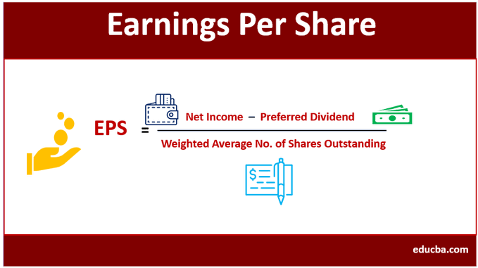
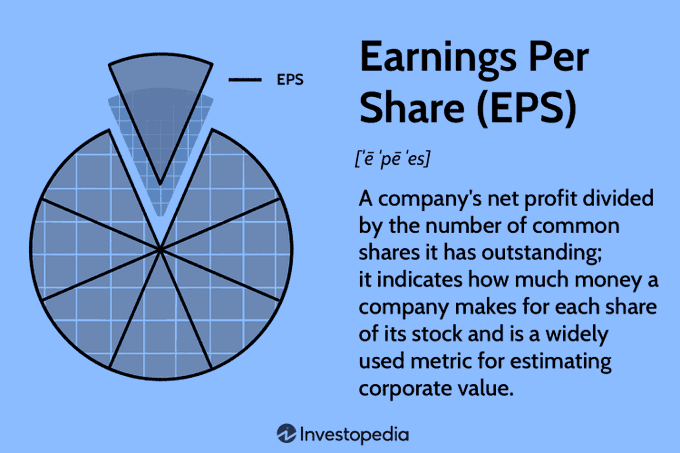
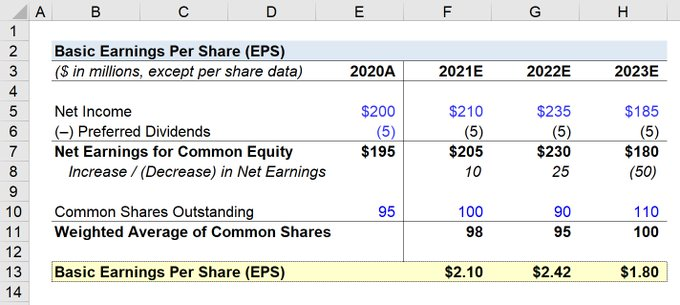
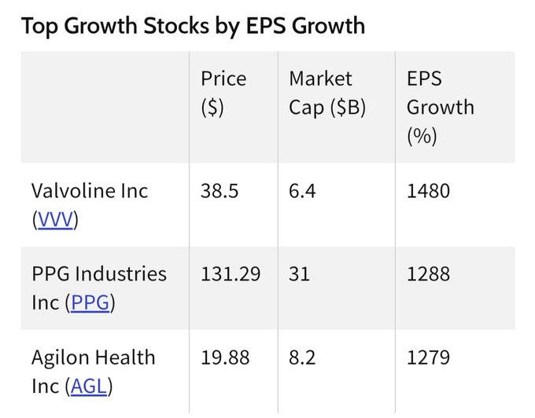
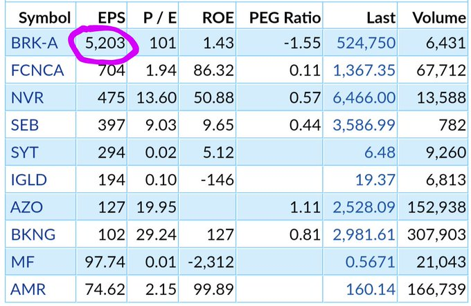
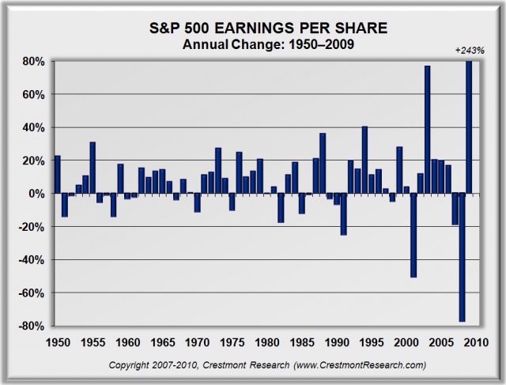
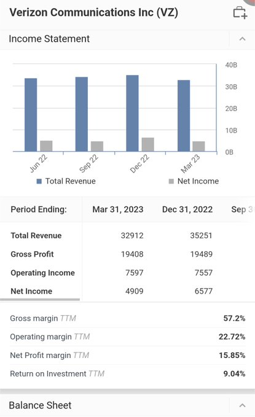
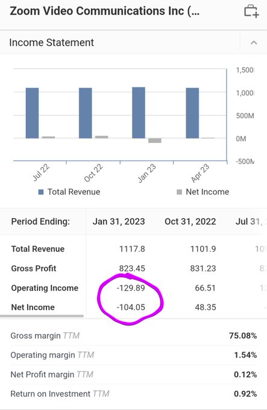
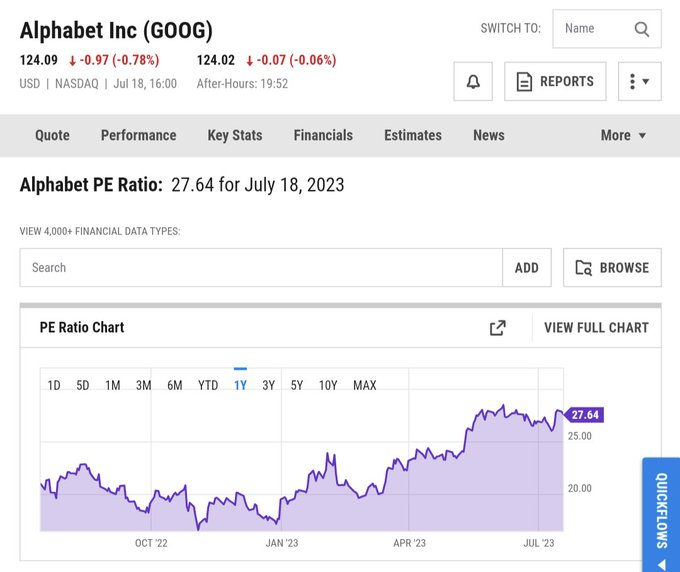

+++
author = "Pauldozer"
title = "What is Earnings Per Share (EPS)"
date = "2023-07-26T00:00:00"
description = "Earnings Per Share (EPS) is a key financial ratio that indicates a company's profitability. It's calculated by dividing net income by the number of outstanding shares. A crucial tool for investors and traders."
tags = [
    "Getting Started",
]

+++

Earnings Per Share (EPS) is a key financial ratio that indicates a company's profitability. It's calculated by dividing net income by the number of outstanding shares. A crucial tool for investors and traders. 🤌💰

For day traders like Tom, EPS provides a snapshot of a company’s profitability. He uses it to predict short-term stock price movements, especially during earnings season. 🔍

## HIGH or LOW
An unexpectedly high or low EPS can spark a strong market reaction. Tom, as a day trader, can profit from these rapid price fluctuations. It's all about timing. ⏰

For example, when Company A reports an EPS significantly higher than expected, the stock price could surge. Tom could potentially capitalize on this movement by making timely trades. 📈

## Long Term Investors
But let's look at the long-term investor, Jack. EPS is important for him too, but he examines it differently. He's not just concerned with the current EPS, but how it changes over time. 📅

Jack notices that Company B’s EPS has been steadily growing over the past five years. This shows that the company is not only profitable, but its profits are also increasing. This steady growth is a positive sign for him. 🚀

## Growth

Consistent growth can reflect effective business strategies and competent management. It makes Company B's stock an attractive investment for Jack, who prefers steady growth over high-risk, high-reward strategies. 🛠️

However, if Company B's EPS starts to decline, Jack might interpret this as a red flag. A falling EPS could signal potential issues with the company's profitability. 🚧

Other key indicators Jack and Tom look at include the Price/Earnings ratio (P/E), Return on Equity (ROE), and Debt-to-Equity ratio (D/E). These combined with EPS give a fuller picture of a company's financial health. 📌

## Conclusion

Remember, EPS is not a standalone indicator, take your horse blinders off 🐴 🦯 It should be used along with other measures for a comprehensive assessment. Stay curious and keep learning! 🔬

Whether you're a day trader like Tom or an investor like Jack, understanding Earnings Per Share (EPS) can greatly enhance your financial decision-making. 