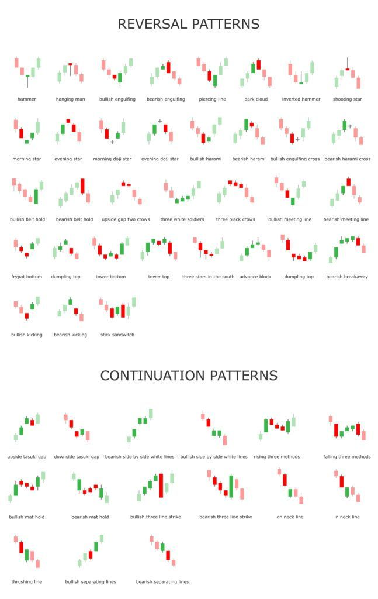

Understanding the dynamics of the market goes beyond mere price movements—it involves decoding the language of volume. 

Volume Price Analysis (VPA), as elucidated by Anna Coulling in her book, "[A Complete Guide to Volume Price Analysis](https://www.amazon.com/Complete-Guide-Volume-Analysis-ebook/dp/B00DGA8LZC/ref)", offers traders a powerful tool to decipher the market's language and make more informed trading decisions.

### Why VPA Matters

VPA is integral to comprehending the strength or weakness behind price movements. By analyzing the interplay between price and volume, traders gain insights into the intentions of market participants, allowing them to anticipate potential trend reversals and continuations.

#### Wyckoff Methods and Market Manipulation

While we won't delve too deeply into Wyckoff Methods and market manipulation, it's essential to acknowledge their presence. VPA often touches upon these concepts, emphasizing how institutional players may manipulate markets, leaving behind discernible volume patterns.

## Candlestick Patterns with Volume

Delving into the specifics, VPA puts a spotlight on the significance of candlestick patterns when coupled with notable volume. Certain candlestick formations gain significance when they coincide with substantial trading volume.

### Key Candlestick Patterns

1. **Reversal Patterns:** Look for candlestick patterns like Bullish/Bearish Engulfing, Hammer, and Doji at potential reversal points. These patterns, when accompanied by increased volume, signal potential shifts in market sentiment.

2. **Continuation Patterns:** Patterns like the Marubozu, Three White Soldiers, and Three Black Crows, when backed by substantial volume, indicate the continuation of existing trends.

### Interpreting Candlestick Patterns with Volume

- **Bullish Scenarios:** A bullish candlestick pattern with increased volume suggests strong buying interest, reinforcing the potential for an upward price movement.

- **Bearish Scenarios:** Conversely, bearish patterns accompanied by significant volume highlight the strength of sellers, indicating a potential downtrend continuation.

## Trading Strategies with VPA

Armed with a foundational understanding of VPA, traders can now explore practical strategies to apply in their trading endeavors.

### 1. **Volume Confirmation Strategy**

- **Objective:** Confirming trend strength through volume analysis.
  
- **Execution:** Compare price trends with corresponding volume trends. A rising market with increasing volume validates the uptrend, while a falling market with rising volume supports a downtrend.

### 2. **Candlestick Pattern Strategy**

- **Objective:** [Leveraging candlestick patterns](/education/how-to-trade-doji-candles/) and volume for precise entries and exits.

- **Execution:** Identify key candlestick patterns (e.g., Doji at support/resistance) and enter trades when accompanied by notable volume, signifying market conviction.

### 3. **Breakout and Pullback Strategy**

- **Objective:** Capitalizing on [breakout opportunities and pullbacks](/education/how-to-trade-the-break-hook-and-go/).

- **Execution:** Trade breakouts confirmed by high volume, indicating a strong momentum. Use pullbacks, accompanied by lower volume, as entry points in the direction of the prevailing trend.

## Conclusion

Volume Price Analysis opens a new dimension of market understanding for traders. By grasping the nuances of VPA, traders can decode the language of volume, gaining a competitive edge in navigating the complexities of the financial markets.
