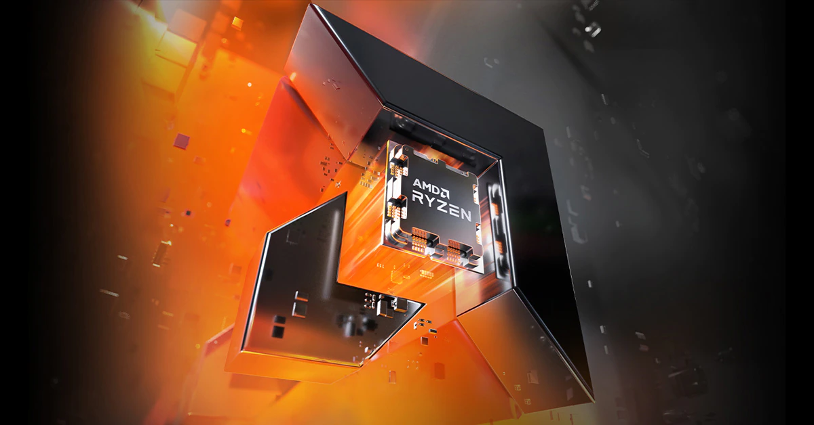

+++
title = "AMD Stock | Navigating the Currents: AMD Stock's Surge in the Semiconductor Sea"
description = "Dive into AMD's journey in the semiconductor industry, exploring its stock performance, the impact of social media on investor sentiment, and future predictions. Discover how AMD navigates market challenges and opportunities."
keywords = "AMD Stock, AMD StockTwits, Semiconductor Stocks, AI Chip Stocks, stock market analysis, technology investments"
ticker = "AMD"
layout = "about"
+++

In the vast and volatile ocean of the stock market, AMD (Advanced Micro Devices) emerges as a beacon of innovation and resilience, commanding the attention of investors and tech enthusiasts alike. As a pivotal player in the semiconductor industry, AMD's journey through market fluctuations and technological advancements offers a fascinating study of strategic prowess and economic impact. This article aims to dive deep into the currents that have propelled AMD stock, exploring the company's significant role in the semiconductor sector, its performance on the stock market, and the influence of investor sentiment as reflected through platforms like AMD StockTwits.

AMD's ascent in the stock market is not just a story of numbers and financials; it's a narrative interwoven with the evolution of technology and the global demand for computing power. From desktops to data centers, AMD's processors and graphics units are at the heart of innovation, driving the company's growth and, subsequently, its stock value. Amidst the competitive tides of the semiconductor industry, AMD has successfully navigated challenges, leveraging cutting-edge technology and strategic partnerships to secure its position as a leader in the market.

The significance of AMD stock extends beyond its financial metrics; it serves as a litmus test for the semiconductor industry's health and technological trends. With the rise of digital transformation, the demand for semiconductors has skyrocketed, placing companies like AMD in the spotlight of global economic discourse. Furthermore, the dynamic conversations and predictions on platforms like AMD StockTwits provide valuable insights into investor sentiment, offering a real-time pulse on the company's market perception.

As we chart the course of AMD's journey, this article will explore the intricate dynamics of the semiconductor industry, AMD's strategic maneuvers to stay ahead of the curve, and the speculative waves of investor sentiment that shape its stock's trajectory. Join us as we navigate the currents of AMD's stock surge, providing a comprehensive analysis of its role in the semiconductor sea and the future that lies ahead.

## Introduction to AMD Stock
Advanced Micro Devices (AMD) has long been a cornerstone of the semiconductor industry, a sector renowned for its rapid innovation and pivotal role in powering today's technology-driven world. AMD's stock reflects not just the company's financial health but also its strategic position in the fiercely competitive semiconductor landscape. This introduction aims to shed light on AMD's recent performance, highlighting its significance in the market and the factors contributing to its stock's movements.

#### Overview of Advanced Micro Devices (AMD)

Founded in 1969, AMD has evolved from a small Silicon Valley startup into a global semiconductor powerhouse. Specializing in CPUs (Central Processing Units), GPUs (Graphics Processing Units), and more, AMD has been instrumental in driving the technological advancements that define our modern digital age. The company's commitment to innovation has positioned it as a key player against rivals, continuously pushing the boundaries of what's possible in computing power and efficiency.

#### Recent Performance and Significance of AMD Stock in the Market

AMD's stock has experienced significant fluctuations over the years, mirroring the company's fortunes and the broader trends in the semiconductor industry. In recent times, AMD has seen a remarkable surge in stock value, attributed to its successful product launches and strategic market positioning. The company's ability to capitalize on the growing demand for high-performance computing solutions has made its stock a focal point for investors keen on the technology sector.

The semiconductor industry's cyclical nature, characterized by periods of tight supply followed by oversupply, directly impacts companies like AMD. However, AMD's strategic initiatives, such as diversifying its product lineup and expanding into new markets, have helped stabilize its stock, making it a compelling option for investors looking for growth in the tech sector.

AMD's stock performance is also a reflection of the company's resilience in navigating the challenges posed by global supply chain disruptions and competitive pressures. By investing in research and development and forging strategic partnerships, AMD continues to strengthen its market position, promising exciting prospects for its stockholders.

As we delve deeper into the currents that have propelled AMD's stock, it becomes clear that the company's journey is a testament to strategic foresight, innovation, and the ability to adapt to the ever-changing technological landscape. This narrative is not just about financial metrics but about AMD's pivotal role in shaping the future of technology.

## AMD StockTwits: A Barometer of Investor Sentiment
In the digital age, the influence of social media on the stock market is undeniable, with platforms like AMD StockTwits playing a pivotal role in shaping investor sentiment. This virtual gathering place for investors and traders offers real-time insights, predictions, and discussions about AMD stock, providing a unique lens through which to view the company's market performance.

#### Exploring the Role of AMD StockTwits in Gauging Investor Mood and Predictions

AMD StockTwits stands as a vibrant community of enthusiasts and investors, offering a diverse range of perspectives on the stock's potential moves. The platform allows users to post their analysis, share news articles, and speculate on future performance, creating a rich tapestry of investor sentiment. This constant flow of information and opinion can significantly influence individual investment decisions and, by extension, AMD's stock price movements.

The real-time nature of AMD StockTwits discussions offers a dynamic view of how current events, product launches, and market trends are perceived by the investing community. This immediacy makes StockTwits a valuable barometer for investor sentiment, providing insights that can precede market movements.

#### Impact of Social Media Discussions on AMD's Stock Price

The collective sentiment on AMD StockTwits can act as a powerful driver of stock price fluctuations. Positive news or bullish forecasts shared on the platform can lead to increased buying pressure, while negative sentiments can prompt selling. This phenomenon highlights the growing impact of social media platforms in the financial markets, where the line between information dissemination and market influence continues to blur.

Moreover, the AMD StockTwits community often reacts swiftly to company announcements or macroeconomic trends, reflecting the broader investor sentiment in the semiconductor industry. These reactions can provide valuable signals to investors looking to understand the market's direction, underscoring the platform's role in the financial ecosystem.

As we delve into the intricacies of how AMD StockTwits discussions influence AMD's stock performance, it becomes clear that social media has transformed the landscape of investment analysis. The platform serves not only as a forum for exchanging ideas but also as a critical indicator of market sentiment, making it an indispensable tool for investors navigating the complexities of the stock market.

## The Semiconductor Industry Landscape
The semiconductor industry, a cornerstone of modern technology, is characterized by rapid innovation, cyclical demand, and intense competition. Within this dynamic landscape, AMD has carved out a significant niche, leveraging its expertise in microprocessor and graphics processor design to challenge industry giants and redefine market expectations. This section delves into the broader semiconductor market and AMD's strategic positioning amidst evolving industry trends.

#### A Look at the Broader Semiconductor Market and AMD's Position Among Competitors

The global semiconductor industry is driven by demand for computing power across various sectors, including consumer electronics, data centers, and automotive. This demand has led to periods of intense growth, followed by supply challenges and market saturation. AMD, with its focus on high-performance and energy-efficient processors, has successfully navigated these cycles, gaining market share and strengthening its brand recognition.

AMD's rivalry with other semiconductor giants has been a focal point of industry analysis. Through strategic product development and marketing, AMD has positioned itself as a viable alternative to its competitors, offering comparable performance at competitive prices. This strategy has not only fueled AMD's growth but also intensified the battle for market dominance in key segments like gaming, server processors, and artificial intelligence.

#### Key Factors Driving Growth and Challenges Within the Industry

The semiconductor industry's growth is propelled by several factors, including the proliferation of digital devices, advancements in artificial intelligence and machine learning, and the increasing computational needs of data centers. However, this growth is not without its challenges. Supply chain disruptions, geopolitical tensions, and technological complexities pose significant hurdles to consistent supply and innovation.

AMD's ability to adapt to these challenges, through investments in research and development, supply chain diversification, and strategic partnerships, has been crucial to its success. The company's resilience in the face of industry-wide obstacles underscores the importance of agility and strategic planning in maintaining competitive edge.

The semiconductor industry landscape is a testament to the relentless pace of technological progress and the competitive dynamics that define market leadership. AMD's journey within this landscape highlights the company's strategic acumen and its commitment to innovation, setting the stage for future growth in an increasingly digital world.

## Financial Performance and Market Analysis of AMD
AMD's financial journey is a testament to its strategic prowess and innovation in the semiconductor industry. As we dissect the company's financial health and market performance, a picture of resilience and calculated growth emerges, setting AMD apart in a fiercely competitive landscape.

#### Detailed Review of AMD's Financial Health and Stock Performance Trends

Over recent years, AMD has demonstrated remarkable financial performance, underscored by steady revenue growth, profitability improvements, and expanding market share. This financial upturn is largely attributed to the company's successful product launches, particularly in the high-performance CPU and GPU segments, which have resonated well with both consumer and enterprise markets.

AMD's strategic focus on key growth areas, such as data centers and gaming, has further bolstered its financial standing. By capitalizing on the surging demand for computing power and graphics performance, AMD has not only enhanced its product portfolio but also strengthened its competitive position against industry giants.

#### Comparison with Competitors and Future Growth Prospects

When compared to its competitors, AMD's agile approach to product development and market penetration stands out. The company's ability to quickly adapt to market needs and technology trends has enabled it to capture opportunities faster than many of its rivals, reflected in its stock performance and investor confidence.

Looking ahead, AMD's growth prospects appear promising, driven by ongoing advancements in semiconductor technology and expanding applications of its products. The company's investment in research and development, coupled with strategic partnerships and acquisitions, positions it well to leverage future technology shifts, including AI, machine learning, and the growing need for energy-efficient computing solutions.

The future outlook for AMD stock is optimistic, with analysts highlighting the company's potential to maintain its growth trajectory amidst the evolving tech landscape. As AMD continues to innovate and expand its market presence, its financial performance is expected to remain a key indicator of its strategic success and the semiconductor industry's overall health.

## Conclusion
The voyage of AMD within the vast and turbulent semiconductor sea is a narrative of strategic navigation, technological innovation, and market resilience. As we've explored throughout this article, AMD's journey is marked by its adept maneuvering through the ebbs and flows of the stock market, propelled by its pioneering advancements in the semiconductor industry. This tale is not merely about financial metrics but underscores AMD's significant role in shaping the future of technology.

The discussions on platforms like AMD StockTwits, reflecting the pulse of investor sentiment, further illustrate the dynamic interplay between social media and stock performance. These conversations, ranging from speculative forecasts to insightful analyses, highlight the vibrant community engaged in AMD's stock narrative, showcasing the impact of collective investor sentiment on market movements.

Looking ahead, the semiconductor industry's horizon is brimming with challenges and opportunities. As AMD sails forward, its continued focus on innovation, strategic market positioning, and responsiveness to industry trends will be crucial in navigating the competitive waters. The optimism surrounding AMD's stock, buoyed by positive predictions and technological advancements, signals a promising journey ahead.

In conclusion, AMD's surge in the semiconductor sea is a testament to the company's enduring spirit and strategic acumen. For investors, enthusiasts, and technology aficionados alike, AMD's stock offers not just a share in a company but a stake in the future of digital innovation. As we continue to monitor AMD's trajectory, one thing is clear: the intersection of technology and finance, as epitomized by AMD, will remain a focal point of fascination and opportunity in the years to come.