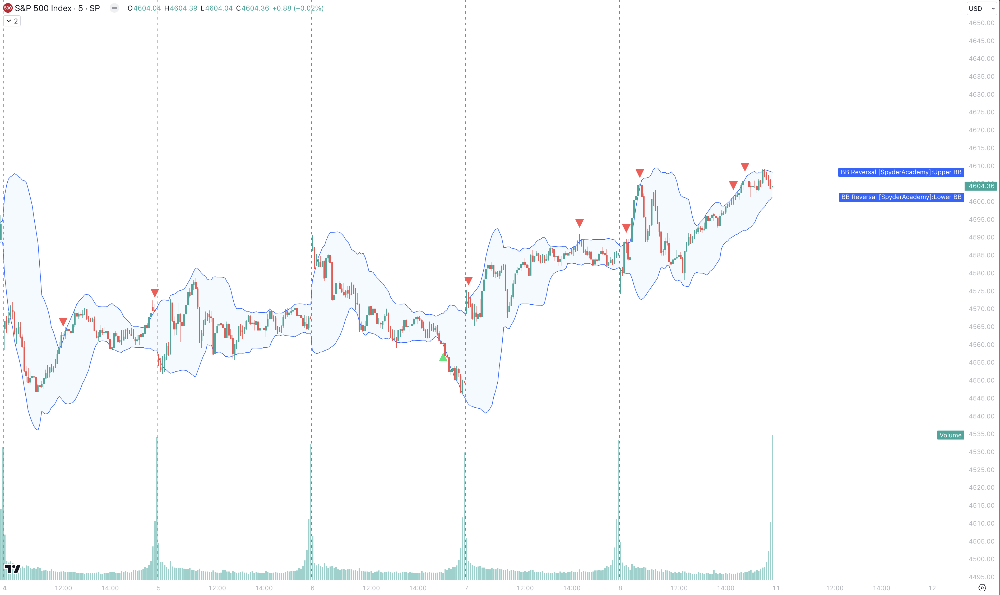

+++
author = "CashMoneyTrades"
title = "Unveiling the Power of Spyder Academy's Bollinger Band Reversal Indicator"
date = "2023-12-06T10:00:00"
description = "Our proprietary Bollinger Band Reversal Indicator is designed to identify potential reversal points in the market. In this blog post, we'll provide insights into what the indicator does and guide you on how to leverage it in your trading strategy."
time = "1 min"
tags = [
   "TradingView",
]
+++

At [Spyder Academy student](/#services)), we are committed to empowering traders with effective tools to navigate the dynamic world of the financial markets. 

One such exclusive offering is our proprietary Bollinger Band Reversal Indicator, designed to identify potential reversal points in the market. 

In this post, we'll provide insights into what the indicator does and guide you on how to leverage it in your trading strategy.

## Understanding the Bollinger Band Reversal Indicator

### What does it do?
The Bollinger Band Reversal Indicator is crafted to highlight potential reversal opportunities in the market. By incorporating Bollinger Bands, a popular volatility indicator, our tool helps traders identify key price levels where a trend reversal may occur.

### Key Features:
- **Bollinger Bands Display:** The indicator visually displays Bollinger Bands on the chart, offering a clear view of price volatility.
- **Doji Precision:** The tool incorporates doji precision, allowing traders to identify instances where open and close prices are close, signifying potential indecision in the market.

## How to Trade with the Bollinger Band Reversal Indicator

### Bullish Reversals:
2. **Long Condition:** Confirmation is provided when the opening price of the previous candle is greater than or equal to the lower Bollinger Band, the low of the previous candle is below the lower band, the closing price of the previous candle is below the lower band, and the current closing price is below the previous closing price.

### Bearish Reversals:
2. **Short Condition:** Confirmation occurs when the opening price of the previous candle is less than or equal to the upper Bollinger Band, the low of the previous candle is above the upper band, the closing price of the previous candle is above the upper band, and the current closing price is above the previous closing price.

### Doji Identification:
- The indicator identifies doji candlestick patterns occurring at high price levels, providing insights into potential market indecision at market highs/lows for the session.

### Plotting Reversal Signals:
- Bullish and bearish reversal signals are plotted on the chart, making it easy for traders to visually identify potential entry points.

## Incorporating the Bollinger Band Reversal Indicator in Your Strategy

1. **Visual Confirmation:** Use the displayed Bollinger Bands to visually confirm price volatility and potential reversal points.
2. **Signal Confirmation:** Confirm reversal signals based on long and short conditions provided by the indicator.
3. **Doji Awareness:** Pay attention to doji patterns at high price levels for additional insights into market indecision.

#### Adding the indicator
As a [Spyder Academy student](/#services), gaining access to the Bollinger Bands Reversal indicator on TradingView is a game-changer. Dive into the Invite Only scripts and, if you've recently joined, a quick restart of your TradingView app will reveal the magic.

## Conclusion

The Spyder Academy Bollinger Band Reversal Indicator is a valuable tool for traders seeking to enhance their technical analysis toolkit. By providing clear signals of potential trend reversals, this indicator empowers traders to make informed decisions in dynamic market conditions.

Remember, while the indicator offers valuable insights, it's essential to incorporate it into a comprehensive trading strategy that considers other factors such as market trends, support and resistance levels, and risk management principles. Happy trading! 📈💼
