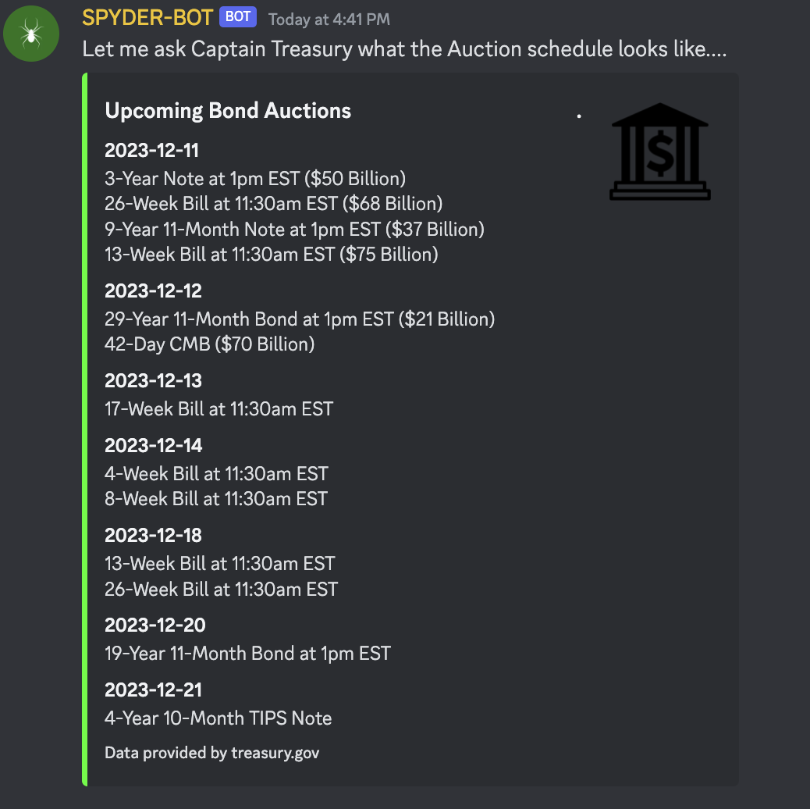

+++
author = "CashMoneyTrades"
title = "Discover the Upcoming Treasury Bond Auctions Schedule"
date = "2023-12-08T10:00:00"
description = "Discover Spyder Academy's Bonds command, a powerful tool designed to position your trading plan in anticipation of Treasury sales announcements."
time = "1 min"
tags = [
   "Discord",
   "Web Tools",
]
+++

Discover the Spyder Academy's Bonds command, a powerful tool designed to enhance your understanding of market events around Treasury Sales.

## Economic Calendar
<section class="section p-3 my-5" style=" margin-left: calc(50% - 50vw); margin-right: calc(50% - 50vw);">

 

      

         
      

   

</section>

{}
   Armed with the expected bond sales data, you can position your trades by derisking ahead of key Treasury Sales scheduled for the day.
{}

#### How to Access the Bonds Schedule in Discord
Simply head to our Classroom Discord channel and type `/bonds`. 

The Spyder-Bot will swiftly respond, providing you with the essential information on upcoming Treasury Sales for Bills, Bonds, and Notes.

#### Prepare your Trading Day by knowing key market events such as Bonds Sales
These sales recently (late 2023) have been known to significantly move the market as participants look at the volume of interest in bond sales to determine market risk.

Empower your trading journey with the Spyder Academy's Bond command. By harnessing the insights provided, you can make more informed decisions. Elevate your trading acumen and explore new opportunities in the dynamic world of finance.

Stay ahead of the market curve – use the Spyder Academy Bond command today!