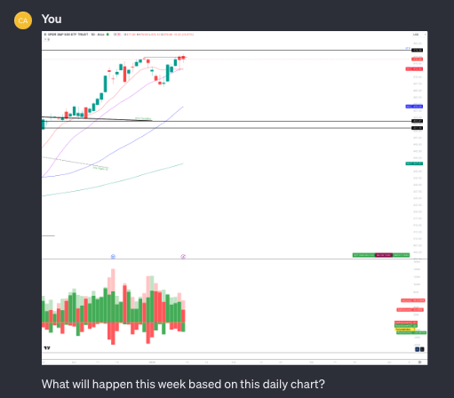

+++
author = "CashMoneyTrades"
title = "Revolutionize Your Trading with 'Stocks Helper' – The AI-Powered Candlestick Chart Analysis Tool"
date = "2024-01-15T10:00:00"
description = "Discover how 'Stocks Helper', our latest OpenAI ChatGPT AI tool, transforms the way traders analyze candlestick charts, offering insightful, AI-driven market analysis to enhance trading strategies."
tags = [
   "TradingView",
]
+++

In the fast-paced world of stock trading, the ability to quickly and accurately analyze market trends is key to success. That's where "Stocks Helper", our innovative new tool, steps in. Leveraging the advanced capabilities of Chat GPT-4, this tool is designed to assist traders in interpreting candlestick charts with remarkable precision and speed.

## Unveiling "Stocks Helper": Your ChatGPT Open AI Trading Assistant

#### What is Stocks Helper?

Stocks Helper is an AI-powered tool that uses the latest advancements in Chat GPT-4 technology to analyze candlestick charts. Candlestick charts, a staple in technical analysis, provide deep insights into market sentiment and potential price movements. However, interpreting these charts can be complex and time-consuming. 

Stocks Helper simplifies this process, offering traders an efficient and accurate way to decode market trends.

**Note - Stocks Helper was built using ChatGPT4 Custom GPT technology.  The responses given may help guide your decisions, but may not always be accurate.  Use of Stocks Helper should be done at your own risk, and any trading decisions made are your own responsibility.**

#### How Does It Work?

Traders can submit a candlestick chart to Stocks Helper, and the tool, powered by GPT-4, will analyze the patterns and indicators present in the chart. It looks at various elements such as the size and color of the candles, the patterns formed (like doji, hammer, or engulfing patterns), and the volume of trading. Based on this analysis, it provides insights into potential bullish or bearish market trends.

**Example Request to Stocks Helper**

**Example Response from Stocks Helper**

#### The Benefits of Using Stocks Helper

1. **Enhanced Accuracy in Analysis**: By utilizing AI, Stocks Helper reduces the margin of error and trader bias that often accompanies manual analysis.
2. **Time Efficiency**: Get instant analysis of complex charts, allowing you to make quicker, well-informed trading decisions.
3. **Ease of Use**: Whether you're a seasoned trader or a beginner, Stocks Helper is designed with a user-friendly interface that makes chart analysis accessible to all.
4. **Educational Value**: New traders can learn from the AI's interpretations, gaining a deeper understanding of technical analysis and how to read market signals.
5. **Customizable Analysis**: Tailor the tool to focus on specific indicators or patterns that align with your trading strategy, making it a versatile asset in your trading toolkit.

#### Integrating Stocks Helper into Your Trading Strategy

**For Beginners**: 
If you're new to trading, Stocks Helper can serve as an educational guide. Use it to understand the basics of candlestick patterns and market trends. This can build your confidence in making informed trading decisions.

**For Experienced Traders**: 
For those with more experience, this tool can act as a second opinion. It can confirm your analysis or provide a different perspective, ensuring a comprehensive evaluation of potential trades.

**For Busy Traders**: 
If time is a constraint, Stocks Helper is your go-to tool for quick analysis. It helps in making swift decisions without compromising on the depth of analysis.

#### Getting Started with Stocks Helper
Getting started is easy. 

Simply access the tool at [ChatGPT - Stocks Helper](https://chat.openai.com/g/g-aWpdX8Osl-stocks-helper), then upload your candlestick chart, and let Stocks Helper do the rest. 

The intuitive interface ensures a seamless experience, and our team is always on hand to assist with any queries.

Note - using the Stocks Helper tool requires a seperate subscription to ChatGPT Plus, offered by Open AI.

#### The Future of Trading with AI
Stocks Helper is just the beginning. As AI technology evolves, we anticipate more advanced features and even greater accuracy in market analysis. 

This tool is not just an aid; it's a glimpse into the future of trading, where AI and human expertise combine to create unprecedented opportunities in the financial markets.

#### Conclusion
Stocks Helper is more than just a tool; it's a trading partner that empowers you to make smarter, faster, and more informed decisions in the stock market. 

Embrace the future of trading today and experience the difference AI can make in your trading journey.

"Stocks Helper" is set to revolutionize the way traders interact with the stock market, offering a blend of AI efficiency and human insight. Stay ahead of the game and transform your trading experience with this cutting-edge tool.