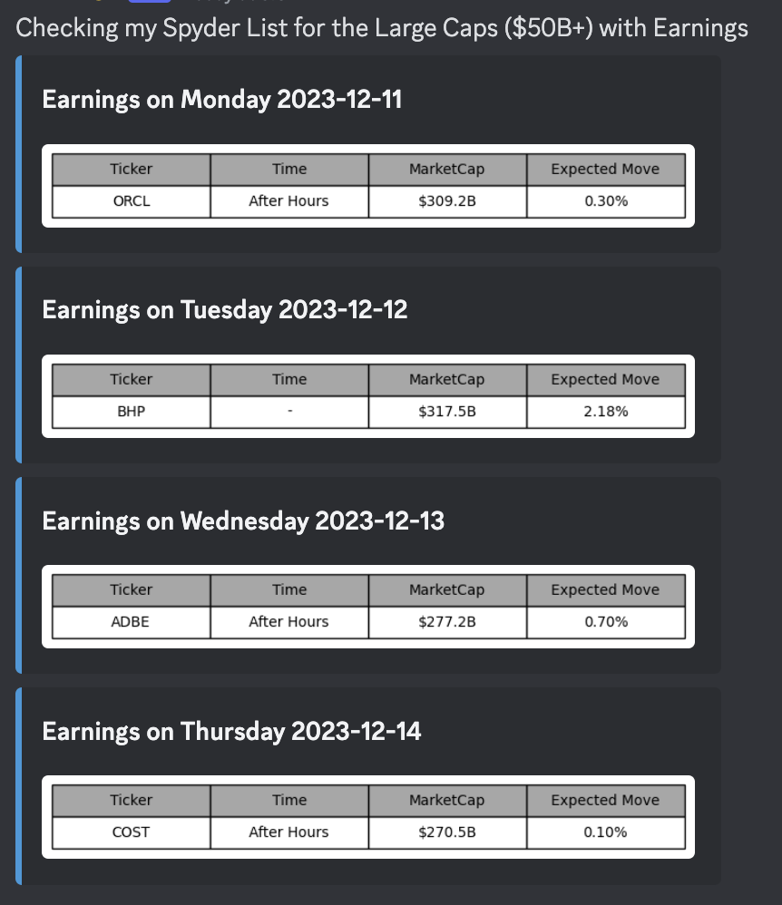

+++
author = "CashMoneyTrades"
title = "Upcoming Earnings Calendar for Strategic IV Flush Trading"
date = "2023-12-07T10:00:00"
description = "Unlock the potential of the Spyder Academy Upcoming Earnings Calendar command to elevate your trading game, specifically when preparing for lucrative IV Flush trades."
time = "1 min"
tags = [
   "Discord",
   "Web Tools",
]
+++

## Upcoming Earnings Calendar

Don't trade before earnings.  

Instead, trade the [IV Flush](/education/how-to-trade-the-iv-flush-strategy/) after earnings by looking at what the options market is expecting. 

Compare the actual move in premarket/after hours with the implied move, then trade the reaction when bulls/bears are both being IV crushed.  The ideal companies to trade in this scenario is when the actual post earnings move has stayed within the Implied Range.

### IV FLUSH CANDIDATES

   

      

       Loading Upcoming IV Flush Candidates
       

   

   

      

         

         

            
Earnings This Week

            

            

         

         

         

         

            
Post Earning Moves

            

            

         

         

      

   

{}
   The graphical representation of the Earnings Calendar adds a layer of clarity to your decision-making process.
{}

#### Accessing the Earnings Calendar Command via Discord
Navigate to your Discord channel and type `/iv_earnings`. 

The Spyder Academy Bot will promptly respond, presenting you with a comprehensive list of earnings scheduled for the week. This invaluable data is meticulously filtered to showcase companies with a market capitalization exceeding $50 billion.

#### Key Features of the Earnings Calendar
**Filtered Market Cap**: The list exclusively displays companies boasting a substantial market cap, ensuring you focus on major players in the market.

**Implied Move**: The displays the expected move as priced by the options market before their Earnings announcement.

#### Evaluating Earnings Data for IV Flush Opportunities
Armed with the curated earnings calendar, you can strategically evaluate potential tickers for [IV Flush Trades](/education/how-to-trade-the-iv-flush-strategy/). 

The Earnings Calendar serves as your roadmap to identifying companies that align with [Trading the IV Flush strategy](/education/how-to-trade-the-iv-flush-strategy/).

#### Considerations for IV Flush Trades:
**Open Interest Analysis**: Opt for companies with a robust open interest, indicating active options trading.

**Market Activity**: Prioritize companies that are heavily traded in the market, reflecting heightened investor interest.

**Post-Earnings Movement**: Identify companies that historically exhibit movements after earnings that are less than their expected move.

Leverage this visual earnings calendar to identify potential opportunities, streamline your research, and enhance your overall trading strategy.

#### Conclusion
Maximize your trading potential by leveraging the Spyder Academy Earnings Calendar command. Tailored to showcase only high-market-cap companies, this tool empowers you to identify promising opportunities for IV Flush trades.

Strategically evaluate the tickers highlighted in the calendar and delve deeper into the Spyder Academy's educational material on how to trade the IV Flush strategy. Stay ahead of market movements, make informed decisions, and take your trading journey to new heights.

Embrace the power of the Earnings Calendar – your key to strategic IV Flush trading success!
