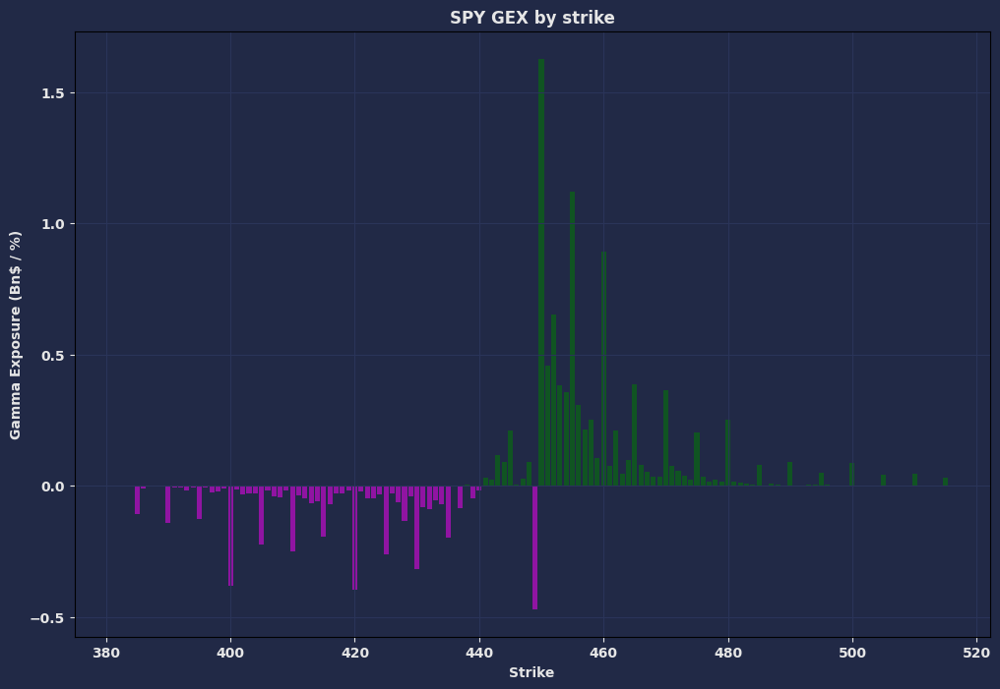
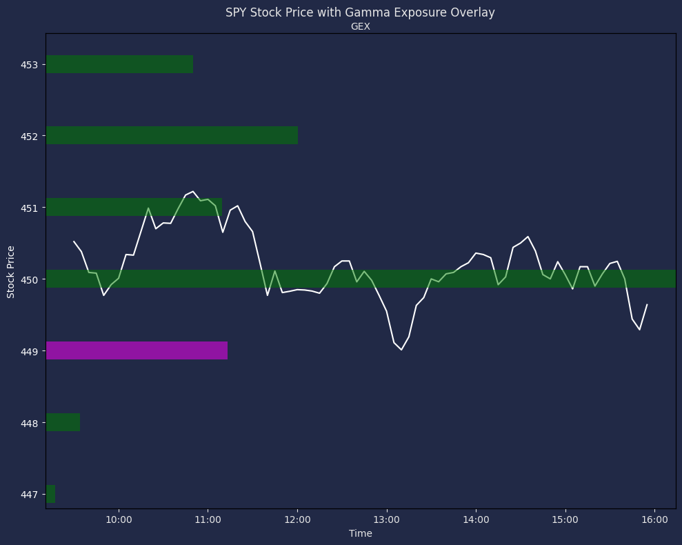

+++
author = "CashMoneyTrades"
title = "How to get Gamma Exposure Levels"
date = "2023-12-07T10:00:00"
description = "How to get Gamma Exposure Levels"
time = "1 min"
tags = [
   "Discord Tools",
]
+++

In our education section, we covered [How to Trade using Gamma Exposure (GEX)](/education/how-to-trade-using-gamma-exposure/) means and why traders should use it.  

Here, lets go over how to use the tool in the Spyder Academy Discord.

## The Spyder Academy Net Gamma Exposure Tool:

Traders can leverage tools like the Net Gamma Exposure tool on the Spyder Academy platform to read near real-time gamma positioning in the market. This provides a deeper understanding of structural flows, offering valuable insights into the market's current state and potential future movements.

In the Spyder Academy Discord Classroom, type ```/gex chart TICKER```, replacing `TICKER` with the ticker you are analyzing.

For Example, typing ```/gex chart SPY``` will result in the following chart being returned (Nov 15, 2023):



This chart shows the Net Gamma Exposure for all options contracts for SPY at the current point in time.  The GREEN bars represent NET CALL GAMMA, while the magenta bars represent NET PUT GAMMA.

Call Gamma is bullish and means that most participants in the market have positions that ideally move towards that particular price level.

Put Gamma is bearish, and means that most market participants want to drive the underlying price of the ticker down to that level.

Thus, these Gamma Levels tend to act as a magnet for price movement.

### Gamma Exposure Overlay

In the chart above, you can see the highest gamma levels are at $450 for SPY.  The gamma levels shrink as you move away from the price, and put gamma starts to increase below that price.  Thus the underlying price will naturally be drawn to that $450 level as that is what the big market makers are betting on.

How does this look if we overlay the Gamma Exposure levels over the stock chart for SPY?



Here, you can see the SPY underlying price opened above teh $450 level, and initially moved down to it before bouncing off near that level.  It found resistance near the $451 strike price, and then started to make a move back towards $450 where it consolidated for much of the day.  

Typically, as market participants start covering their positions, the underlying price will start to move away from that level depending on how aggressively their positions are being covered.

Although the largest Gamma Exposure levels act as a magnet, it is not a guarantee that the price of the underlying will trade at that level on that day.  It can be a magnet to move the price in that direction.  Sometimes other news events can overwhelm and move the stock price in the opposite direction.  In such cases, you can see the Open Interest on these contracts reduce rapidly if the move away is strong as market partipants aggressively cover to get out of their positions.

However, if price does start moving towards the largest GEX levels, then these levels can provide targets for the entire move, while you trim along the way to that magnet level.
