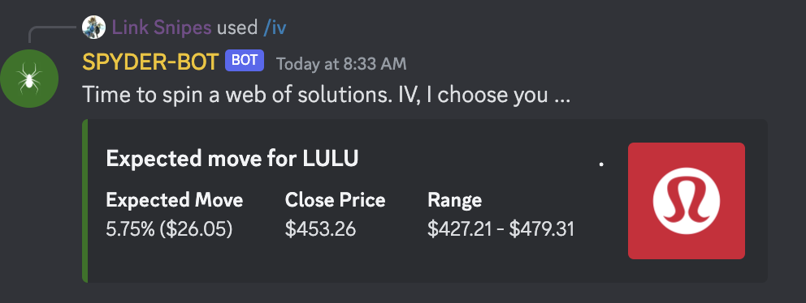

+++
author = "CashMoneyTrades"
title = "Discover the Implied Volatility Command for Precision IV Flush Trades"
date = "2023-12-07T10:00:00"
description = "Discover Spyder Academy's Implied Volatility (IV) command, a powerful tool designed to enhance your understanding of market positioning, especially in anticipation of earnings announcements."
time = "1 min"
tags = [
   "Web Tools",
   "Discord",
]
+++

Are you ready to take your trading game to the next level? Discover the Spyder Academy's Implied Volatility (IV) command, a powerful tool designed to enhance your understanding of market positioning, especially in anticipation of earnings announcements.

#### Get The Expected Move

   

      

         

            

               <input id="ticker" class="form-control no-border-transparent-bg" type="text" placeholder="Enter Ticker" autocomplete="off" style="text-transform:uppercase">
            

            

               <button type="button" class="btn btn-lg btn-success" onclick="getIV(); return false;">Get IV</button>
            

         

      

   

   

      

         

            
Expected Move

              
         

         

            
Close Price

            
         

         

            
Range

            
         

      

   

{}
   Armed with the expected move data, you gain a crucial advantage in evaluating potential trading strategies. 
{}

#### How to Access the Implied Volatility Command on Discord
Not only do you now have access to pull IV on the website, you can also head to our Classroom Discord channel and type `/iv TICKER`. 

The Spyder-Bot will swiftly respond, providing you with the essential information on the expected move for the specified ticker. This invaluable insight is derived from the current market positioning, making it an indispensable resource for traders seeking an edge in the market.

#### Making Informed Decisions with Expected Move Data
One such strategy that becomes more accessible with this information is the coveted [IV Flush Strategy](/education/how-to-trade-the-iv-flush-strategy/).

#### Understanding the IV Flush Strategy
[Trading the IV Flush strategy](/education/how-to-trade-the-iv-flush-strategy/) involves capitalizing on changes in implied volatility, particularly around significant events like earnings announcements. As the market braces for these pivotal moments, understanding the expected move can guide your decision-making process.

#### Key Steps to Execute the IV Flush Strategy

**1. Invoke the Implied Volatility Command:** Use `/iv TICKER` to fetch the expected move data.

**2. Evaluate the Expected Move:** Assess the provided information to gauge market sentiment and positioning.

**3. Explore the IV Flush Strategy:** Dive into the Spyder Academy's educational material on [How To Trade The IV Flush strategy](/education/how-to-trade-the-iv-flush-strategy/)  to refine your approach.

Empower your trading journey with the Spyder Academy's Implied Volatility command. By harnessing the insights provided, you can make more informed decisions, especially when considering advanced strategies like the IV Flush. Elevate your trading acumen and explore new opportunities in the dynamic world of finance.

Stay ahead of the market curve – use the Spyder Academy Implied Volatility command today!