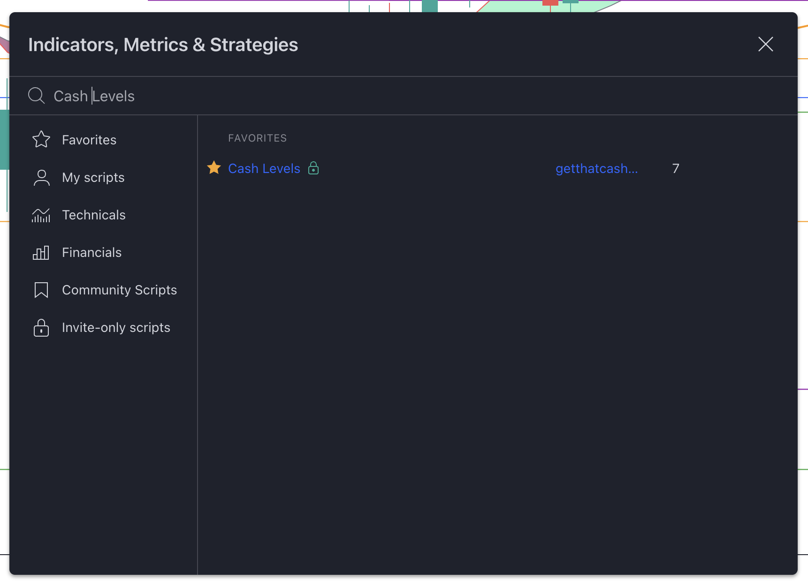
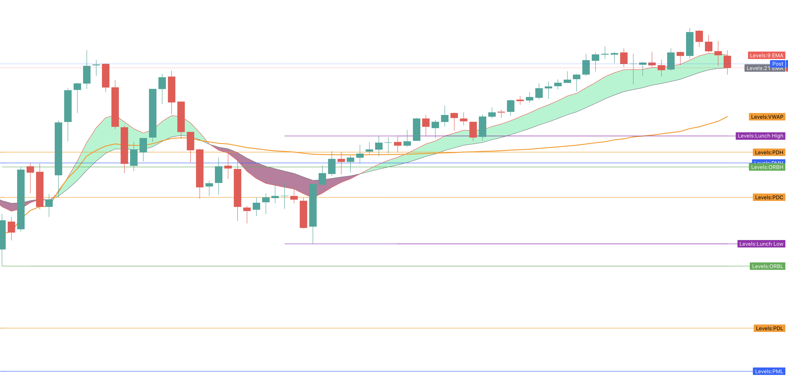
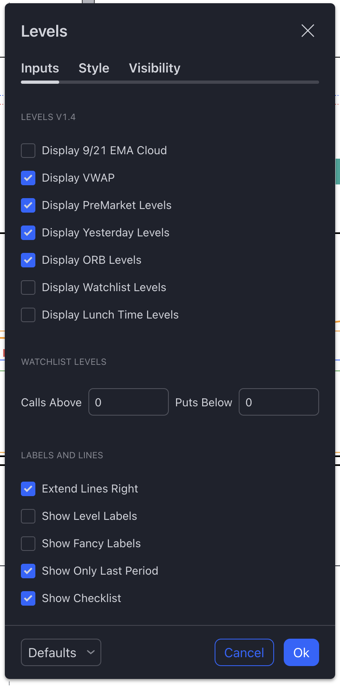

+++
author = "CashMoneyTrades"
title = "Streamline Your Trading with Spyder Academy's Key Levels Indicator"
date = "2023-12-06T10:00:00"
description = "Unleash the power of Spyder Academy's exclusive Key Levels indicator on TradingView to streamline your daily preparation and focus on what truly matters – trading your charts!"
time = "1 min"
tags = [
   "TradingView",
]
+++

#### Adding the indicator
As a [Spyder Academy student](/#services), gaining access to the Key Levels indicator on TradingView is a game-changer. Dive into the Invite Only scripts and, if you've recently joined, a quick restart of your TradingView app will reveal the magic.

#### Viewing the Indicator on your chart

## Yesterday's Tale: Highs, Lows, and the Closing Act

### Yesterday High (PDH):

Yesterday's MVP, the Yesterday High, represents the peak market reached the day before. Its significance lies in its role as a psychological level. A break above signals bullish strength, while falling below hints at bearish dominance.

### Yesterday Low (PDL):

Counterpart to the PDH, the Yesterday Low is the previous day's lowest point. A battleground for bulls and bears, breaching below signals bearish sentiment, while holding above indicates bullish strength.

### Yesterday Close (PDC):

The Yesterday Close marks the end of the previous day's drama. A crucial level for traders, it serves as a reference point for potential continuation or reversal cues.

## Before the Bell: Pre Market High/Low

### Pre Market High (PMH) and Pre Market Low (PML):

These levels, set before the opening bell, offer insights into early sentiment. PMH is the pre-market session's highest point, and PML is the lowest. Traders pay attention for clues before regular trading hours begin.

## Opening Act: Opening Range High/Low

### Opening Range High (ORBH) and Opening Range Low (ORBL):

Established within the first 15 minutes, ORBH and ORBL set the initial tone of the day. Breakout above ORBH signals bullish momentum, while breakdown below ORBL hints at bearish activity.

## The Lunch Act: LunchTime Range High/Low

### Lunch High and Lunch Low:

Between 12 pm and 1 pm ET, as the market grinds into the lunch hour, these levels act as support/resistance in the afternoon session.

## Tips for Trading Like a Pro:

1. **Intraday Planning:**
   - Integrate these key levels into your intraday trading plan for potential trade guidance.

2. **Confirmation is Key:**
   - Exercise patience and wait for confirmatory signals before making decisions based on these levels.

3. **Dynamic Nature:**
   - Adapt your strategies based on real-time price action, recognizing the dynamic nature of markets.

## Wrapping Up:

There you have it – the key levels that unlock the mysteries of charts. Whether it's Yesterday's echoes, Pre-Market whispers, or the Opening Range script, let these levels be your trading compass. Dive into the charts, experiment, and embrace the journey – happy trading, chart whisperers! 📈💼
