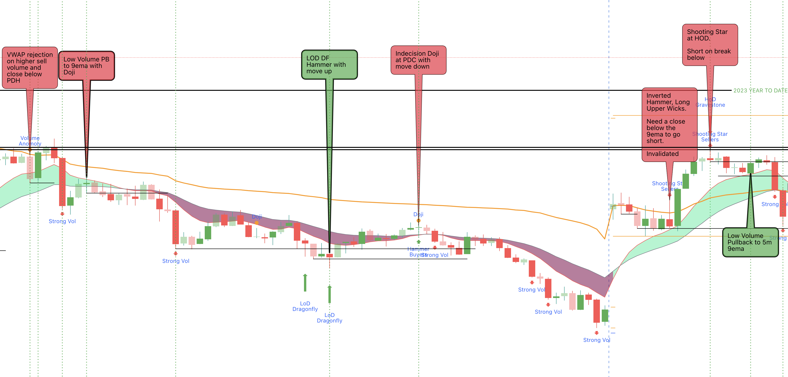

+++
author = "CashMoneyTrades"
title = "Decoding the VPA Indicator: A Deep Dive into Volume Price Analysis"
date = "2023-12-06T10:00:00"
description = "Unlock the power of Volume Price Analysis (VPA) with our VPA indicator, designed for the discerning trader navigating the intricacies of the financial markets using Volume Price Analysis."
time = "1 min"
tags = [
   "TradingView",
]
+++

# 

Unlock the power of Volume Price Analysis (VPA) with our VPA indicator, designed for the discerning trader navigating the intricacies of the financial markets using Volume Price Analysis. 

In this comprehensive guide, we'll delve into the workings of the VPA indicator, shedding light on its features and how to harness its insights for more informed trading decisions.

## Understanding the VPA Indicator

### Candlestick Volume Analysis
The VPA indicator operates at the intersection of candlestick patterns and volume analysis. By dissecting each candle's body size, wicks, and corresponding volume, it aims to uncover valuable information about market sentiment and potential trend reversals.

### Key Metrics
The VPA indicator introduces several key metrics to gauge buying and selling pressure:

- **Buying Volume:** Volume associated with bullish price movements.
- **Selling Volume:** Volume associated with bearish price movements.
- **Total Volume:** The sum of buying and selling volume.

### Unique Candlestick Insights
The indicator identifies various candlestick patterns and associated volume conditions, offering insights into the strength of bullish and bearish trends. Let's explore some key components:

- **Large Spread Candle with Large Volume:** Indicates a strong bullish or bearish candle with substantial volume support.
- **Large Upper Wick with High Selling Volume:** Highlights a potential inverted hammer or shooting star pattern, signaling bearish sentiment.
- **Large Lower Wick with High Buying Volume:** Suggests a potential hammer pattern, indicating bullish sentiment.
- **Hanging Man Patterns:** Recognizes bullish and bearish hammer candles, providing additional context to potential trend reversals.

## Leveraging the VPA Indicator for Trading

### Trade with Caution
The VPA indicator unveils opportunities for reversal and continuation trades based on Volume and Price Action Analysis. However, traders are advised to approach these Trades cautiously, recognizing their speculative nature and the inherent risk of rapid capital loss.

### Quick Entry and Exit
Given the dynamic nature of the VPA signals, traders should be agile and ready to execute quick entry and exit strategies. Timeliness is crucial when responding to the indicator's insights.  Entries based on Doji candles also allow tight risk management based on the trade being invalidated.  It is always a good idea to cut losing trades quickly while giving winning trades room to run.

### Hammering Out Profitable Strategies
The VPA indicator offers valuable signals for recognizing hammer patterns, gravestone dojis, and dragonfly dojis. Traders can use these insights to align their strategies with potential trend reversals.  Combine these signals with [Key Levels](/tools/key-levels/) and other strategies to boost your confidence trading with Volume Price Analysis!

## Conclusion

The VPA indicator is a robust tool for traders seeking a deeper understanding of market dynamics through the lens of volume and candlestick patterns. While it opens the door to exciting trading opportunities, it's essential to balance enthusiasm with risk management. Embrace the VPA indicator as a valuable ally in your trading journey, combining its insights with a comprehensive strategy for optimal results.

Happy trading, and may the VPA indicator illuminate your path to informed and profitable decisions!
